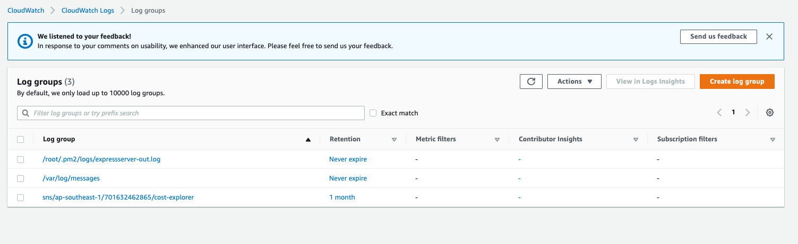

## Objective

To setup a cloudwatch agent in ec2 to be able to push log files to cloudwatch

## Screenshots



## Instructions

Install awslogs and download setup script

```sh
sudo yum install -y awslogs
curl https://s3.amazonaws.com/aws-cloudwatch/downloads/latest/awslogs-agent-setup.py -O
```

Run the setup script and a interactive console will do the rest

```sh
sudo python ./awslogs-agent-setup.py --region ap-southeast-1
> Step 1 of 5: Installing pip ...DONE
  
  Step 2 of 5: Downloading the latest CloudWatch Logs agent bits ... DONE
  
  Step 3 of 5: Configuring AWS CLI ...
  AWS Access Key ID [None]:
  AWS Secret Access Key [None]:
  Default region name [ap-southeast-1]:
  Default output format [None]:
  
  Step 4 of 5: Configuring the CloudWatch Logs Agent ...
  Path of log file to upload [/var/log/messages]: /root/.pm2/logs/expressserver-out.log
  Destination Log Group name [/root/.pm2/logs/expressserver-out.log]:
  
  Choose Log Stream name:
    1. Use EC2 instance id.
    2. Use hostname.
    3. Custom.
  Enter choice [1]: 1
  
  Choose Log Event timestamp format:
    1. %b %d %H:%M:%S    (Dec 31 23:59:59)
    2. %d/%b/%Y:%H:%M:%S (10/Oct/2000:13:55:36)
    3. %Y-%m-%d %H:%M:%S (2008-09-08 11:52:54)
    4. Custom
  Enter choice [1]: 1
  
  Choose initial position of upload:
    1. From start of file.
    2. From end of file.
  Enter choice [1]: 2
```

You should see an output like this

```sh
> - Configuration file successfully saved at: /var/awslogs/etc/awslogs.conf
    - You can begin accessing new log events after a few moments at https://console.aws.amazon.com/cloudwatch/home?region=ap-southeast-1#logs:
    - You can use 'sudo service awslogs start|stop|status|restart' to control the daemon.
    - To see diagnostic information for the CloudWatch Logs Agent, see /var/log/awslogs.log
    - You can rerun interactive setup using 'sudo python ./awslogs-agent-setup.py --region ap-southeast-1 --only-generate-config'

```
