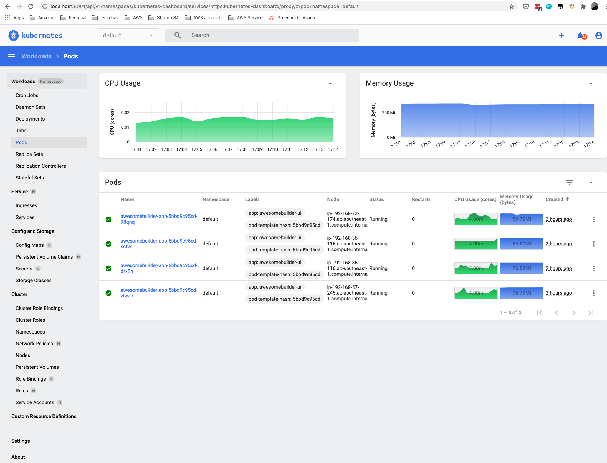

# Objective
1. To wrap an existing application into a container
2. Deploy the container using EKS

# Table of content
<!-- vscode-markdown-toc -->
* 1. [Launch a managed cluster](#Launchamanagedcluster)
	* 1.1. [References](#References)
* 2. [Understanding workloads](#Understandingworkloads)
	* 2.1. [References](#References-1)
* 3. [Push a container to ECR](#PushacontainertoECR)
* 4. [Deploy loadbalancer controller](#Deployloadbalancercontroller)
* 5. [Deploy application on to cluster](#Deployapplicationontocluster)
* 6. [Deploy metrics server](#Deploymetricsserver)
* 7. [Deploy Kubernetes dashboard](#DeployKubernetesdashboard)
* 8. [Send logs to cloudwatch](#Sendlogstocloudwatch)
	* 8.1. [References](#References-1)
* 9. [Setup container insights](#Setupcontainerinsights)
* 10. [Enable vertical pod autoscaler](#Enableverticalpodautoscaler)
* 11. [Enable horizontal pod autoscaler](#Enablehorizontalpodautoscaler)
* 12. [Enable cluster auto scaler](#Enableclusterautoscaler)
* 13. [Nodes](#Nodes)
	* 13.1. [Why do I need cluster autoscaler?](#WhydoIneedclusterautoscaler)
	* 13.2. [Why will I want to update a managed node group?](#WhywillIwanttoupdateamanagednodegroup)
	* 13.3. [Managed node group](#Managednodegroup)
		* 13.3.1. [Without a launch template](#Withoutalaunchtemplate)
		* 13.3.2. [With launch template](#Withlaunchtemplate)
	* 13.4. [Self managed node group](#Selfmanagednodegroup)
	* 13.5. [AWS Fargate](#AWSFargate)
* 14. [CNI](#CNI)
	* 14.1. [What is an overlay network?](#Whatisanoverlaynetwork)
	* 14.2. [Why did AWS develop CNI?](#WhydidAWSdevelopCNI)
	* 14.3. [How does security group works with AWS CNI?](#HowdoessecuritygroupworkswithAWSCNI)
	* 14.4. [When should you not use AWS CNI?](#WhenshouldyounotuseAWSCNI)
	* 14.5. [References](#References-1)

<!-- vscode-markdown-toc-config
	numbering=true
	autoSave=true
	/vscode-markdown-toc-config -->
<!-- /vscode-markdown-toc -->


# Steps

##  1. <a name='Launchamanagedcluster'></a>Launch a managed cluster

Create cluster

```sh
> eksctl create cluster \                                                                                                                                                                                               --name awesomebuilder-container \
 --version <1.18> \
 --with-oidc \
 --without-nodegroup
```

Test if cluster is ready

```sh
> kubectl get svc
```

Create managed node group

```sh
> eksctl create nodegroup \
  --cluster awesomebuilder-container\
  --name awesomebuilder-node-group \
  --node-type t3.micro \
  --nodes 2 \
  --nodes-min 1 \
  --nodes-max 4 \
  --ssh-access \
  --ssh-public-key /Users/leesebas/.ssh/id_rsa.pub \
  --managed
```

(Optional) Create managed node group with spot instances

```sh 
eksctl create nodegroup \
--cluster awesomebuilder-container \
--name=awesomebuilder-spot-node-group \
--node-labels="autoscaling=enabled,purpose=awesomebuilder-ui,instancetype=spot" \
--spot \
--instance-types=m3.medium \
--nodes 5 \
--nodes-min 1 \
--nodes-max 10 \
--asg-access \
--full-ecr-access \
--ssh-access \
--ssh-public-key /Users/leesebas/.ssh/id_rsa.pub \
--managed
```

Watch the status of the nodes creation

```sh
> kubectl get nodes --watch
```

Scaling nodegroup

```sh
# List nodegroup: eksctl get nodegroup --cluster=<clusterName> [--name=<nodegroupName>]
> eksctl get nodegroup --cluster=awesomebuilder-container

# Scale node group
> eksctl scale nodegroup --cluster=awesomebuilder-container --nodes=3
```

Delete nodegroup

```sh
eksctl delete nodegroup --cluster=awesomebuilder-container --name=awesomebuilder-ui-node-group
```

Enable logging

```sh
eksctl utils update-cluster-logging --enable-types all --cluster awesomebuilder-container
```

Provide permission to ec2-instance-role


###  1.1. <a name='References'></a>References

1. https://eksctl.io/usage/managing-nodegroups/

##  2. <a name='Understandingworkloads'></a>Understanding workloads


You can deploy the following types of workloads on a cluster.

1. Deployment – Ensures that a specific number of pods run and includes logic to deploy changes.
2. ReplicaSet – Ensures that a specific number of pods run. Can be controlled by deployments.
3. StatefulSet – Manages the deployment of stateful applications.
4. DaemonSet – Ensures that a copy of a pod runs on all (or some) nodes in the cluster.
5. Job – Creates one or more pods and ensures that a specified number of them run to completion.

By default, all Amazon EKS clusters have the following workloads:

1. coredns –A Deployment that deploys two replicas of the coredns pods. The pods provide name resolution for all pods in the cluster. Two pods are deployed by default for high availability, regardless of the number of nodes deployed in your cluster. For more information, see Installing or upgrading CoreDNS. The pods can be deployed to any node type. However, they can be deployed to Fargate nodes only if your cluster includes a Fargate profile with a namespace that matches the namespace for the workload.

2. aws-node – A DaemonSet that deploys one pod to each Amazon EC2 node in your cluster. The pod runs the Amazon Virtual Private Cloud (Amazon VPC) CNI controller, which provides VPC networking functionality to the pods and nodes in your cluster. For more information, see Pod networking (CNI). This workload isn't deployed to Fargate nodes because Fargate already contains the Amazon VPC CNI controller.

3. kube-proxy – A DaemonSet that deploys one pod to each Amazon EC2 node in your cluster. The pods maintain network rules on nodes that enable networking communication to your pods. For more information, see kube-proxy in the Kubernetes documentation. This workload isn't deployed to Fargate nodes.

###  2.1. <a name='References-1'></a>References
1. https://kubernetes.io/docs/concepts/workloads/


##  3. <a name='PushacontainertoECR'></a>Push a container to ECR

Tag container

```sh
# List images
> docker images

# Tag container
> docker tag awesomebuilder-ui:latest public.ecr.aws/m8o2b2o2/awesomebuilder:awesomebuilder-ui

# Login through docker client
> aws ecr-public get-login-password --region us-east-1 | docker login --username AWS --password-stdin public.ecr.aws/m8o2b2o2

# Push container
> docker push public.ecr.aws/m8o2b2o2/awesomebuilder:awesomebuilder-ui
``` 


##  4. <a name='Deployloadbalancercontroller'></a>Deploy loadbalancer controller

Verify if IAM OIDC provider is found for the cluster

```sh
# aws eks describe-cluster --name <cluster_name> --query "cluster.identity.oidc.issuer" --output text
> aws eks describe-cluster --name awesomebuilder-container --query "cluster.identity.oidc.issuer" --output text

https://oidc.eks.ap-southeast-1.amazonaws.com/id/C4F83DBF343BA80974F8335C22BE8523

> aws iam list-open-id-connect-providers | grep C4F83DBF343BA80974F8335C22BE8523

```

Set up IAM policy

```sh
# download policy
> curl -o iam_policy.json https://raw.githubusercontent.com/kubernetes-sigs/aws-load-balancer-controller/v2.1.0/docs/install/iam_policy.json

# create iam policy
> aws iam create-policy \
    --policy-name AWSLoadBalancerControllerIAMPolicy \
    --policy-document file://iam_policy.json

```

Create the account in kubernetes

```sh
eksctl create iamserviceaccount \
  --cluster=awesomebuilder-container \
  --namespace=kube-system \
  --name=aws-load-balancer-controller \
  --attach-policy-arn=arn:aws:iam::057509847405:policy/AWSLoadBalancerControllerIAMPolicy \
  --override-existing-serviceaccounts \
  --approve

```

Create the service account in kubernetes

```yaml
#aws-load-balancer-controller-service-account.yaml
apiVersion: v1
kind: ServiceAccount
metadata:
  labels:
    app.kubernetes.io/component: controller
    app.kubernetes.io/name: aws-load-balancer-controller
  name: aws-load-balancer-controller
  namespace: kube-system
  annotations:
      eks.amazonaws.com/role-arn: arn:aws:iam::<AWS_ACCOUNT_ID>:role/AmazonEKSLoadBalancerControllerRole

```

Deploy aws load balancer controller service

```sh
> kubectl apply -f aws-load-balancer-controller-service-account.yaml
> kubectl get serviceaccounts --all-namespaces

# Ensure that alb-ingress-controller is uninstalled

> kubectl get deployment -n kube-system alb-ingress-controller 

Error from server (NotFound): deployments.apps "alb-ingress-controller" not found

```

Install the AWS Load Balancer Controller

```sh
#With Helm

>kubectl apply -k "github.com/aws/eks-charts/stable/aws-load-balancer-controller//crds?ref=master"
>helm repo add eks https://aws.github.io/eks-charts
>helm upgrade -i aws-load-balancer-controller eks/aws-load-balancer-controller \
  --set clusterName=awesomebuilder-container \
  --set serviceAccount.create=false \
  --set serviceAccount.name=aws-load-balancer-controller \
  -n kube-system
  
#Verify that the controller is installed

> kubectl get deployment -n kube-system aws-load-balancer-controller

```

##  5. <a name='Deployapplicationontocluster'></a>Deploy application on to cluster

Create a kubernetes namespace

```sh
> kubectl create namespace awesomebuilder
```

Create the service and deployment yaml

```yaml
apiVersion: v1
kind: Service
metadata:
  name: awesomebuilder-service
  annotations:
    service.beta.kubernetes.io/aws-load-balancer-type: nlb-ip
spec:
  ports:
    - port: 80
      targetPort: 5000
      protocol: TCP
  type: LoadBalancer
  selector:
    app: awesomebuilder-ui
---
apiVersion: apps/v1
kind: Deployment
metadata:
  name: awesomebuilder-app
spec:
  replicas: 4
  selector:
    matchLabels:
      app: awesomebuilder-ui
  template:
    metadata:
      labels:
        app: awesomebuilder-ui
    spec:
      containers:
        - name: awesomebuilder
          image: %IMAGE_PATH%
          ports:
            - name: http
              containerPort: 5000

```

Deploy the application

```sh
> kubectl apply -f awesomebuilder-service.yaml

# View resources: kubectl get all -n <namespace>
> kubectl get all -n awesomebuilder

# View details of the deployed service: kubectl -n <my-namespace> describe service <my-service>
> kubectl -n awesomebuilder describe service awesomebuilder-service

# View details of one of the pods: kubectl -n <my-namespace> describe pod <my-deployment-776d8f8fd8-78w66>
> kubectl -n awesomebuilder describe pod <my-deployment-776d8f8fd8-78w66>
```

##  6. <a name='Deploymetricsserver'></a>Deploy metrics server

The Kubernetes Vertical Pod Autoscaler automatically adjusts the CPU and memory reservations for your pods to help "right size" your applications. This adjustment can improve cluster resource utilization and free up CPU and memory for other pods. 

To check if a metrics server is deployed

```sh
> kubectl -n kube-system get deployment/metrics-server
```

Deploy the metric server

```sh
kubectl apply -f https://github.com/kubernetes-sigs/metrics-server/releases/download/v0.3.7/components.yaml
```

Verify the metric server is deployed

```sh
kubectl get deployment metrics-server -n kube-system

```

##  7. <a name='DeployKubernetesdashboard'></a>Deploy Kubernetes dashboard

Create service account yaml

```yaml
#eks-admin-service-account.yaml
apiVersion: v1
kind: ServiceAccount
metadata:
  name: eks-admin
  namespace: kube-system
---
apiVersion: rbac.authorization.k8s.io/v1beta1
kind: ClusterRoleBinding
metadata:
  name: eks-admin
roleRef:
  apiGroup: rbac.authorization.k8s.io
  kind: ClusterRole
  name: cluster-admin
subjects:
- kind: ServiceAccount
  name: eks-admin
  namespace: kube-system

```

Deploy service account

```sh
kubectl apply -f eks-admin-service-account.yaml
```

Deploy kube dashboard

```sh
> kubectl apply -f https://raw.githubusercontent.com/kubernetes/dashboard/v2.0.5/aio/deploy/recommended.yaml

# Expose the proxy network
> kube proxy

# Get secret token
> kubectl -n kube-system describe secret $(kubectl -n kube-system get secret | grep eks-admin | awk '{print $1}')
```

Visit [Kube dashboard](http://localhost:8001/api/v1/namespaces/kubernetes-dashboard/services/https:kubernetes-dashboard:/proxy/#!/login)



##  8. <a name='Sendlogstocloudwatch'></a>Send logs to cloudwatch

Attach CloudWatchAgentServerPolicy policy to ec2 IAM role

Create cloudwatch namespace

```sh
> kubectl apply -f https://raw.githubusercontent.com/aws-samples/amazon-cloudwatch-container-insights/latest/k8s-deployment-manifest-templates/deployment-mode/daemonset/container-insights-monitoring/cloudwatch-namespace.yaml

> kubectl get namespace
```

Create config map

```sh
ClusterName=awesomebuilder-container
RegionName=ap-southeast-1
FluentBitHttpPort='2020'
FluentBitReadFromHead='Off'
[[ ${FluentBitReadFromHead} = 'On' ]] && FluentBitReadFromTail='Off'|| FluentBitReadFromTail='On'
[[ -z ${FluentBitHttpPort} ]] && FluentBitHttpServer='Off' || FluentBitHttpServer='On'
kubectl create configmap fluent-bit-cluster-info \
--from-literal=cluster.name=${ClusterName} \
--from-literal=http.server=${FluentBitHttpServer} \
--from-literal=http.port=${FluentBitHttpPort} \
--from-literal=read.head=${FluentBitReadFromHead} \
--from-literal=read.tail=${FluentBitReadFromTail} \
--from-literal=logs.region=${RegionName} -n amazon-cloudwatch

```

Download fluent-bit.yaml

```sh
> curl https://raw.githubusercontent.com/aws-samples/amazon-cloudwatch-container-insights/latest/k8s-deployment-manifest-templates/deployment-mode/daemonset/container-insights-monitoring/fluent-bit/fluent-bit.yaml -o fluent-bit.yaml

```

Remove fluent bit section to reduce amount of logs

```yaml
[INPUT]
    Name                tail
    Tag                 application.*
    Path                /var/log/containers/fluent-bit*
    Parser              docker
    DB                  /var/fluent-bit/state/flb_log.db
    Mem_Buf_Limit       5MB
    Skip_Long_Lines     On
    Refresh_Interval    10
    Read_from_Head      ${READ_FROM_HEAD}

```

Add a rolling update strategy

```yaml
apiVersion: apps/v1
kind: DaemonSet
metadata:
  name: fluent-bit
  namespace: amazon-cloudwatch
  labels:
    k8s-app: fluent-bit
    version: v1
    kubernetes.io/cluster-service: "true"
spec:
  selector:
    matchLabels:
      k8s-app: fluent-bit
  updateStrategy:
    type: RollingUpdate
    rollingUpdate:
      maxUnavailable: 1
...

```

Deploy fluent bit

```sh
> kubectl apply -f fluent-bit.yaml

# Bonus (restart)

> kubectl rollout restart daemonset.apps/fluent-bit
```


###  8.1. <a name='References-1'></a>References
1. https://docs.aws.amazon.com/AmazonCloudWatch/latest/monitoring/Container-Insights-setup-logs-FluentBit.html

##  9. <a name='Setupcontainerinsights'></a>Setup container insights

Deploy quick start to collect container insights
```
ClusterName=awesomebuilder-container
RegionName=ap-southeast-1
FluentBitHttpPort='2020'
FluentBitReadFromHead='Off'
[[ ${FluentBitReadFromHead} = 'On' ]] && FluentBitReadFromTail='Off'|| FluentBitReadFromTail='On'
[[ -z ${FluentBitHttpPort} ]] && FluentBitHttpServer='Off' || FluentBitHttpServer='On'
curl https://raw.githubusercontent.com/aws-samples/amazon-cloudwatch-container-insights/latest/k8s-deployment-manifest-templates/deployment-mode/daemonset/container-insights-monitoring/quickstart/cwagent-fluent-bit-quickstart.yaml | sed 's/{{cluster_name}}/'${ClusterName}'/;s/{{region_name}}/'${RegionName}'/;s/{{http_server_toggle}}/"'${FluentBitHttpServer}'"/;s/{{http_server_port}}/"'${FluentBitHttpPort}'"/;s/{{read_from_head}}/"'${FluentBitReadFromHead}'"/;s/{{read_from_tail}}/"'${FluentBitReadFromTail}'"/' | kubectl apply -f - 

```

##  10. <a name='Enableverticalpodautoscaler'></a>Enable vertical pod autoscaler

clone git repo

```sh
> git clone https://github.com/kubernetes/autoscaler.git
> git checkout vpa-release-0.8
> cd autoscaler/vertical-pod-autoscaler/

#Deploy vpa
> ./hack/vpa-up.sh

#Delete VPC
> ./hack/vpa-down.sh
```


##  11. <a name='Enablehorizontalpodautoscaler'></a>Enable horizontal pod autoscaler

Enable autoscale for deployment

```
kubectl autoscale deployment.apps/awesomebuilder-app --cpu-percent=10 --min=1 --max=10
```

##  12. <a name='Enableclusterautoscaler'></a>Enable cluster auto scaler

```sh
> kubectl apply -f https://raw.githubusercontent.com/kubernetes/autoscaler/master/cluster-autoscaler/cloudprovider/aws/examples/cluster-autoscaler-autodiscover.yaml

# Update safe-to-evit to false - to prevent CA from removing the node
> kubectl -n kube-system annotate deployment.apps/cluster-autoscaler cluster-autoscaler.kubernetes.io/safe-to-evict="false"

# Edit the auto scaling deployment
> kubectl -n kube-system edit deployment.apps/cluster-autoscaler

# Modify accordingly

 spec:
      containers:
      - command:
        - ./cluster-autoscaler
        - --v=4
        - --stderrthreshold=info
        - --cloud-provider=aws
        - --skip-nodes-with-local-storage=false
        - --expander=least-waste
        - --node-group-auto-discovery=asg:tag=k8s.io/cluster-autoscaler/enabled,k8s.io/cluster-autoscaler/awesomebuilder-container
        - --balance-similar-node-groups
        - --skip-nodes-with-system-pods=false

# Update cluster autoscaler image
> kubectl -n kube-system set image deployment.apps/cluster-autoscaler cluster-autoscaler=asia.gcr.io/k8s-artifacts-prod/autoscaling/cluster-autoscaler:v1.18.3

# Verify auto-scaler
> kubectl -n kube-system logs -f deployment.apps/cluster-autoscaler

```

# References

1. eksctl: https://eksctl.io/
2. Best practices: https://aws.github.io/aws-eks-best-practices/
3. Container-roadmap: https://github.com/aws/containers-roadmap
4. EKS workshop: https://www.eksworkshop.com/
    1. [Auto scaling](https://www.eksworkshop.com/beginner/080_scaling/deploy_ca/)


# FAQ

##  13. <a name='Nodes'></a>Nodes

###  13.1. <a name='WhydoIneedclusterautoscaler'></a>Why do I need cluster autoscaler?

Cluster Autoscaler is a tool that automatically adjusts the size of the Kubernetes cluster when one of the following conditions is true:

there are pods that failed to run in the cluster due to insufficient resources.
there are nodes in the cluster that have been underutilized for an extended period of time and their pods can be placed on other existing nodes.

1. https://github.com/kubernetes/autoscaler/tree/master/cluster-autoscaler
2. https://docs.aws.amazon.com/eks/latest/userguide/cluster-autoscaler.html

Alternative

Scale node group using eksctl

1. https://eksctl.io/usage/managing-nodegroups/


###  13.2. <a name='WhywillIwanttoupdateamanagednodegroup'></a>Why will I want to update a managed node group?

There are several scenarios where it's useful to update your Amazon EKS managed node group's version or configuration:

1. You have updated the Kubernetes version for your Amazon EKS cluster and want to update your nodes to use the same Kubernetes version.
2. A new AMI release version is available for your managed node group. For more information about AMI versions, see Amazon EKS optimized Amazon Linux AMI versions.
3. You want to adjust the minimum, maximum, or desired count of the instances in your managed node group.
4. You want to add or remove Kubernetes labels from the instances in your managed node group.
5. You want to add or remove AWS tags from your managed node group.
6. You need to deploy a new version of a launch template with configuration changes, such as an updated custom AMI.

###  13.3. <a name='Managednodegroup'></a>Managed node group

####  13.3.1. <a name='Withoutalaunchtemplate'></a>Without a launch template

Create Cluster with managed node

```sh
eksctl create cluster \
--name awesomebuilder-container \
--version 1.18 \
--region ap-southeast-1 \
--nodegroup-name awesomebuilder-linux-nodes \
--nodes 3 \
--nodes-min 1 \
--nodes-max 4 \
--with-oidc \
--ssh-access \
--ssh-public-key <name-of-ec2-keypair> \
--managed
```

Create node group

```sh
eksctl create nodegroup \
  --cluster <my-cluster> \
  --region <us-west-2> \
  --name <my-mng> \
  --node-type <m5.large> \
  --nodes <3> \
  --nodes-min <2> \
  --nodes-max <4> \
  --ssh-access \
  --ssh-public-key <my-public-key.pub> \
  --managed

```

####  13.3.2. <a name='Withlaunchtemplate'></a>With launch template

```yaml
---
apiVersion: eksctl.io/v1alpha5
kind: ClusterConfig

metadata:
  name: <my-cluster>
  region: <us-west-2>
  version: '<1.18>'
iam:
  withOIDC: true 
managedNodeGroups:
- name: <ng-linux>
  launchTemplate:
    id: lt-<id>
    version: "<1>"
```    


###  13.4. <a name='Selfmanagednodegroup'></a>Self managed node group

```yaml
apiVersion: eksctl.io/v1alpha5
kind: ClusterConfig

metadata:
  name: <my-cluster>
  region: <us-west-2>
  version: '<1.18>'

iam:
  withOIDC: true   

managedNodeGroups:
  - name: <linux-ng>
    instanceType: <m5.large>
    minSize: <2>

nodeGroups:
  - name: <windows-ng>
    instanceType: <m5.large>
    minSize: <2>
    volumeSize: <100>
    amiFamily: <WindowsServer2019FullContainer>

```


###  13.5. <a name='AWSFargate'></a>AWS Fargate

```sh
eksctl create cluster \
--name awesomebuilder-ui-fargate \
--version 1.18 \
--region ap-southeast-1 \
--fargate
```

##  14. <a name='CNI'></a>CNI
###  14.1. <a name='Whatisanoverlaynetwork'></a>What is an overlay network?
An overlay network is a type of networking whereby administrators create multiple atomic and discrete virtualized network layers on top of the physical infrastructure. It decouples network services from the underlying infrastructure by leveraging encapsulation techniques

AWS Virtual Private Cloud uses this technique to run thousands of private, atomic networks across across millions of devices, spanning multiple sites and regions.

In the context of Kubernetes, an overlay network allows Pods in a Kubernetes cluster to communicate over multiple clusters in a separate IP range to the underlying VPC.


 
###  14.2. <a name='WhydidAWSdevelopCNI'></a>Why did AWS develop CNI?
Using overlay network is extremely complex. There are too many layer of abstraction and encapsulation

1. VPC Flow Logs don’t work: The underlying VPC has no context for the encapsulated overlay network that is running on top of it. VPC flow logs will only show traffic between the hosts in the Kubernetes cluster and makes troubleshooting any network related issues a pain.
2. Security Groups don’t work: Since the VPC has no context for the overlay network, it is unable to apply security policies to the individual pods, instead only applying them to the Kubernetes cluster itself. This means you need to run, manage and maintain two sets of network policy controls.
3. I have another thing I can break: By implementing an overlay network, I have created another fault domain for my application stack. The more fault domains that I need to worry about, the more likely I am going to be woken up at 3am with a problem that affects every single application in the cluster.
4. I don’t want to manage this stuff anymore: The reason we are moving to the cloud is to shift the accountability away from me and to a company that can scale these services larger, better, faster and more efficiently than I could dream to. By creating another network stack for me to manage, I feel like I’m stepping back into the dark ages of on-premise networks.

AWS VPC CNI looks to simplify the complexity by leveraging its ability to attached multiple ENI to a virtual machines

Goals of AWS VPC CNI:

1. Pod network connectivity performance must be similar to AWS VPC Network. That is, low latency, minimal jitter, high throughput and high availability
2. Users must be able to express and enforce granular network policies and isolation comparable to those achievable with native EC2 networking and security groups
3. Network operation must be simple and secure. Users must be able to apply existing AWS VPC networking and security best practices for building Kubernetes clusters over AWS VPC
4. VPC Flow Logs must work
5. VPC Routing Policies must work
6. Pod Network Setup in Seconds
7. Pods must be able to attach to the network in seconds
8. Clusters should be able to scale to ~2000 nodes.


###  14.3. <a name='HowdoessecuritygroupworkswithAWSCNI'></a>How does security group works with AWS CNI?

As AWS CNI map pods to a secondary IP addresses, we can specify which security groups to assign to pods 


###  14.4. <a name='WhenshouldyounotuseAWSCNI'></a>When should you not use AWS CNI?
Virtual Machines in AWS have a max limit on the number of Elastic Network Interfaces that can be attached to any single vm at any time. This number varies by instance type. This can be calculated as follows:

ENIs x Secondary ips per ENI = Max Pods per Node

If the application you are building requires extremely high density of pods to nodes, you would be better off using one of the other CNI solutions like Calico or Weave, or perhaps something like Hashicorp’s Nomad which has been proven to scale up to one million containers across 5k hosts.

Another issue with the AWS CNI is its inefficient use of IP addresses. In order to attach an IP address to a Pod as quickly as possible, the CNI pre-loads a number of IPs to the Node. If the cluster is deployed in a particularly small VPC, you may run out of addresses, even if they aren’t being used by real workloads.

1. https://docs.aws.amazon.com/eks/latest/userguide/pod-networking.html

###  14.5. <a name='References-1'></a>References
1. https://www.contino.io/insights/kubernetes-is-hard-why-eks-makes-it-easier-for-network-and-security-architects


