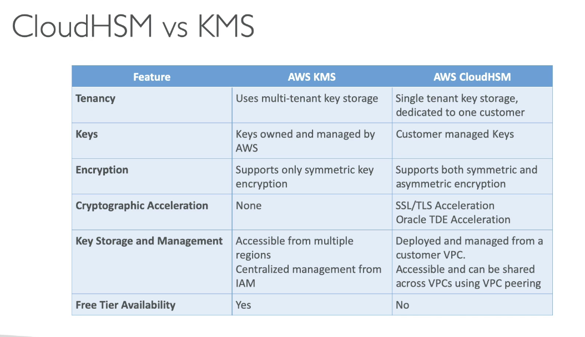

# Section 1: Identity & Federation

## Summary

1. Users and Accounts all in AWS
2. AWS organizations
3. Federation with SAML
4. Federation without SAML with custom IdP
5. Federation with SSO for multiple account
6. Web Identity Federation
7. Cognito for most web and mobile application
8. Active Directory on AWS
   1. Microsoft AD: standalone or setup trust AD with on premise
   2. AD Connector: proxy requests to on-premise
   3. Simple AD: standalone and cheap AD-compatible, with no MFA
9. Single Sign On to connect to multiple AWS accounts (organizations) and SAML apps


## IAM 
1. Users have long term credentials
2. Groups 
3. Roles: short-term credentials, uses STS
    1. EC2 instance role: uses the EC2 metadata service
    2. Service role: API gateway, code deploy
    3. Cross account roles
4. Policies - defined what a role or user can do
    1. AWS managed
    2. Customer managed
    3. Inline policies
5. Resource based policies (S3 bucket)

### IAM policies Deep dive

1. JSON doc with
    1. Effect
    2. Action
    3. Resource
    4. Conditions
    5. Policy Variable
2. Explict "Deny" has precedence over ALLOW
3. Best practice: use least privilege for maximum security
    1. Access Advisor: See permissions granted and when last accessed
    2. Access Analyzer: Analyze resources that are shared with external entity

### IAM AWS Managed Policies

1. AdministratorAccess
2. PowerUserAccess
    1. Use of "NotAction" instead of "Deny" to enable whitelisting

### IAM policies conditions

1. Operators
    1. String
    2. Numeric
    3. Date
    4. Boolean
    5. IpAddress
    6. ArnEquals/ArnLike
    7. Null

### IAM Policies Variables and Tags

1. ${aws:username}

### IAM Roles vs Resource Based Policies

1. Attach a policy to a resource versus attaching of a using a role as a proxy

```
# Assume role
# When you assume a role, you give up your original permissions and take the permissions assigned to the role
User Account A --> Role Account B -- > S3 Account B


# Resource Based Policy (S3 Bucket, SNS, SQS)
# Principal doesnt have to give up any permissions
User Account A --> S3 Bucket Policy --> S3 Account B
```

## STS

1. Define an IAM role within your account or cross-account
2. Define which principals can acess this IAM role
3. Use AWS STS (Security token service) to retrieve credentials and impersonate the IAM role you have access to (AssumeRole API)
4. Temporary credentials can be valid from 5 minutes to 1 hour

### Why assume role with STS?

1.  Provide access for an IAM user in one AWS account that you own to access resources in another account that you own
2. Provide access to IAM users in AWS accounts owned by third parties
3. Provide access for services offered by AWS to AWS resources
4. Provide access for externally authenticated users (identity federation)
5. Adding a time statement to revoke active sessions and credentials for a role

Scenario 1
```
User account A --> Role Account A --> terminate EC2 instances

## Explicitly grant user permission to assume the role
## Force user to switch to the role to terminate EC2
## Add multi-factor authentication protection to the role
## Least privilege + auditing using Cloudtrail
```

Scenario 2
```
## Production Account 
1. Admin create role, UpdateApp that grants Development account read/write access to "productionapp" bucket


## Development account
2. Admin grant members of the group developers permission to assume the UpdateApp Role
```

### Provide access to AWS accounts owned by third parties

1. Zone of trust = accounts, organization that you own
2. Outside zone of trust = 3rd parties
3. Use IAM access analyter to find out which resources are exposed
4. For granting access to a 3rd party
    1. 3rd party AWS account ID
    2. An external ID (secret between you and the 3rd party)
        1. To uniquely associate with the role between you and the 3rd party
        2. Must be provided when defining the trust and when assume the role
        3. Must be chosen by the 3rd party
    3. Define permissions in the IAM policy

### Why we need external ID? 

To prevent confused deputy


### Important APIs

1. AssumeRole: access a role within your account or cross account
2. AssumeRoleWithSAML: return credentials for users logged with SAML
3. AssumeRoleWithWebIdentity: Return creds for users logged with an IDP (Not recommended - use Cognito)
4. GetSessionToken: For MFA, from a user or AWS account root user
5. GetFederationToken: Obtain temporary creds for a federated user, usually a proxy app that will give creds to a distributed app inside a corporate network

### Identity Federation in AWS

1. Federation allow user outside of AWS to assume temporary role for accessing AWS resources
2. These users assume identity provided access role


### Types of federations
1. SAML 2.0
2. Custom Identity Broker
3. Web Identity Federation with Amazon Cognito
4. Web Identity Federation without Amazon Cognito
5. Single Sign On
6. Non-SAML with AWS microsoft AD

### Why use federation?
Using federation, you don't need to create IAM users

### SAML 2.0 Federation

1. Integrate AD/ADFS with AWS (or any SAML 2.0)
2. Provides access to AWS console or CLI
3. No need to create an IAM user for each of your employees


#### ADFS


#### How to setup?

Previously

1. Need to setup a trust between AWS IAM and SAML
2. SAML 2.0 enable web-based, cross domain SSO
3. Uses the STS API:AssumeRoleWithSAML

Recommendation

1. Use Amazon Single Sign On (SSO)

### Custom Identity broker application


1. Use only if IdP is not compatible with SAML 2.0
2. IdP must determine the appropriate IAM policy
3. Uses the STS API: AssumeRole or GetFederationToken

The difference: It is not the user who exchanges the token but the identity broker who does it.

### Web identity federation: AssumeRoleWithWebIdentity

1. Not recommended way


### Web Identity Federation - AWS Cognito

1. Recommended
    1. Create IAM roles using Cognito with the least privilege needed
    2. Build trust between OIDC (open ID connect) IDP and AWS
2. Congito benefit
    1. Support for anonymous users
    2. Support for MFA
    3. Data synchronization
    4. Cognito replaces a Token Vending Machine


### Web Identity Federation - IAM policy

1. After being authenticated with Web Identity Federation, you can identity the user with an IAM policy variable

```
1. cognito-identity.amazonaws.com:sub
2. www.amazon.com:user_id
3. graph.facbeook.com:id
4. accounts.google.com:sub
```


## AWS Directory Services

1. Found on any window server with AD domain services
2. Database of objects: User, accounts, computers, printers
3. Centralize security management, create account, assign permissions
4. Objects are organized in trees and group of trees is a forest

## What is ADFS?

1. Provide single sign-on application
2. SAML across 3rd party


## AWS Directory Service

### AWS Managed Microsoft AD

1. Create your own AD in AWS, manage users locally
2. Establish 'trust' connection with your on-premise AD
3. Deployed in AWS VPC
    1. Provision EC2 Window instances
    2. Run traditional AD applications (sharepoint, etc)
4. Multi-AZ deployment of AD in 2 AZ, # of AD
5. Have the most integrated AWS services 


1. Connect to on-premise AD
    1. Establish a Direct connect or VPN connection
2. Setup 3 kind of forest trust
    1. one way trust - AWS -> on-premise
    2. one way trust - on-premise -> AWS
    3. two way forest trust - AWS <-> on-premise
3. Forest trust is different than synchronization (Replication is not supported)

#### AD replication

1. Create a replica of your AD on EC2 in the cloud
2. Establish trust between the AWS Managed Microsoft AD and EC2
3. Create a replication on EC2 self managed replica
4. Setup a 2 way trust between Microsoft managed AD and the ec2 self managed replica

### AD Connector

1. Directory gateway (proxy) to redirect to on-premise AD
2. Users are managed on the on-premise AD
3. No caching capability
4. Manage user solely on premise, no possiblity of setting up a trust
5. Doesn't work with SQL Server, doesn't do seamless joining

### Simple AD

1. AD-compatible managed director on AWS, LDAP compatible
2. Cannot be joined with on-premise AD
3. inexpensive AD
4. No support for MFA, RDS SQL server, AWS SSO
5. Small: 500 user/ large: 5000 user
6. No trust relationship


## AWS Organizations

1. Master account must invite child account
2. Master account can create child accounts
3. Master can access child account using
    1. Cloudformation stacksets to create IAM roles in target accounts
    2. Assume the role using the STS cross account capability
4. Strategy to create a dedicated account for logging or security
5. Integration with AWS Single Sign On (SSO)

### Features

1. Consolidated billing features
    1. Pricing benefits from aggregated usage
    2. Single payment method
2. Use SCP to prevent member account from leaving the org
3. Invited accounts must approve enabling features

### Multi account strategy

1. Create accounts per department, per cost center, per dev/test/prod, per account service limi
2. Multi account vs one account multi VPC
3. Use tagging standards for billing purpose
4. Enable cloudtrail on all accounts, send logs to central S3 account
4. Establish cross account roles for admin purposes

### Organization units

1. By business unit
2. By Environmental life cycle (dev, prod)
3. By Project

### Service Control Policies (SCP)

1. Whitelist or blacklist IAM actions
2. Applied at the ROot, OU or Account Level
3. SCP is applied to all users/roles of the account, including root
4. SCP does not have effect on service-linked roles
    1. service linked roles enable other AWS services to integrate with AWS organizations and cant be restricted by SCP
5. SCP must have an explicit Allow
    1. Restrict access to certain services (i.e. cannot use EMR)
    2. Enforce PCI compliance by explicitly disabling services

### SCP Heirarchy

1. Root OU --> FullAWSAccess SCP
   1. Root Account  --> DenyAccessAthena SCP
   2. Prod OU --> DenyRedShift SCP
      1. Account A --> AuthorizeRedshift SCP (ultimately: cannot use RedShift)
      2. HR OU --> DenyAWSLambda SCP
         1. Account B --> Cannot use Lambda, Redshift

### IAM policy evaluation logic


### AWS organization - Reserved Instances

1. All accounts in the organizations can receive the hourly cost benefit of reserved instantances that are purchased by any other account
2. The payer account (master account) can turn off RI discount, and saving plans discount sharing for any account in the organization, including the payer account
3. To share an RI or saving plans discount with an account, both accounts must have sharing turn on

## AWS Resource Access Manager (RAM)

1. Share AWS resources that you own with other account
2. Share with any account or within your organizations
3. Avoid resource duplication
4. VPC subnets
   1. Allow to have all the resources launched in the same subnet
   2. Must be from the same AWS organizations
   3. Cannot share security groups or default VPC
   4. Participants can manage their own resources in there
   5. Participants cannot view, modify, delete resources that belong to other participants or the owners
5. AWS transit gateway
6. Route53 Resolver rules
7. License Manager Configuration

## AWS Single Sign On (SSO)

1. Centrally manage SSO to access mulitple accounts and 3rd party business applications
2. Integrated with AWS organizations
3. Support SAML 2.0 markup
4. Integration with on-premise AD
5. Centralize permission management and centralize auditing with cloudtrail


### SSO vs AssumeRoleWithSAML


# Section 2: Security

## AWS CloudTrail

1. Provide governance, compliance and audit for your AWS account
2. Get an history of events/API call made within your AWS account
3. If a resource is deleted, look into cloudtrail
4. default UI only shows "Create", "Modify" or "Delete"

### Cloudtrail trail:
1. Detail list of all the events you choose
2. Can include events happening at the object level in S3
3. Can store event in S3 for further analysis
4. Can be region specific or be global and include global events

### Delivery to S3


### Multi account, multi region logging

1. Transferring all logs to a single security account
2. Benefits
   1. Able to harden the security account
   2. Provide read-only access to accounts by creating a role and allow accounts to assumeRole

### Alert for API calls

```
Cloudtrail --> Cloudwatch logs --> Metric Filters --> Cloudwatch alarm --> SNS --> Lambda
```

### How to react to events the fastest

1. Take up to 15 minutes to deliver events
2. Cloudwatch events 
   1. Can be triggered for any API call in Cloudtrail
   2. Fastest, most reactive way
3. Cloudtrail delivery in cloudwatch logs
   1. Events are streamed
   2. Can perform a metric filter to analyze occurences and detect anomalies
4. Cloudtrail delivery in S3
   1. Events are delivered every 5 minutes
   2. Possibility of analyzing logs integrity, delivery cross account, long-term storage

## AWS KMS

1. Easy way to control access to your data, AWS manages key for you
2. Fully integrated with IAM for authorization

### KMS 101

1. CMK can never be retrieved by the user, CMK can be rotated for extra security
2. Encrypted secrets can be stored in the code/environment variables
3. KMS can only help in encrypting up to 4kb of data per call
4. if data > 4KB, use envelop encryption
5. To give access to KMS to someone
   1. Make sure the key policy allow the user
   2. Make sure the IAM policy allow the API call
6. Track API calls made to KMS in cloudtrail

### Type of KMS key

1. Customer managed CMK
   1. Create, manage and use, can enable or disable
   2. Possibility of rotation policy
   3. Resource policy
   4. Leverage for envelope encryption
2. AWS Managed CMK
   1. Use by AWS service
   2. Managed by AWS

### How does KMS work?

1. Prerequisite: Less than 4kb secret

```
CLI/SDK --> Encrypt API --> KMS with CMK (check IAM permission) --> send encrypted secret back to application
```

## Parameter Store

1. Secure storage for configuration and secrets
2. Version tracking of configurations/secrets
3. Seamless encryption using KMS
4. Integration with cloudformation
5. Can retrieve secrets from Secret manager using the SSM parameter store API

```
Application --> get plain text configuration --> SSM parameter store (check IAM permissions)
```

### Parmeter store Hierarchy

1. /my-department/my-app/[dev/prod]/[db-url/db-password]

## Secret Manager

1. Meant for storing secrets
2. Capability to force rotation of secrets every X days
3. Automate generation of secrets on rotation
4. Integration with Amazon RDS

## RDS security

1. KMS encryption at rest for underlying EBS volumes/snapshot
2. Transparent data encryption for Oracle and SQL server
3. SSL encryption to RDS for all DB
4. IAM authentication for MySQL and PostgreSQL
5. Authorization happens within RDS
6. Copy unencrypted RDS snapshot into an encrypted one
7. Cloudtrail cannot be used to track queries made within RDS

## SSL encryption, SNI & MITM

1. SSL (Secure seockets layers)
2. TLS (Transport Layer security)
3. Public SLL certificate are issued by Certificate Authorities (i.e. GoDaddy, GlobalSign, Symantec, Letsencrypt)
4. SSL certificates expires and need to renew it

### How it works?

1. Asymmetric encryption is expensive
2. Symmetric encryption is cheaper
3. Asymmetric handshake is used to exchange a per-client random symmetric key
4. Possible for client to send an SSL certificate as well (two way certificate)


### SSL - Server Name Indication (SNI)

1. Solves the problem of loading multiple SSL certificates onto one web server (to serve multiple websites)
2. It is a "newer" protocol and requires the client to indicate the hostname of the target server in the initial SSL handshake
3. The Server will find the correct certificate, or return the default one
4. Only works for ALB and NLB (newer generation), cloudfront 


### SSL - Man in the middle attack

1. Use HTTPS
2. Use a DNS that has DNSSEC
   1. To send a client to a pirate server, a DNS response needs to be "forged" by a server which intercepts them
   2. Protect your domain name by configuring DNSSEC
   3. Amazon Route53 does not support DNSSEC for DNS service
3. You can run a custom DNS server on Amazon EC2

## ACM (AWS Certificate Manager)

1. Host public SSL certificates in AWS
   1. Buy your own and upload them using the CLI
   2. Have ACM provision and renew  pubic SSL certificate for you (FOC)
2. ACM load SSL certificate to
   1. Load balancers
   2. Cloudfront distributions
   3. APIs on API Gateway


### ACM Good to know

1. Create public certificate
   1. Verify public DNS
   2. Must be issued by a trusted public CA
2. Create private certificate
   1. For internal applications
   2. Create your own private CA
   3. Applications must trust private CA
3. Certificate renewal
   1. Automatically done if generated by ACM
   2. Manual uploaded certificate must be renewed manually
4. ACM is a regional service
   1. To use with a global application, you need to issue an SSL certificate in each region where your application is deployed
   2. You cannot copy certs across regions

## Cloud HSM (Hardware security module)

1. AWS provision encryption hardware
2. Dedicated hardware
3. Manage your own encryption keys entirely
4. HSM device is tamper resistant
5. Support both symmetric and asymmetric encryption
6. Good option to use with SSE-C encryption
7. Must use CloudHSM client software
   1. Manage the keys
   2. Manage the Users
8. IAM permissions
   1. CRUD an HSM Cluster

```
CloudHSM Client --> SSL connection --> AWS CloudHSM
```

### High Availability

1. CloudHSM clusters are spread across Multi AZ (HA)
2. Greate for availability and durability




## Solution architecture - SSL on ELB

1. HTTPS connection to EC2 instances
   1. Need to load certificate to EC2
   2. Security vulnerability as the certificate is found on the EC2
2. Solution: Offload to CloudHSM
   1. SSL private key never leave HSM device
   2. Need to setup a cryptographic user on the CloudHSM device
   3. 