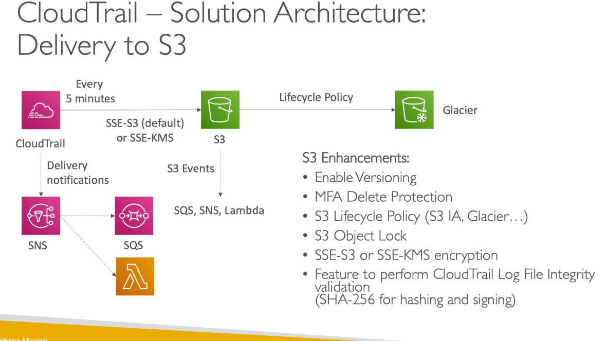
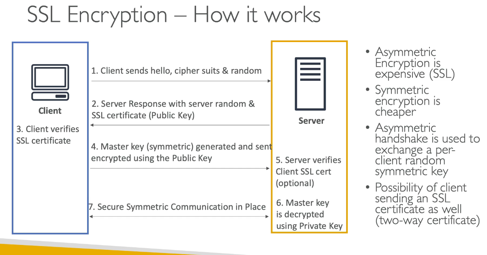
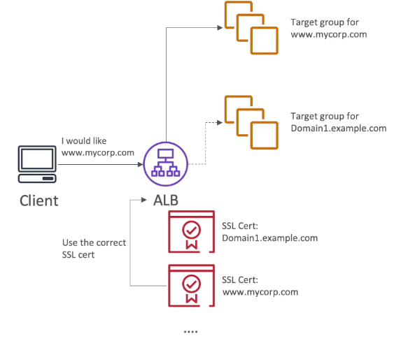
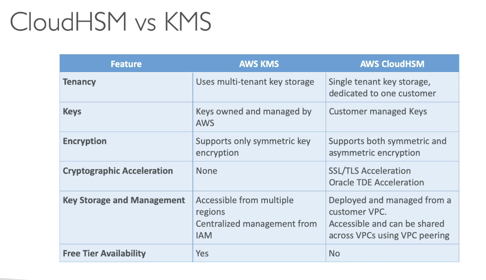
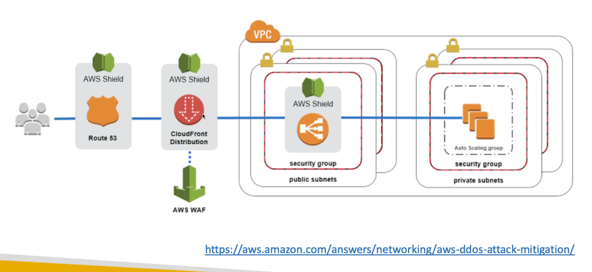
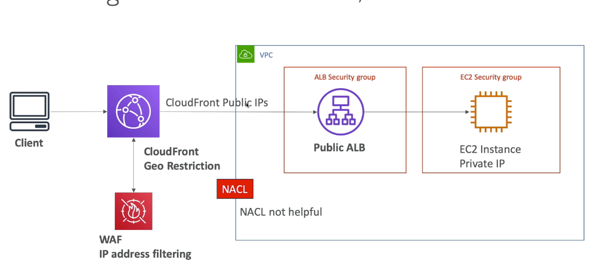

# Chapter 2: Security

## AWS CloudTrail

1. Provide governance, compliance and audit for your AWS account
2. Get an history of events/API call made within your AWS account
3. If a resource is deleted, look into cloudtrail
4. default UI only shows "Create", "Modify" or "Delete"

### Cloudtrail trail:
1. Detail list of all the events you choose
2. Can include events happening at the object level in S3
3. Can store event in S3 for further analysis
4. Can be region specific or be global and include global events

### Delivery to S3



### Multi account, multi region logging

1. Transferring all logs to a single security account
2. Benefits
   1. Able to harden the security account
   2. Provide read-only access to accounts by creating a role and allow accounts to assumeRole

### Alert for API calls

```
Cloudtrail --> Cloudwatch logs --> Metric Filters --> Cloudwatch alarm --> SNS --> Lambda
```

### How to react to events the fastest

1. Take up to 15 minutes to deliver events
2. Cloudwatch events 
   1. Can be triggered for any API call in Cloudtrail
   2. Fastest, most reactive way
3. Cloudtrail delivery in cloudwatch logs
   1. Events are streamed
   2. Can perform a metric filter to analyze occurences and detect anomalies
4. Cloudtrail delivery in S3
   1. Events are delivered every 5 minutes
   2. Possibility of analyzing logs integrity, delivery cross account, long-term storage

## AWS KMS

1. Easy way to control access to your data, AWS manages key for you
2. Fully integrated with IAM for authorization

### KMS 101

1. CMK can never be retrieved by the user, CMK can be rotated for extra security
2. Encrypted secrets can be stored in the code/environment variables
3. KMS can only help in encrypting up to 4kb of data per call
4. if data > 4KB, use envelop encryption
5. To give access to KMS to someone
   1. Make sure the key policy allow the user
   2. Make sure the IAM policy allow the API call
6. Track API calls made to KMS in cloudtrail

### Type of KMS key

1. Customer managed CMK
   1. Create, manage and use, can enable or disable
   2. Possibility of rotation policy
   3. Resource policy
   4. Leverage for envelope encryption
2. AWS Managed CMK
   1. Use by AWS service
   2. Managed by AWS

### How does KMS work?

1. Prerequisite: Less than 4kb secret

```
CLI/SDK --> Encrypt API --> KMS with CMK (check IAM permission) --> send encrypted secret back to application
```

## Parameter Store

1. Secure storage for configuration and secrets
2. Version tracking of configurations/secrets
3. Seamless encryption using KMS
4. Integration with cloudformation
5. Can retrieve secrets from Secret manager using the SSM parameter store API

```
Application --> get plain text configuration --> SSM parameter store (check IAM permissions)
```

### Parmeter store Hierarchy

1. /my-department/my-app/[dev/prod]/[db-url/db-password]

## Secret Manager

1. Meant for storing secrets
2. Capability to force rotation of secrets every X days
3. Automate generation of secrets on rotation
4. Integration with Amazon RDS

## RDS security

1. KMS encryption at rest for underlying EBS volumes/snapshot
2. Transparent data encryption for Oracle and SQL server
3. SSL encryption to RDS for all DB
4. IAM authentication for MySQL and PostgreSQL
5. Authorization happens within RDS
6. Copy unencrypted RDS snapshot into an encrypted one
7. Cloudtrail cannot be used to track queries made within RDS

## SSL encryption, SNI & MITM

1. SSL (Secure seockets layers)
2. TLS (Transport Layer security)
3. Public SLL certificate are issued by Certificate Authorities (i.e. GoDaddy, GlobalSign, Symantec, Letsencrypt)
4. SSL certificates expires and need to renew it

### How it works?

1. Asymmetric encryption is expensive
2. Symmetric encryption is cheaper
3. Asymmetric handshake is used to exchange a per-client random symmetric key
4. Possible for client to send an SSL certificate as well (two way certificate)



### SSL - Server Name Indication (SNI)

1. Solves the problem of loading multiple SSL certificates onto one web server (to serve multiple websites)
2. It is a "newer" protocol and requires the client to indicate the hostname of the target server in the initial SSL handshake
3. The Server will find the correct certificate, or return the default one
4. Only works for ALB and NLB (newer generation), cloudfront 



### SSL - Man in the middle attack

1. Use HTTPS
2. Use a DNS that has DNSSEC
   1. To send a client to a pirate server, a DNS response needs to be "forged" by a server which intercepts them
   2. Protect your domain name by configuring DNSSEC
   3. Amazon Route53 does not support DNSSEC for DNS service
3. You can run a custom DNS server on Amazon EC2

## ACM (AWS Certificate Manager)

1. Host public SSL certificates in AWS
   1. Buy your own and upload them using the CLI
   2. Have ACM provision and renew  pubic SSL certificate for you (FOC)
2. ACM load SSL certificate to
   1. Load balancers
   2. Cloudfront distributions
   3. APIs on API Gateway


### ACM Good to know

1. Create public certificate
   1. Verify public DNS
   2. Must be issued by a trusted public CA
2. Create private certificate
   1. For internal applications
   2. Create your own private CA
   3. Applications must trust private CA
3. Certificate renewal
   1. Automatically done if generated by ACM
   2. Manual uploaded certificate must be renewed manually
4. ACM is a regional service
   1. To use with a global application, you need to issue an SSL certificate in each region where your application is deployed
   2. You cannot copy certs across regions

## Cloud HSM (Hardware security module)

1. AWS provision encryption hardware
2. Dedicated hardware
3. Manage your own encryption keys entirely
4. HSM device is tamper resistant
5. Support both symmetric and asymmetric encryption
6. Good option to use with SSE-C encryption
7. Must use CloudHSM client software
   1. Manage the keys
   2. Manage the Users
8. IAM permissions
   1. CRUD an HSM Cluster

```
CloudHSM Client --> SSL connection --> AWS CloudHSM
```

### High Availability

1. CloudHSM clusters are spread across Multi AZ (HA)
2. Greate for availability and durability




## Solution architecture - SSL on ELB

1. HTTPS connection to EC2 instances
   1. Need to load certificate to EC2
   2. Security vulnerability as the certificate is found on the EC2
2. Solution: Offload to CloudHSM (SSL acceleration)
   1. SSL private key never leave HSM device
   2. Need to setup a cryptographic user on the CloudHSM device
   
## S3 Security

### S3 encryption for objects

1. SSE-S3: encrypt s3 object using key handled and managed by AWS
2. SSE-KMS: leverage AWS key management service to manage encryption keys 
3. SSE-C: when you want to manage your own encryption keys
4. Client side encryption
5. Glacier: AES-256 encrypted, managed by AWS

### Encryption in transit

1. AWS S3 expose
   1. HTTP
   2. HTTPS
2. Use HTTPS for SSE-C as you are sending your encryption key over to S3

### Events in S3

1. S3 access log
   1. Take hours to deliver
   2. Might be incomplete
2. S3 event notifications
   1. Receive notifications when certain events happen in your bucket
   2. Destination: SNS, SQS queue, lambda
   3. Typically delivered in seconds but can take minutes. Notification for every object if versioning is enabled
3. Trusted advisor
   1. Check the bucket permission
4. Cloudwatch events
   1. Need to enable cloudtrail object level logging on S3 


### User security

1. user based
2. resource based - allow cross account
   1. Grant public access to the bucket
   2. force objects to be encrypted at upload
   3. Grant access to another account
   4. Option conditions: 
      1. public IP or elastic IP
      2. Source VPC endpoint: Only works with VPC endpoints
      3. Cloudfront origin identity
      4. MFA

### Preseigned URL
 
1. Can generate pre-signed URLS using SDK or CLI
   1. For download (can use CLI)
   2. For upload (use sdk)
2. Valid for 3600 seconds (1 hour)
3. User given a pre-signed URL inherits the permission of the person who generated the URL

### VPC endpoint gateway for S3

1. Problem: Private instance need to use NAT --> internet gateway to connect to S3 bucket and restrict it to AWS:SourceIP
2. Solution: Use VPC endpoint gateway to S3 bucket and restrict it using Source VPCe or all AWS:SourceVPC (encompass all possible VPC endpoints)
   
### S3 object lock and glacier vault lock

1. S3 Object lock
   1. Adopt a WORM (Write once read many)
   2. Block an object version deletion for a specific amount of time
2. Glacier vault lock
   1. Lock the policy for future edits (can no longer be changed)
   2. Helpful for compliance and data retention

## Network security, DDoS, Shield and WAF

1. Security group
   1. Attached to ENI - EC2, RDS, Lambda in VPC
   2. Stateful (any traffic to go in is able to go out)
   3. Can reference CIDR/ security group
   4. Can reference a security group in other account using VPC peering
   5. Default: inbound denied, outbound allowed
   6. No deny rules
2. NACL
   1. Attached at the subnet level
   2. Are stateless (inbound and outbound rules need to be applied)
   3. Can only reference a CIDR range
   4. Default: allow all inbound and outbound
   5. NACL can have deny rules
3. Host firewall
   1. Software base - not provided by AWS

### DDoS attact

1. Network based
   1. Syn Flood: too many TCP request
   2. UDP reflection: get other servers to send many big UDP request
   3. DNS flood attack: overwhelm the DNS so legitimate user can't find the site
   4. Slow loris attact: lots of HTTP connections are opened and maintained
2. Application Level attacks (HTTP level)
   1. cache bursting stratgeies: overload the backend database by invalidating cache

#### DDOS protection on AWS

1. AWS shield standard: protect against DDoS attack for your website
2. AWS shield advance: 24/7 premium DDoS protection
3. AWS WAF: filter specific request based on rules (drop request more than 5 mb)
4. Cloudfront and Route 53:
   1. Availability protection using global edge network
   2. combine with AWS shield, provide DDoS attack mitigation at the edge
5. Be ready to scale - leverage AWS auto scaling
6. Separate static resources (S3/ Cloudfront) from dynamic ones (EC2/ALB)



### AWS Shield

1. Shield standard
   1. Free service
2. AWS Shield advance
   1. $3,000/month per organization
   2. 24/7 DDoS Response team
   3. Protect against more sophiscated attack on EC2, ELB, Cloudfront, Global accelartor and route 53
   4. Protect against higher fees during usage spikes due to DDoS

### AWS Web application firewall

1. Protect against common web exploits
2. Deploy on ALB - localized rules
3. API gateway/cloudfront - edge locations
4. Define Web ACL
   1. Rules can include IP address, HTTP headers
   2. Protect from common attack - SQL injections
   3. Geo/rate base

### AWS firewall manager

1. Manage rules in all accounts of an AWS organization

## Blocking an IP address



## AWS Inspector

1. **Only for EC2 instances (started from an AMI)**
2. Analyze the running OS against known vulnerabilities
3. Analyze agains unintended network accessibility
4. AWS inspector against must be installed on OS in EC2 instances
5. No custom rules, only AWS managed rules
6. After assessment, you get a report with a list of vulnerabilities

## AWS Config

1. Help with auditing and recording compliance of your AWS resources
2. Help record configuration and changes over time
3. Does not prevent actions from happening (no deny)
4. AWS config is a per-region base
5. View compliace of a resource over time

### What questions does AWS config solve?
   1. is there any unrestricted SSH access to my security groups?
   2. does my bucket have any public access

### AWS Config rules
   1. Can use AWS managed config rules
   2. Can make custom config rules (defined in AWS Lambda)
   3. Rules can be evaluated/triggered
      1. For each config change
      2. Can trigger cloudwatch event if the rule is non-compliant
   4. Rules can have auto remediations
      1. Define remediation through SSM automation

## AWS Managed Logs

1. Load balancer access logs --> S3
   1. Access logs from load balancers
2. Cloudtrail logs --> S3 and cloudwatch logs
   1. logs for API calls made within your account
3. VPC flow logs --> S3 and cloudwatch logs
   1. information about ip traffic going to and from network
4. Route 53 access logs --> cloudwatch logs
   1. Log information about route 53 queries
5. S3 access logs --> S3
   1. Server access logging provide details records for the request
6. Cloudfront access logs --> S3
   1. Detail information about every user request
7. AWS config --> S3

## AWS guard duty

1. Intelligent threat discovery to protect AWS account
2. Input data
   1. Cloudtrail logs: unusual API calls
   2. VPC flow log: unusual internal traffic, unusual IP address
   3. DNS logs (AWS DNS)
3. Setup cloudwatch event rules to be notified in case of findings


