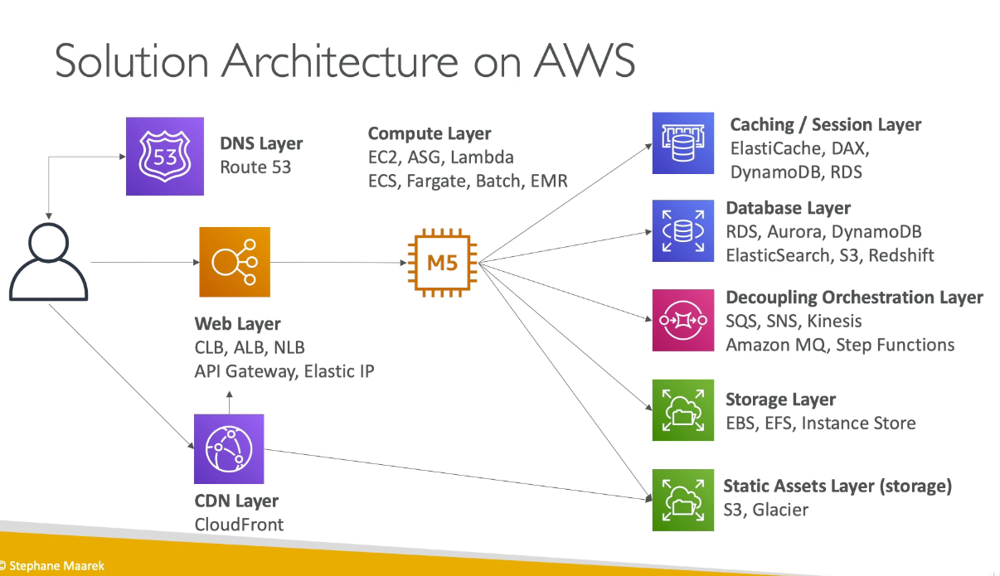
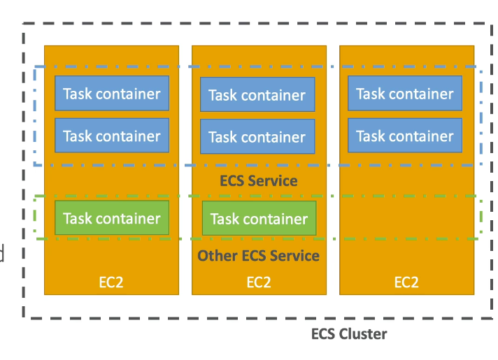
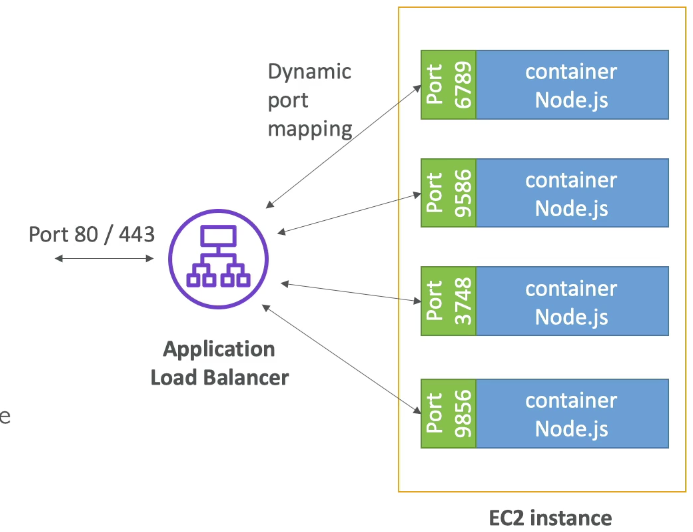
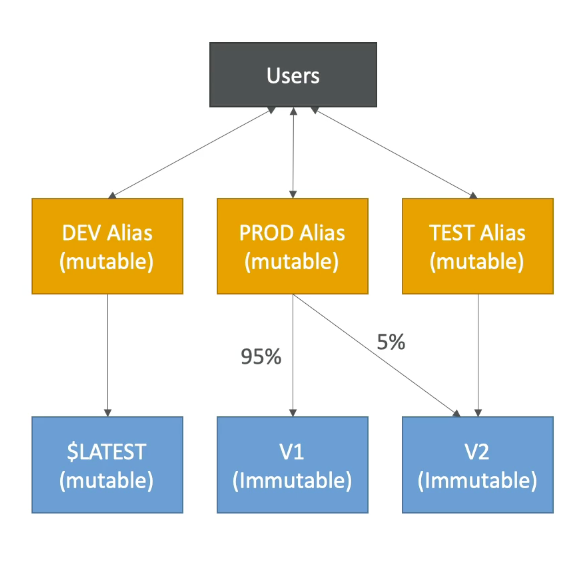
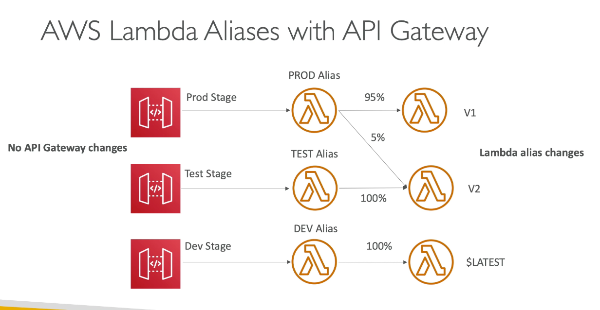
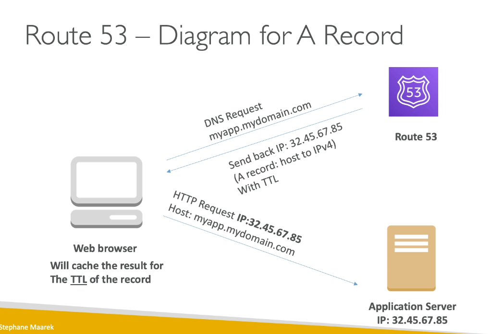
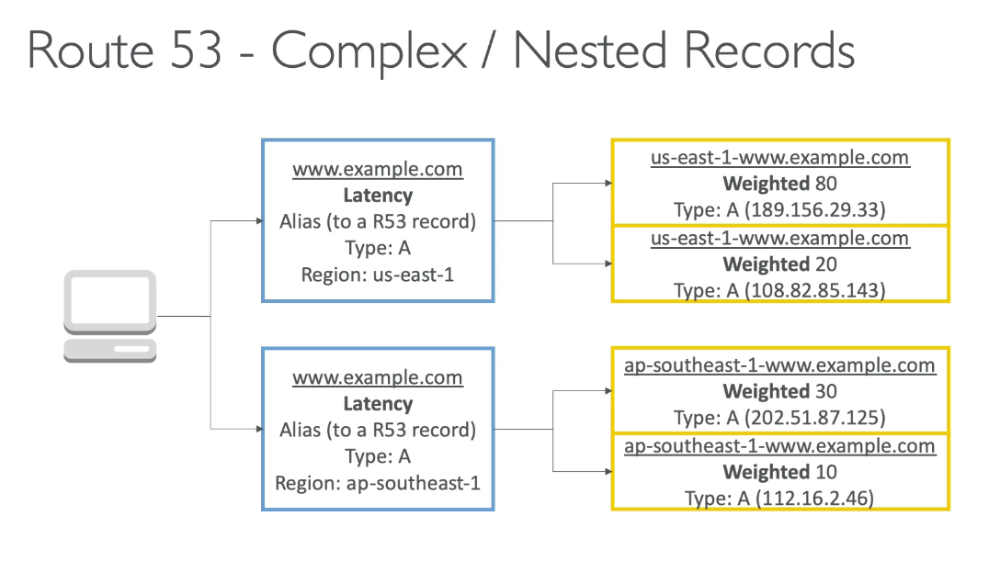
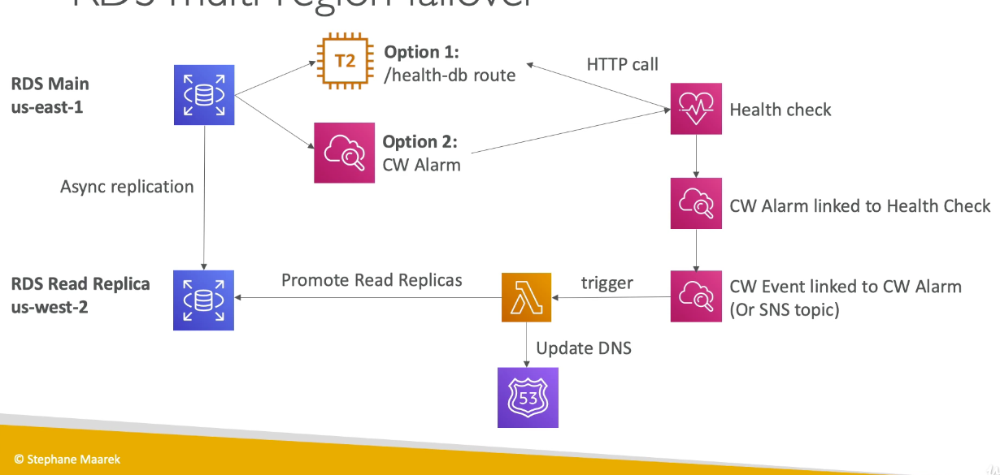
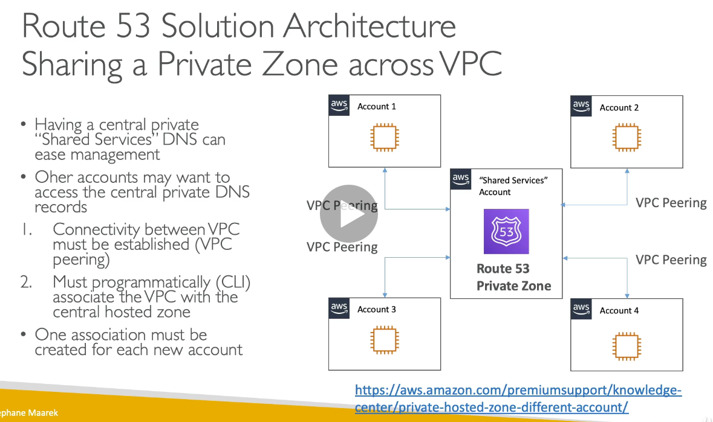

# Chapter 3: Compute and Load balancing

## Solution architecture on AWS



## EC2

### Instance family

1. R: application that need a lot RAM
2. C: application need need good CPU
3. M: application that need medium
4. I: good IO
5. G: Need graphic card
6. T: Burstable instance

### Placement group

1. Cluster: cluster instances into a low-latency group in a single AZ
   1. Same rack, same AZ
   2. Pros: great network
   3. Cons: if rack fails, all instances fails at the same time
   4. Note: Choose instance type that has enhanced networking
2. Spread: spread instances across underlying hardware (Max 7 instances per AZ)
   1. Can span across multilple AZ
   2. Reduced risk of simultaneous failure
   3. EC2 instance are on different physical hardware
   4. Limited to 7 instances per AZ per placement group
3. Partition - spread instances across many different partitions 
   1. AZ will be divided into partition
   2. Up to 7 partition per AZ
   3. Up to 100 of EC2 instances
   4. A partition failure can affect many EC2 but wont affect other partitions
   5. can choose which partition by using meta data
4. Move in/out of a placement group
   1. Stop instance
   2. modify instance placement
   3. start your instance

### Instance launch types

1. On demand instances: short workload, predictable pricing, reliable
2. Spot instances: short workload for cheap, can lose instances
3. Reserved: (Min 1 years)
   1. Reserved instances: long workloads
   2. Convertible reserved instances: long workload with flexible instances
   3. Scheduled reserved instances: every thursday between 3 and 6pm
4. Dedicated instances: no other customer will share your hardware
5. Dedicated hosts: book an entire physical server, control instance placement
   1. Can define host affinity so that instance reboot are kept on the same host
   2. Great for software licenses that operate at the core level

### EC2 included metrics

1. CPU
2. Network
3. Status check
   1. instance status = check EC2 VM
   2. system status = check the underlying hardware
4. Disk: Read/Write
5. **RAM is not included in the AWS EC2 metrics**

### EC2 instance recovery

1. Setup a cloudwatch alarm to monitor StatusCheckFailed_system to perform EC2 instance recovery
   1. Use EC2 instance recovery to recover EC2
   2. Same private, public, elastic ip, metadata, placement group

## Auto scaling

1. Simple/step scaling: increase or decrease based on 2 CW alarms
2. Target tracking: select a metric and a target value - ASG will adjust accordingly
   1. Keep average CPU at 40%
   2. Keep request count per target at 1000
3. To scale based on RAM, you must use CUSTOM cloudwatch metrics
4. Spot fleet suppot (mix on spot and on-demand instances)
   1. Using launch configuration/template
   2. Terminate instances manually
   3. ASG will relaunched instances with new AMI
5. Scheduled scaling actions
   1. Modify ASG settings at pre-defined time (min/max/desired)
   2. Helpful when patterns are known in advance
6. Lifecycle hooks
   1. Perform actions before an instance is in service or before it is terminated
   2. Example: cleanup, log extraction, special health checks

### Scaling process (can be suspended)

1. launch: add a new ec2 instance
2. terminate: remove ec2 instance
3. health check
4. replaceunHealthy
5. AZrebalance
6. AlarmNotification
7. ScheduledActions
8. AddToLoadBalancers

### Health checks

1. EC2 status check
2. ELB health check
3. ASG will launch a new one after terminating an unhealthy one

### Updating an application

1. Create new launch template version and terminate instances with template version 1
   1. Cons: traffic is going to be spread across the different version
2. Create a new auto scaling group
   1. Send small amount of traffic to new ASG
   2. Slowly shift traffic to ASG 2 
3. Create a ALB 2 with new ASG 2
   1. Use route 53 CNAME weighted record
   2. Rely heavily on client to behave correctly - respecting TTL
   3. Pros: Able to test ALB 2 separately

## Spot instances and spot fleet

1. Spot instance can get a discount of up to 90%
2. Defined max spot price 
   1. Hourly spot price varies
   2. If the current spot price > your max price
3. Spot Block
   1. Spot instance during a specific time frame (1 to 6 hours) without interruptions
   2. Instance may be reclaimed

## Spot fleet

1. Collection of spot instances and optionally on-demand instances
2. Set a max price you are willing to pay per spot instances
3. Can have a mix of instance types 
4. Support ASG, ECS (ASG underlying), AWS Batch
5. Soft limit
   1. Target capcity per spot fleet : 10,000
   2. Target capcity across all spot fleet : 100,000

## ECS - Elastic container service

1. Container orchestration service
2. Run docker container on EC2 machines
3. Made up of 
   1. ECS Core: 
   2. Fargate: running ECS tasks on AWS provisioned compute
   3. EKS: Running ecs on AWS powered kubernetes
   4. ECR: registry

### What is docker?

1. Docker is a "container technology"
2. Run a containerized application on any machine with Docker installed
3. Container allows our application to work the same way anywhere
4. Control how much ram and CPU
5. More efficient than virtual machines
6. Scale container up and down very quickly

### Use cases

1. Run Microservices
   1. Mulitple docker container
   2. Easy service discovery feature
   3. Direct integration with ALB
   4. Auto scaling capability
2. Run Batch/scheduled tasks
   1. Schedule ECS container to run on demand/reserved/spot instances
3. Migrate applications to the cloud
   1. Dockerize legacy application
   2. Run on cloud

### Concepts

1. ECS cluster: Set of EC2 instances
2. ECS Service: Applications definition running on ECS cluster
3. ECS tasks + definition
   1. containers running to create the application
4. ECS IAM roles: roles assigned to tasks to interact with AWS



### AWS ECS - ALB integration

1. ALB has a direct integration with ALB called "Port mapping"
2. This allow you to run multiple instances of the same application on the same EC2 machine
   1. Increased resiliency even if running on 1 EC2 instances
   2. Maximize utilization of CPU/COres
   3. Ability to perform rolling upgrades without impact application uptime



### Fargate

1. When launching ECS cluster, we have to create our EC2 instances
2. If we scale, we need to add EC2 instances
3. With fargate, we do not need to provision EC2 instances
4. Increasing the task number, AWS will find a place to run the task

### Security and network

1. IAM security
   1. EC2 instance role have basic ECS permission
   2. ECS task level should have an IAM task role (maximum security)
2. Secrets and configurations injection into parameters, environment variables
3. Task networking
   1. none: no network connectivity
   2. bridge: use Docker virtual container-based network
   3. host: use host network interface
   4. awsvpc:
      1. Every task launched on the instance get its own ENI and a private IP address
      2. Simplified networking, enhanced security, security groups
### Service auto scaling

1. CPU and RAM is tracked in cloudwatch at the ECS service level
2. Target tracking: target a specific average cloudwatch metrics
3. Step scaling: scale base on CW alarms
4. Schedule scaling: based on predictable changes
5. ECS service scaling != ec2 auto scaling

### Spot instances

1. ECS classic
   1. Can have underlying EC2 instances as spot instances
2. Fargate
   1. Add tasks running on fargate spot

## AWS Lambda

1. API gateway
2. Kinesis
3. DynamoDB
4. S3
5. IOT
6. CW events
7. CW logs
8. AWS SNS
9. AWS Cognito
10. AWS SQS

### Serverless architecture

Thumbnail image

```
New image --> S3 --> Lambda --> S3
```

Cron job

```
CW events --> lambda
```

### Lambda support 

1. Node.js/python/ruby/java/goLang/C#
2. Limit
   1. RAM: 128MB to 3GB
   2. CPU: more ram, more CPU (1.5 G get 2 vCPU)
   3. Timeout: 15 minutes
   4. /tmp storage: 512 MB
   5. Deployment package: 250 MB
   6. Concurrency execution: 1000 

### Latencies consideration

1. lambda latency
   1. Cold invocation: ~100ms
   2. warm invocation: ~ms
   3. provisioned concurrency: keep a small number of lambda warmed
2. API gateway 
   1. invocation: 100ms
3. Cloudfront
   1. invocation: 100ms
4. X ray can help visualize the end-to-end latency

### Lambda - security

1. IAM roles for lambda to grant access to other AWS service
2. Resource-based policies for lambda
   1. Allow other account to invoke or manage lambda
   2. Allow other services to invoke or manage lambda

### Lambda - VPC

1. Default lambda deploy in AWS Cloud
   1. Able to talk to the internet and dynamoDB
2. However, if you have a private RDS, you wont be able to access it
3. Solution: Launch lambda in VPC and connect to private RDS
4. Lambda cannot access external API and hence need to have a NAT + IGW to talk to external API
5. For dynamoDB, we can create a VPC gateway endpoint 
   1. Provide a private route to DynamoDB
6. Cloudwatch logs works even without endpoint or NAT Gateway

### Logging monitoring and tracing

1. Cloudwatch
   1. AWS lambda logs are stored in AWS cloudwatch logs
   2. Lambda metrics are displayed in AWS cloudwatch metrics
   3. Make sure your AWS Lambda functions has an execution role with an IAM policy that authorizes writes to Cloudwatch logs
2. X-ray
   1. possible to trace lambda with X-ray
   2. Enable in lambda configuration (runs X-ray daemon)
   3. Use AWS SDK in code
   4. Ensure lambda function has correct IAM execution role

### Invocation

1. Synchronous: CLI, SDK, API gateway
   1. Result is returned right away
   2. Error handling must happen on client side (exponential backoff, retries)
2. Asynchronous invocation: S3, SNS, Cloudwatch events
   1. Lambda attempt to retry on errors (3 tries)
   2. Make sure the process is idempontent
   3. Can defined a DLQ for failed processing
3. Event source mapping: kinesis data stream, SQS, SQS FIFO queue, DynamoDB streams
   1. records needs to be polled from source
   2. All records respect ordering except SQS
   3. If error, entire batch is reprocessed until success
      1. Implication: for kinesis, dynamoDB stream - it will stop shard processing due to in-order
      2. SQS Fifo: will stop unless a DLQ has been defined
   4. Must be idempotent

### Destination

1. Lambda can send results to destinations.
2. asynchronous invocations
   1. Both success and failed events can be sent to SQS, SNS Lambda and EventBridge bus
3. Event source mapping
   1. Only discarded event batches can be sent to SQS and SNS
   2. Can also send to DLQ from SQS

### Lambda Version

1. Work on a Lambda function, work on $LATEST$
2. Versions are immutable (increase version numbers)
3. Each version has their own ARN

### Lambda aliases

1. Aliases are pointer to lambda function version
2. Defined "dev", "test", "prod"
3. Aliases are mutable
4. Aliases enable blue/green deployment by assigning weight to lambda functions
5. Aliases have their own ARN





### Code deploy

1. Code deploy can help you automate traffic shift for Lambda aliases
2. Feature is integrated within the SAM framework
   1. Linear: grow traffic every N minutes until 100%
      1. Liner10PercentEvery3Minutes
      2. Liner10PercentEvery10Minutes
   2. Canary: try x percent than 100%
   3. AllAtOnce: immediate
3. Can create pre & post traffic hooks to check the health of the lambda function to help roll-back if anything is wrong

## Load balancers

1. Classic load balancer
   1. Http, Https, TCP
2. Application Load Balancer
   1. HTTP, HTTPS, Websocket
3. Network Load Balancer
   1. TCP, TLS & UDP
4. Can setup internal or external ELB

### Classic load balancer

1. Client --> listener (CLB) --> Internal (EC2)
2. Health check can be HTTP (L7) or TCP (L4)
3. SSL can have many Subject Alternate Name (SAN) but the SSL certificate must be changed anytime a SAN is added/edited/removed
4. Better to use ALB with SNI (Server name indication)
5. Can use multiple CLB if you want distinct SSL certificates
6. TCP -> TCP passes all traffic to EC2 instances
   1. Only way to implement 2 way SSL authentication


### Application Load Balancer

1. Load balancing to multiple HTTP application across machines
2. Load balancing to multiple appliations on the same machine 
3. Support for HTTP/2 and Websocket
4. Support for redirect (HTTP to HTTPS)


#### Target Group

1. Route base on path in URL
2. Route base on hostname in URL
3. Route base on query string header
4. ALB are a great fit for micro service 
5. Has a port mapping feature to redirect to a dynamic port in ECS
6. Types of target group
   1. EC2 instances
   2. ECS tasks (managed by ECS)
   3. Lambda functions
   4. IP address - must be private IPs
   5. ALB can route to multiple groups
   6. Health check is done on the target group level
7. SSL certificate
   1. Support multiple listener
   2. Support SNI - Server Name Indication


### Network load balancer

1.  Forward TCP/UDP traffic to instance
2.  Millions of request per seconds
3.  NLB has 1 static IP per AZ and supports assigning Elastic IP
4.  Less latency ~ 100ms (400ms for ALB)
5.  Support for TLS/Websockets
6.  Use case: extreme performance, TCP or UDP traffic, AWS private link
7.  Target group
    1.  EC2 instances
    2.  ECS tasks
    3.  IP address
8.  Proxy protocol
    1.  send additional information such as source
    2.  preparents a proxy protocol header to retrieve source IP address of the originating client
  
### Cross zone load balancing

1. With cross zone load balancing: each load balancer instance distributes evently across all registered instances in all AZ
2. Otherwise, LB distribute request evently across registered instances in its AZ only
3. CLB
   1. disabled by default
   2. No charges for inter AZ if enabled
4. ALB
   1. Always on
   2. No charges for inter AZ
5. NLB
   1. Disabled by default
   2. you pay charges for inter AZ

### Load balancer stickiness

1. It is possible to implement stickiness so that the same client is always redirected to the same instance behind a LA
2. Cookie used for stickiness has an expiration date you control
3. Alternative, cache session data in elasticCache, DynamoDB

## API gateway

1. Help expose lambda, http and AW services as an API
2. provides
   1. API versioning
   2. authorization
   3. traffic management (API keys, throttles)
   4. huge scale
   5. serverless
   6. req/resp transformation
   7. OpenAPI spec
   8. CORS
3. Limit
   1. 29 seconds timeout
   2. 10 MB max payload size

### Deployment stages

1. API changes are deployed to "Stages"
2. stages can be roll back as a history of deployment 

### Integration

1. HTTP
   1. Expose HTTP endpoints in the backend (ALB)
   2. Rate limit, caching, user authentications
2. Lambda function
   1. invoke
   2. expose REST API backed by lambda
3. AWS Service
   1. Expose any AWS API through API gateway
   2. i.e. start a step function, post a message to SQS
   3. Why? Add authentication, deploy publicly, rate control
   
### Solution architect discussion

#### API gateway in front of S3

Problem:

```
API gateway --> proxy --> S3
```

Limit: 10 MB payload

Solution
```
Client --> API gateway --> invoke --> lambda (generate pre-signed URL)
Client --> pre-signed URL --> upload to S3
```

### API gateway - ednpoint types

1. Edge-optimized (default)
   1. Request are routed through cloudfront edge locations
   2. API gateway still lives in one region
2. Regional
   1. For client within same region
   2. Could manually combine with Cloudfront (control caching)
3. Private
   1. Can only be accessed from VPC using an interface VPC endpoint (ENI)
   2. Use a resource policy to define access

### Cache API responses

1. Caching reduces the number of calls made to backend
2. Default TTL: 300 seconds (5 mins)
3. Caches are defined per stage
4. possible to override cache settings per method
5. Client can invalidate cache with header: Cache-Control: max-age=0 (with proper IAM authentication)
6. Flush cache entirely
7. Cache encryption option
8. Cache capcity between 0.5 to 237 GB

### API gateway errors

1. 4XX means client error
   1. 400: Bad request
   2. 403: Access denied
   3. 429: Quota exceeded, Throttle
2. 5xx means server errors
   1. 502: Bad gateway exceptions
   2. 503: service unavailable
   3. 504: Integration failure - i.e gateway timeout (29 second)

### Security

1. SSL certificate to API gateway
2. Resource policy
   1. AWS accounts, IP, CIDR blocks, VPC, VPC endpoints
3. IAM execution roles for API gateway at the API level
4. CORS

### Authentication

1. IAM based access
   1. Passed IAM credentials in headers through Sig V4
2. Lambda Authorizer
   1. use Lambda to verify OAuth/ SAML/ 3rd party
3. Cognito User pools
   1. Client authenticate with cognito
   2. Client passes the token to api gateway
   3. API gateway knows how to verify the token
   4. Pass identity to lambda

### API gateway - loggin, monitoring, tracing

1. Cloudwatch logs
   1. Enable cloudwatch logging at the stage level
   2. can log full requests
   3. Can send API gateway access logs
   4. can send logs directly into Kinesis Data Firehose
2. Cloudwatch Metrics
   1. Metrics are by stage, possibility to enable detailed metrics
   2. IntegrationLatency, Latency, CacheHitCount, CacheMissCount
3. X-Ray
   1. Enable tracing to get extra information abount request in API gateway

## Route 53

### Records

1. Managed DNS 
2. A: hostname to IPv4
3. AAAA: hostname to IP6
4. CNAME: hostname to hostname
5. alias: hostname to AWS resources
   1. Use for CLB, ALB, NLB, Cloudfront, S3 bucket, Elastic beanstalk
   2. can be used for root apex record


#### Diagram for A record



1. DNS Cache for TTL duration in web browser
2. TTL is mandatory for each DNS record

### Simple Routing policy

1. Map a hostname to a single resource
2. You cannot attach health checks to simple routing policy
3. Client will choose 1 randomly if more than 1 is return

### Weighted routing policy

1. Control the % of the requests that go to specific endpoint
2. Helpful to test % of traffic on new app version
3. Helpful to split traffic between 2 regions - load balancing
4. Can be associated with Health Checks
5. Does not need to be sum up to 100%

### Failover routing policy (Active - passive)

1. If primary health check records fails, it will failover to secondary IP address

### Latency routing policy

1. redirect to the server that has the least latency close ot us
2. Super helpful when latency of user is a priority
3. Has a failover capability if you enable health check

### Geo location routing policy

1. Routing based on user location
2. Create a "default" policy in case there is no match on location

### Route 53 - complex/nested records

1. Use case: figure out lowest latency then redirect to another 53 record



### Multivalue routing policy

1. Up to 8 healthy records are returned for each multi value query
2. Multivalue is not a subsitute for having an ELB

### Good to know

1. Private DNS
   1. Can use Route 53 for internal private DNS
   2. Must enable the VPC settings enableDNSHostNames and enableDNSSupport
2. DNSSEC 
   1. for domain registration
   2. does not support for DNS service

### Health check

1. health check --> automated DNS failover
   1. Health checks monitor endpoint
   2. Health check that monitor other health checks
   3. Health check that monitor cloudwatch alarms - i.e. throttles of DynamoDB, alarm on RDS, custom metrics
   4. Health checks are integrated with CW metrics
2. Health checks can be setup to pass/fail base on text in the first 5120 bytes
3. Health check pass only with 2xx and 3xx
4. Calculated health checks
   1. Create separate individual health checks
   2. Specify how many of the health checks need to be passed


#### Private Hosted zones

1. Route 53 health checkers are outside the VPC
2. They cannot access private endpoints
3. Solution:
   1. Create a cloudwatch metrics and associate an alarm
      1. Use health check to check the alarm
   2. Make a resource public
   3. Configure health checker to check on its dependencies that is public such as the database server

### Health checks RDS multi-region failover



### Share a private zone across VPC




### Comparison of solution architect

#### EC2 on its own with Elastic IP

1. attached elastic IP address to a standby instance if primary failover
2. Client does not see the change happen

#### Stateless web app - scaling horizontally

1. "DNS based load balancing"
2. Ability to use multiple instances
3. DNS TTL implies client may get outdated

#### ALB + ASG

1. Time to scale is slow 
2. Users are not sent to instance that are out of service
3. ALB is elastic but cannot handle sudden, huge peak of demand
4. Cloudwatch used for autoscaling
5. Cross-zone balancing for even traffic distribution
6. Target Utilization should be between 40% to 70%

#### ALB + ECS on EC2 (backed by ASG)

1. ASG + ECS allows to have dynamic port mapping
2. Maximize utilization of a instance
3. Tough to orchestrate ECS service auto scaling + ASG auto-scaling

#### ALB + ECS on Fargate

1. Application run on docker
2. Service auto scaling is easy
3. No need to launch an EC2 instance in advance
4. Limited by ALB in case of sudden peaks
5. "Managed" load balancer
6. "serverless" application layer

#### ALB + Lambda

1. Limited to Lambda's runtime
2. Seamless scaling thanks to Lambda
3. Simple way to expose lambda functions as HTTP/S without all the features from API gateway
4. Can combine with WAF
5. Good for microservices
6. Use ECS for some request/use lambda for other

#### API gateway + lambda

1. Pay per request, seamless scaling, fully serverless
2. Soft limit
3. API gateway features, authentication
4. Lambda cold start time
5. Fully integrated with X-ray

#### API Gateway  + AWS Service

1. API gateway --> Lambda --> SQS (Not recommended)
2. API gateway --> SQS (recommended)
   1. Cheaper
   2. Less latency
3. Limit: API gateway has a limit of 10mb

#### API gateway + HTTP backend


