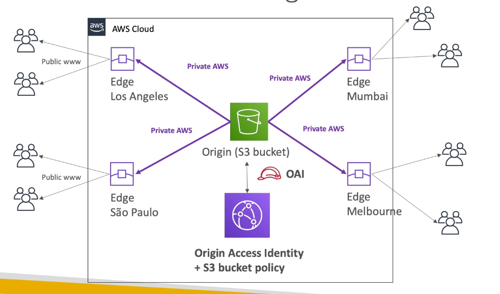

# Chapter 5: cloudfront

## AWS Cloudfront

1. Content delivery Network
2. DDoS protection, integratio with shield and AWS WAF
3. Can expose external HTTPS and can talk to internal HTTPS backend

### Origin

1. S3 bucket
   1. Distribute file
   2. Enhance security with cloudfront origin access
   3. cloudfront can be used as an ingress
2. S3 website
   1. Must first enabled the bucket as a static S3 website
3. Custom Origin  (HTTP)
   1. ALB
   2. EC2 instance
   3. API gateway
   4. Any HTTP backend (on-premise)
4. Possibility to have a primary and secondary origin (HA - failover)

### S3 as an origin

1. Use OAI (Origin access identity) + S3 bucket policy, forces the only way to distribute S3 content is through cloudfont
   

### EC2 or ALB as an origin

1. EC2/ALB must be public
2. Security Group must allow the public IP of edge locations

### Cloudfront vs S3 cross region replication

1. Cloudfront
   1. Global edge network
   2. Files are cached for a TTL
   3. Great for static content
2. S3 Cross region replication
   1. Files are updated in near real-time
   2. read-only
   3. Must be setup for each region you want
   4. Great for dynamic content that needs to be available at low latency in few regions

### Cloudfront geo restriction

1. Restrict access using approved countries or banned countries
2. Country is determined using a 3rd party geo-ip database
3. Use case: Copyright laws to control access to content

### Cloudfront signed URL / signed cookies

1. Use case: Distribute paid shared content to premium users over the world
2. We can use Cloudfront Signed URL/Cookie
   1. Include URL expiration
   2. Include IP ranges to access the data
   3. Trusted signers
3. How long should the URL be valid for?
   1. Shared content: short (few minutes)
   2. Private content: years
4. Signed URL : Access to individual files (1 signed url per file)
5. Signed cookies: Access to multiple files (1 signed cookie for many files)
6. How to generate signed URL
   1. Client --> Application --> Authenticate + Authorize --> Generate signed URL --> return signed URL
   2. Client --> Use Signed URL --> Cloudfront --> OAI --> S3

#### What is the difference between cloudfront signed URL vs S3 pre-signed URL

1. Cloudfront
   1. Cloudfront signed URL allow access to a path regardless of origin
   2. Can filter by IP, path, date, expiration
   3. Leverage caching features
2. S3 presigned URL
   1. issue a request as the person who pre-signed URL
   2. Uses the IAM key of the signing IAM principal
   3. Limited lifetime

### Caching

1. metadata
   1. headers
   2. session cookies
   3. query string parameters
2. Cache lives at each cloudfront Edge Location
3. Maximize cache hit rate to minimize request on origin
4. Control TTL (0 seconds to 1 year) - set from origin : cache-control

### Whitelist headers

1. Select header that is not changed often so that it can used as a cache index

### Separate static and dynamic content in distribution

1. All static content will go to S3 (Maximize cache hits)
2. Dynamic content cached based on correct header and cookie 

### Cloudfront caching vs API gateway caching

1. Client --> Edge location --> API gateway Edge
2. Client --> Cloudfront --> API gateway Regional 
   1. More control on the caching
   2. Can disable cache in API gateway

### Lambda@Edge

1. Deploy lambda alongside with Cloudfront CDN
   1. Build more responsive applications
   2. Serverless
   3. Pay only as you use
2. Able to change request and response
   1. After Cloudfront receives a request from a viewer (viewer request)
   2. Before Cloudfront forwards the request to origin (origin request)
   3. After Cloudfront receives the response from origin (origin response)
   4. Before Cloudfromt forward the response to the viewer (viewer response)
3. Able to generate response to viewers without sending to origin
4. Does not have cache, it is used to change request/response
5. Use case
   1. Check authentication/authorization
   2. 
   3. A/B testing
   4. Website security and privacy
   5. Increase cache hit ratio by modify headers, normalize user-agent
   6. bot mitigation at edge

### HTTPS configuration and Host (Different hostname)

1. Not forwarding host-header to ALB because it is different
2. 2 SSL certificate to manage

### HTTPS configuration and Host (Same hostname; DOES NOT WORK)

1. Cloudfront will forward the request to itself

### HTTPS configuration and Host (Will work)

1. 1 SSL certificate to manage
2. SSL cert is the same one as Cloudfront
3. Hostname address is different so Cloudfront is able to redirect traffic to hostname

### Amazon ElasticCache

1. Managed Redis/Memcached
2. Help reduce load off databases for read intensive workloads
3. Help make application stateless
4. AWS take care of OS maintenance, monitoring, failure recovery and backups
5. Use ElasticCache requires heavy application code changes

#### Use cases

1. DB cache (offload database loads)
   1. Lazy loading: Application queries elastic cache, if not available, get from RDS
   2. Requires cache invalidation strategy 
2. User session store (stateless application)
   1. Writes session data into elastic cache

### Redis vs MemecacheD

1. Redis
   1. Multi AZ with auto failover
   2. Read replicas to scale reads and have high availability
   3. Persiste, data durability
      1. Read only file feature (AOF)
      2. backup and restore feature
2. Memcached
   1. Multi node for partiioning data (sharded)
   2. Non persistent
   3. No backup and restore
   4. Multi threaded architecture

### Handling extreme rates

