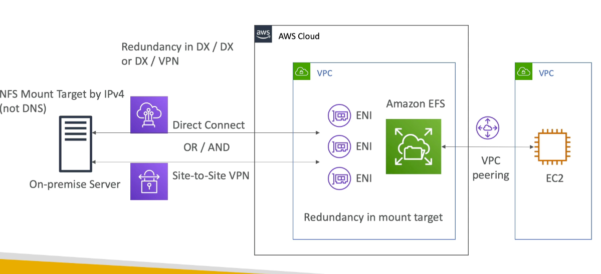
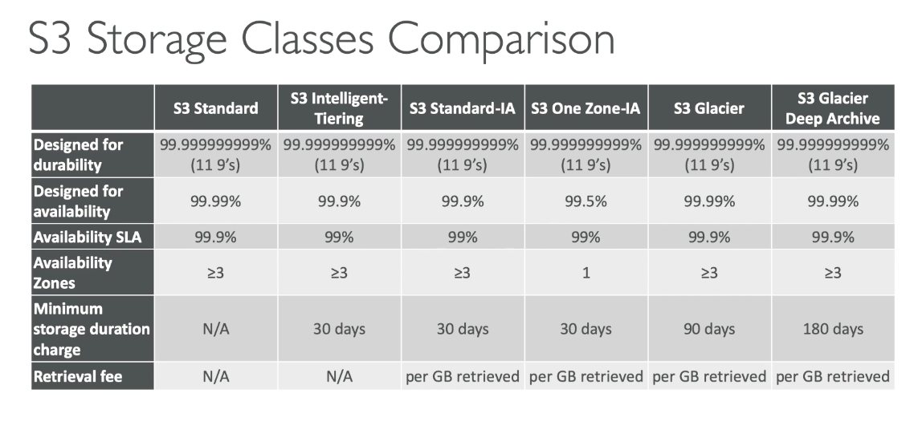
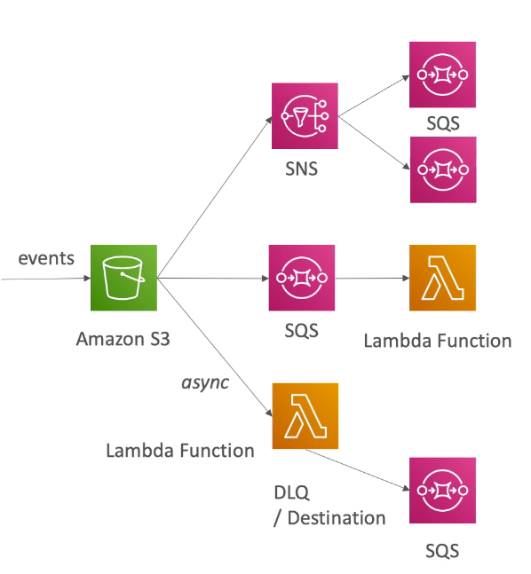
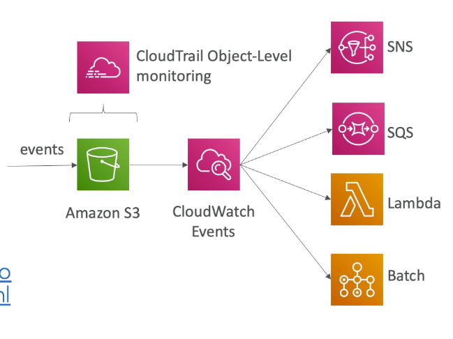
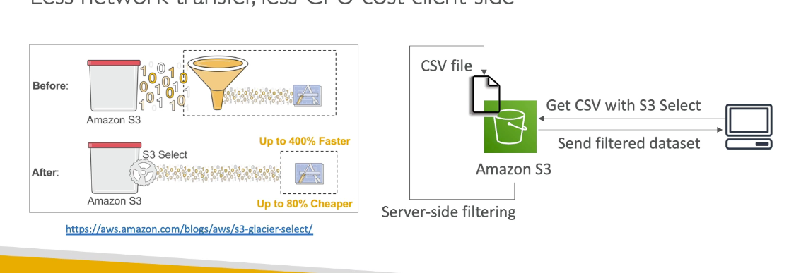
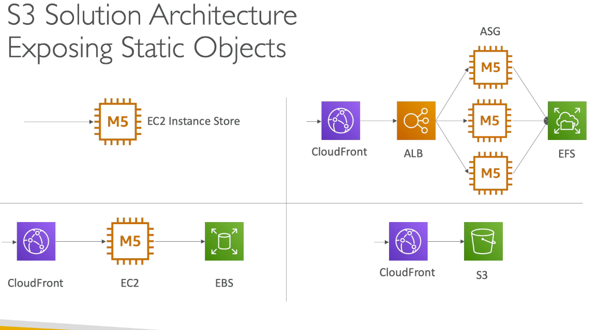
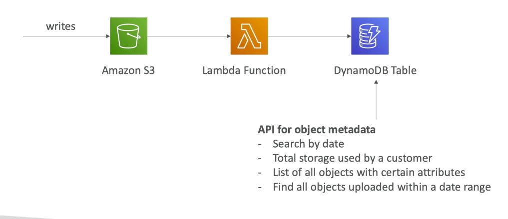
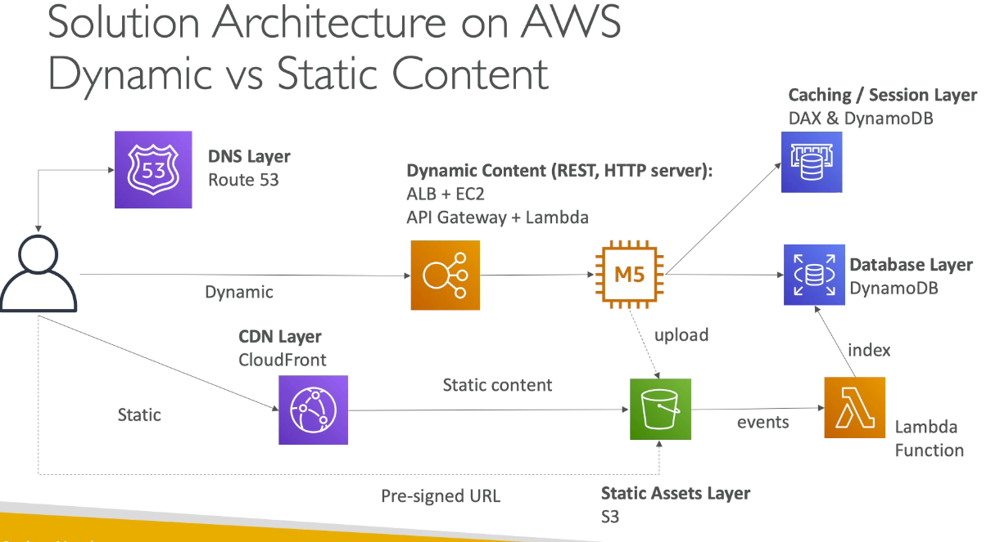

# Chapter 4: Storage

## EBS

1. Network drive attach to 1 instance only
2. Link to a specific AZ 
   1. To move, you will need to do a snapshot and restore
3. Volumes can be resized
4. Make sure to choose an instance type that is EBS optimized to enjoy maximum performance

### Volume Types

1. gp2
   1. 3 IOPS/GiB, min 100 IOPS, burst to 3000 IOPS, maximum  16000 IOPS
   2. 1 GiB - 16 TiB 
   3. For 1 TB added, you get 3000 IOPS
2. io 1: provision IOPS (expensive)
   1. min 100 IOPS, max 64000 IOPS (Nitro) or 32000 (Others)
   2. 4 GiB - 16 TiB: size of volume and IOPS are independent
3. st 1: throughput optimized HDD
   1. 500 GiB - 16 TiB, 500 MiB/s throughput
4. sc 1: Cold HDD
   1. 250 GiB - 16 TiB, 250 MiB/s throughput

### Raid configurations

1. Raid 0 
   1. add (EBS volume 1 + volume 2)
   2. twice as much performance 
2. Raid 1  
   1. mirror (every write will go to volume 1 and 2)
   2. same performance

### EBS snapshot

1. Incremental - only backup changed blocks
2. EBS backup uses IO and shouldn't run while application is handling a lot of traffic
3. Snapshot will be stored in S3
4. Not necessary to detach volume to do snapshot
5. Can copy snapshot across region (for DR)
6. Can create AMI for snapshot
7. EBS volumes restored by snapshots need to be pre-warmed (use dd to read the entire volume)
**8. Snapshot can be automated using Amazon Data Lifecycle Manager**

### Local EC2 instance store

1. physical disk attached to the physical server where you EC2 is
2. Very high IOPS
3. Disks up to 7.5 TiB
4. Block storage
5. Cannot be increase in size
6. Risk of data loss if hardware fail

### EBS vs Instance store

1. Some instance do not come with Root EBS volumes
2. Instance store is physically attached to the machines
3. Pros for instance store:
   1. Better I/O performance 
   2. Good for buffere/cache
   3. Data survives reboots
4. Cons
   1. On stop or termination, instance store is lost
   2. You cannot resize instance store
   3. Backup must be operated by the user

### EFS

1. Use cases: content management, web server, data sharing, wordpress
2. Compatible with Linux based AMI, POSIX-compliant
3. Use NFSv4.1
4. Use security group to control access to EFS
5. Encryption at rest with KMS
6. Can only attached to 1 VPC, create 1 ENI target per AZ

#### Performance

1. scale to 1000s of concurrent NFS client, 10GB /s
2. grow to Petabyte-scale
3. Performance mode
   1. General puporse
   2. Max I/O
4. Throughput Mode
   1. Bursting Mode - linked to File system size
   2. Provisioned IO Mode: High throughput to storage ratio
5. Storage Tier
   1. Standard: frequent access file
   2. Infrequent Access: higher cost to retrieve the file, lower price point

### On-premise & VPC peering

## S3

1. Object storage, serverless, unlimited storage, pay as you go
2. Good to store static content
3. Access object by key, no indexing
4. Not a file system, cannot be mounted natively on EC2

### Anti pattern (DONT USE S3 for)

1. Lots of small files
2. POSIX file system, file locks
3. Search features, queries, rapidly changing data
4. Website with dynamic content

### Storage class

1. Can transition objects between tiers using S3 Lifecycle policy

### replication

1. Cross region replication
2. Same region replication
3. Combine with life cycle polices
4. Why?
   1. reduce latency
   2. disaster recover
   3. security
**5. Need to enable S3 bucket versioning for replication**

### S3 event notifications

1. Object name filtering possilbe (*.jpb)
2. Can invoke SNS, SQS and Lambda
3. It is possible to get only 1 notifications for 2 write that happen at the same time, to overcome this, you will need to enable versioning

### S3 - Cloudwatch events

1. By default, cloudtrail record S3 bucket level API
2. Cloudtrail logs for object-level S3 can be enabled
3. This help generate event for GetObject,PutObject,DeleteObject

### Baseline

1. Automatically scales to high request rates, latency 100-200 ms
2. Can achieve at least 3500 PUT/COPY/POST/DELETE and 5500 GET/HEAD request per second per prefix in a bucket
3. No limit to the number of prefix

#### What is a prefix?

bucket/folder1/sub1 => /folder1/sub1
bucket/folder1/sub2 => /folder1/sub2

### S3 performance

1. Upload
   1. Multi-part upload
      1. Recommend for files > 100MB
      2. Must use for files > 5GB
      3. Can help parallelize uploads (speed up transfers)
   2. S3 transfer acceleration
      1. Increase transfer speed by transferring file to an AWS edge location which will forward data to S3 bucket
      2. Compatible with multi-part
2. Download
   1. S3 Byte-range fetches
      1. Parallelize GET by requesting specific byte ranges
      2. Better resilience in case of failures 
      3. Can be used to retrieved only partial data
   2. S3 Select and Glacier Select
      1. Retreive less data using SQL by performing server side filtering
      2. Can filter by rows and columns
      3. Less network transfer, less CPU cost client side
   

## Solution Architect

### How to expose static object?
1. Use EC2 instance 
   1. Not very scalable 
2. Use Cloudfront --> EC2 --> EBS
   1. Able to cache static asset
3. Use cloudfront --> ALB --> EC2 instances --> EFS
   1. Expensive
4. Cloudfront --> S3
   1. Highly recommended

### Indexing objects in DynamoDB

1. S3 has no indexing capability
2. Use DynamoDB Table to store object metadata
3. S3 --> Lambda --> DynamoDBTable

### Dynamic vs static content

