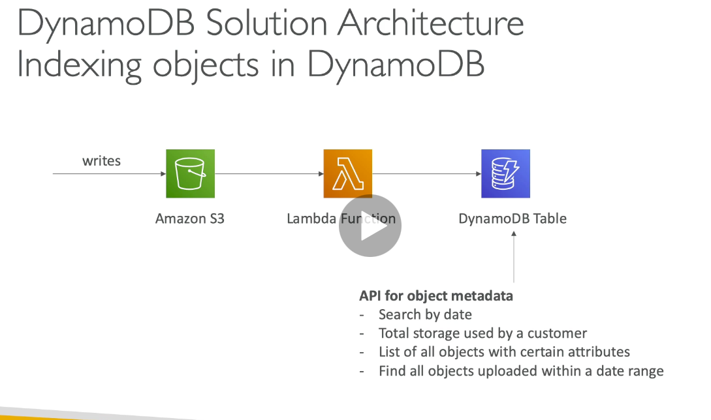
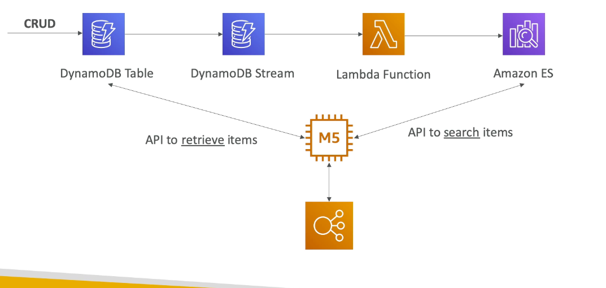
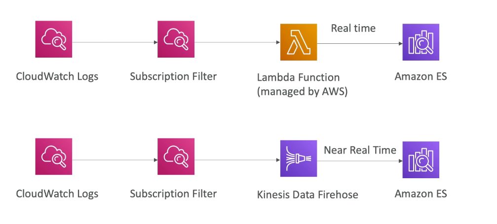
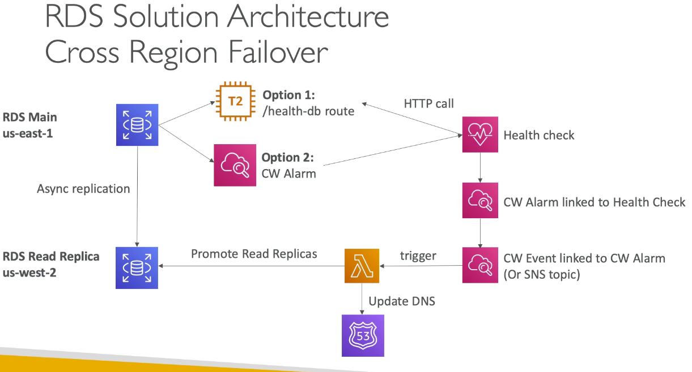

# Chapter 6: database

## DynamoDB

1. NoSQL, fully managed, (1 million request per second)
2. Similar to Apache Cassandra (can migrate to DynamoDB)
3. No disk space to provision, max object size is 400KB --> to store bigger object, use S3
4. Capacity: provisioned (write/reacd capacity unit, auto-scaling) or on-demand (if you do not not your patterns)
5. Support CRUD 
   1. Read can be eventual or strong consistency
6. Supports transaction (ACID support)
7. Backup available, point in time recovery
8. Integrated with IAM for security

### Basic

1. Made of tables
2. Each table has a primary key
3. Can have infinite number of items (rows)
4. Each item has attributes (can be dynamically added)
5. Max size is 400KB
6. Data supports
   1. Number binary, boolean, list, map, null

### Primary keys

1. Partition key (HASH)
   1. Must be unique and diverse so that it is distributed
2. Partition key + sort key
   1. The combination must be unique
   2. partition key can be the same
   3. Data is grouped by partition key
   4. common use of sortkey: timestamp, gameId

### Indexes

1. LSI - Local secondary index
   1. Primary key + alternative sort key
   2. Must be defined at table creation time
2. GSI - Global secondary index
   1. Change primary key and optional sort sort
   2. Can be defined after the table is created
3. If you want to query dynamoDB, you need to ensure there is an index created

### Important features

1. TTL automatically expire row after a epoch date
2. DynamoDB streams
   1. react to changes to dynamoDB tables in real time
   2. Can be read by Lambda, EC2
   3. 24 hours retention of data
3. Global tables
   1. Replicated across region
   2. Active active replication
   3. Enable dynamoDB stream
   4. Useful for low latency, DR purposes

### Indexing object in DynamoDB

1. Store meta data of S3 object to DynamoDB

### DAX - DynamoDB accelerator

1. Seamless cache for DynamoDB, no application re-write
2. Writes go through DAX to DynamoDB
3. Micro second latency for cached reads and queries
4. Solves hot key problem
5. 5 minutes TTL for cache by default
6. Up to 10 nodes in the cluster
7. Multi AZ (3 nodes mim for production)

### DAX or elastic cache

1. Client --> DynamoDB : Use DAX (individual object cache)
2. Client --> store aggregation results --> Elastic cache

## Elastic Search

1. Managed version of ElasticSearch
2. Need to run on server
3. Use cases
   1. Log analytics
   2. Indexing
   3. Full text search

### Elastic search + kibana + logstash

1. Elastic search: provide search and indexing capability
2. Kibana
   1. Provide real-time dashboard
3. Logstash
   1. log ingestion mechanism

### Elastic search patterns - dynamoDB

## RDS

1. Managed DB: provisioning, backups
2. Launched within a VPC
3. Storage by EBS (gp2 or io1)
4. Backups: automated with point in time recovery. backup expire
5. Snapshop: Manual
6. RDS events: get notfied via SNS for events
7. Multi AZ: standby instance for failover in case of outage
8. Read replica: eventual consistency - cross regions

### Security

1. KMS encryption at rest for underlying EBS volumnes/snapshots
2. Transparent Data Encryption for Oracle and SQL server
3. SSL encryption to RDS
4. IAM authentication to mySQL and postgreSQL
5. Authorization happens within RDS (not in IAM)
6. Copy an unencrypted snapshot to an encrypted one
7. Cloudtrail cannot be used to track queries made in RDS

### Solution architect

## Aurora

1. postgreSQL and mySQL compatible
2. Automatically grow storage to 64 TB, 6 copies of data and multi AZ
3. Create up to 15 read replicas with reader endpoint
4. Cross region RR: entire database is copied 
5. Load/offload data directly from/to S3: efficient use of resource
6. Backup, snapshot and restore

### High availability and read scaling

1. 6 copies of your data across 3 AZ
2. Storage is striped across 100s of volumes
3. 6 copies of your data across 3 AZ
   1. 4/6 needed for writes
   2. 3/6 for reads
4. Automated failover for master in less than 30s
5. Master + up to 15 aurora read replicas serve reads
6. Support for cross region replication

### Aurora serverless

1. Automated database instantiation and auto scaling based on actual usage
2. No capacity planning
3. Good for infrequent, intermitten or unpredictable workloads
4. Pay per second, can be more cost-effective

### Global aurora

1. Global database
   1. 1 Primary region
   2. Up to 5 secondary regions
   3. 16 read replica per secondary region
   4. RTO <1 minute to promote another region to master

### Auora multi-master
1. Every aurora node can do read and write
