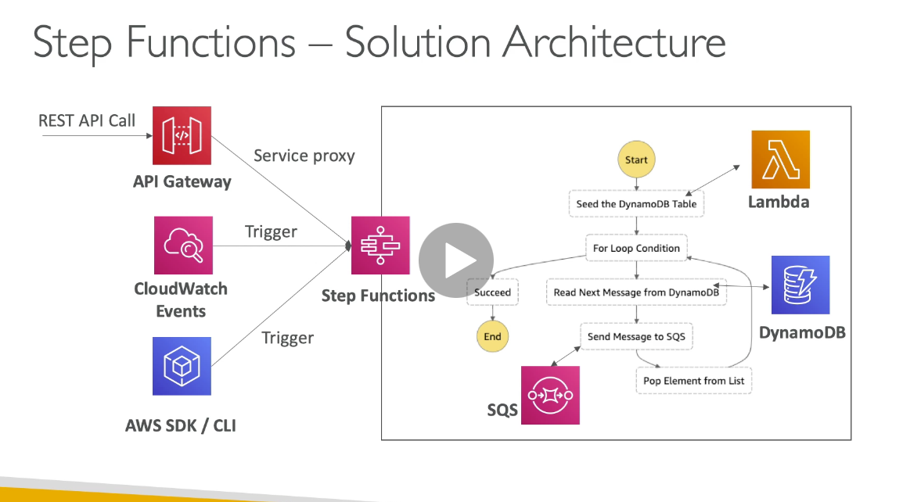
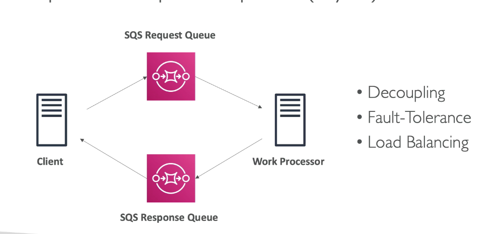

# Chapter 7: service communication

## Step functions

1. Build serverless visual workflow to orchestrate lambda functions
2. Represent flow as a JSON state machine
3. Maximum execution time of 1 year
4. Able to implement human approval feature
5. There will be added latency to pass calls
6. Tasks
   1. Lambda task: invoke tasks
   2. Activity task: setup activity worker (HTTP), ec2 instances, mobile devices
      1. Poll step function service
   3. Service task
      1. Connnected to a supported AWS service
      2. ECS task, fargate, dynamoDB, batch job, sns topic, sqs queue
   4. Wait task
      1. To wait for a duration or until a timestamp

## AWS SWF (Simple workflow service)

1. Coordinate work among application
2. Code run on EC2 (not serverless)
3. 1 year max run time
4. Activity step and decision step
5. Built-in human intervention step
6. Step function is recommended except:
   1. External signals to intervene in the process
   2. Child processes that return values to parent processes
   3. Need to use Amazon Mechnical Turk

## AWS SQS

1. Serverless, managed queue, integrated with IAM
2. Extreme scale
3. Main purpose is to decouple services
4. Max message size is 256 kb
   1. Use a pointer to S3 for large messages
5. Can be read from EC2, lambda
6. SQS to use as a write buffer for DynamoDB/RDS
7. SQS FIFO
   1. receive messages in order they were sent
   2. 300 message/s without batching, 3000 messages/s

### Idempotency

1. Message can be processed twice by consumer (in case of failure)
2. Consumer will have to implement idempotent
3. Same action done twice by the consumer won't duplicate the effect

### Event source mapping

1. Lambda (will use long polling)
2. Specify batch size (1 - 10 messages)
3. Recommended: set the queue visibility timeout to 6x the timout of your lambda function
4. To use a DLQ, setup on the SQS queue and not Lambda (Lamda DLQ is only for asynchronous invocation, trigger from SNS or Cloudwatch)
5. Use a lambda destination for failures

## Amazon MQ

1. SQS, SNS are cloud-native services, they use propreietary protocols
2. Use open protocols: MQTT, AMQP, Openwire
3. Amazon MQ is Managed Apache Active MQ
4. It is not serverless, can run in HA
5. Has both queue feature and topic feature

## SNS

1. Send 1 message to many receivers
2. Event producer only send messages to 1 SNS topic
3. Many event receivers can subscribe to SNS topic
4. Each subscriber will receive all message (new feature to filter message)
5. Up to 10,000,000 subscriptions per topic
6. 100,000 topic limit
7. Subscriber can be
   1. SQS
   2. HTTP/HTTPS
   3. Lambda
   4. Emails
   5. SMS
   6. Mobile notification

### SNS + SQS fan out
1. Fully decoupled, no data loss, ability to add receivers of data later
2. SQS allows for delayed processing, retries of work
3. May have more workers on one queue and one worker on the other queue

