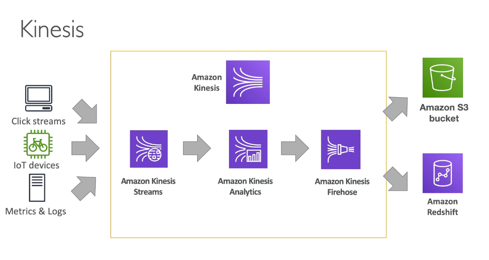
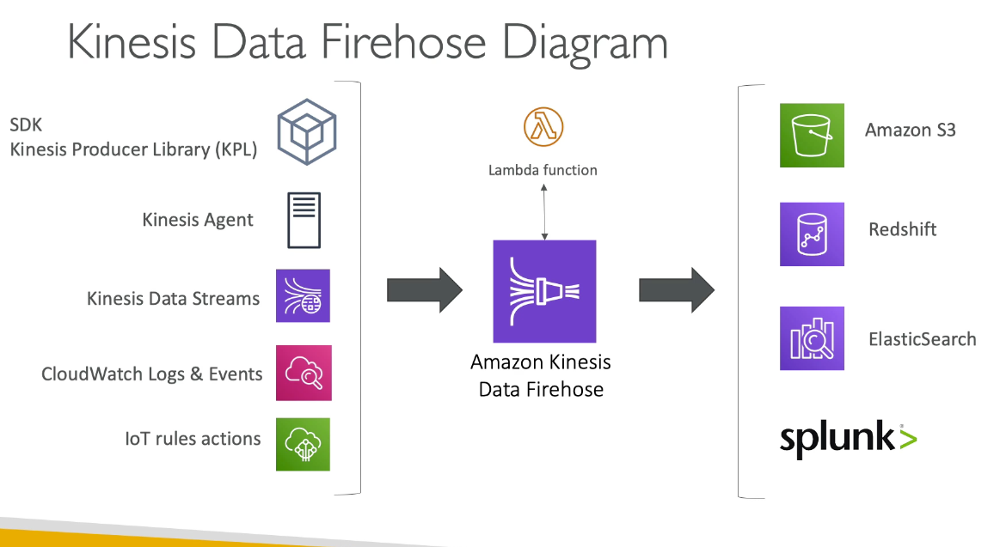
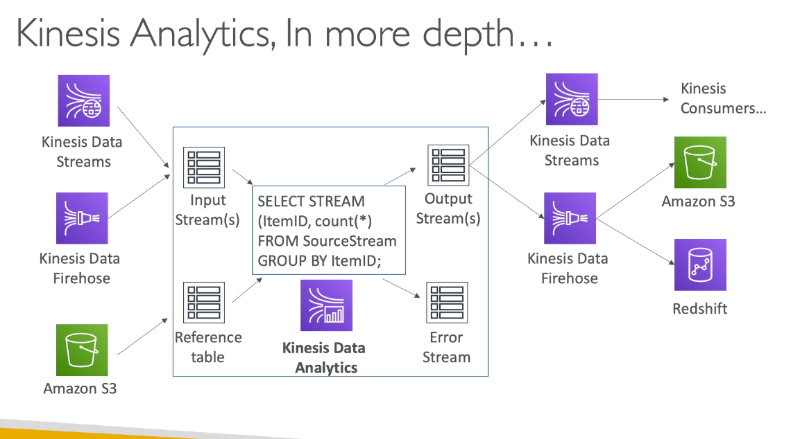
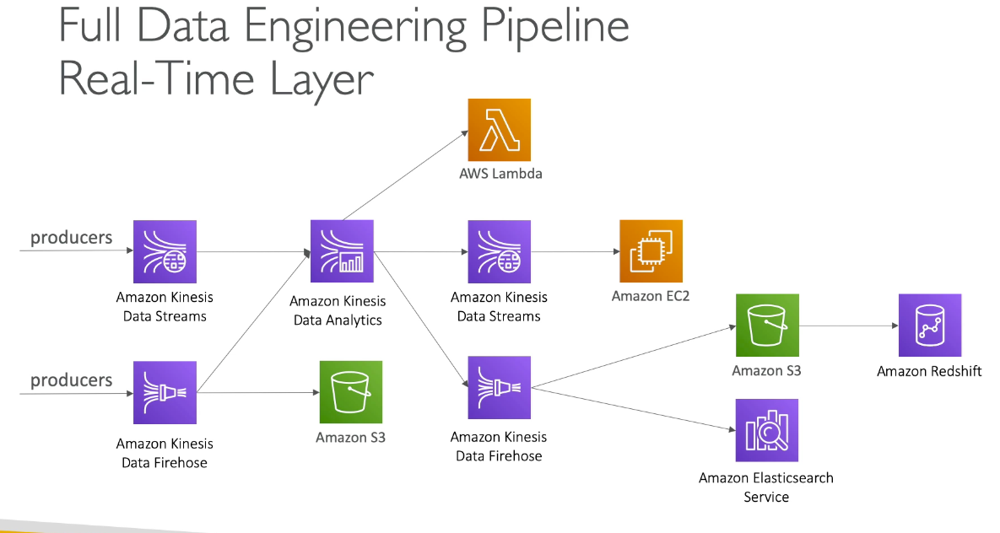
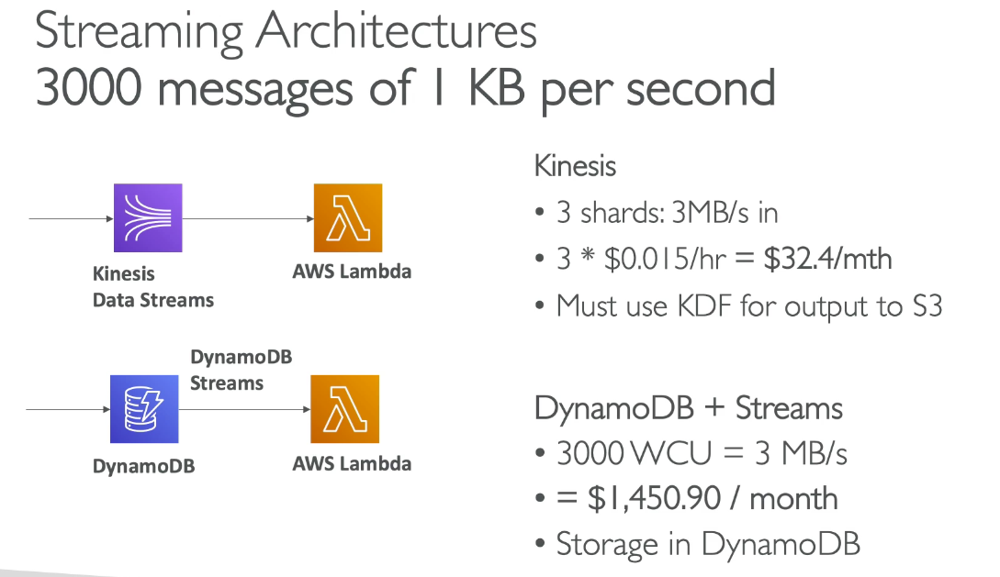
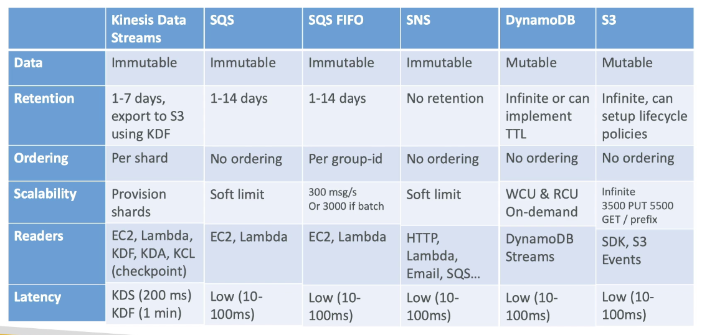
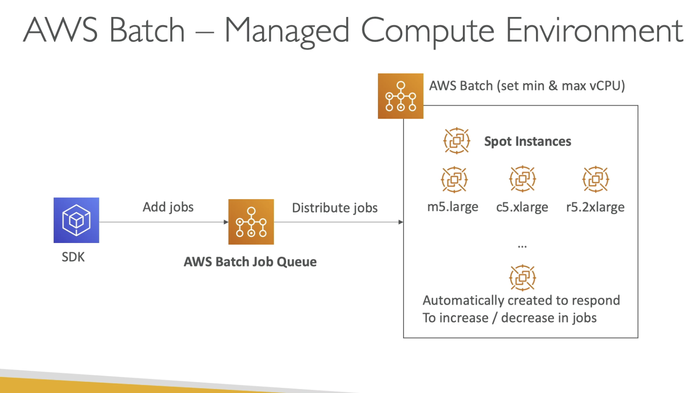
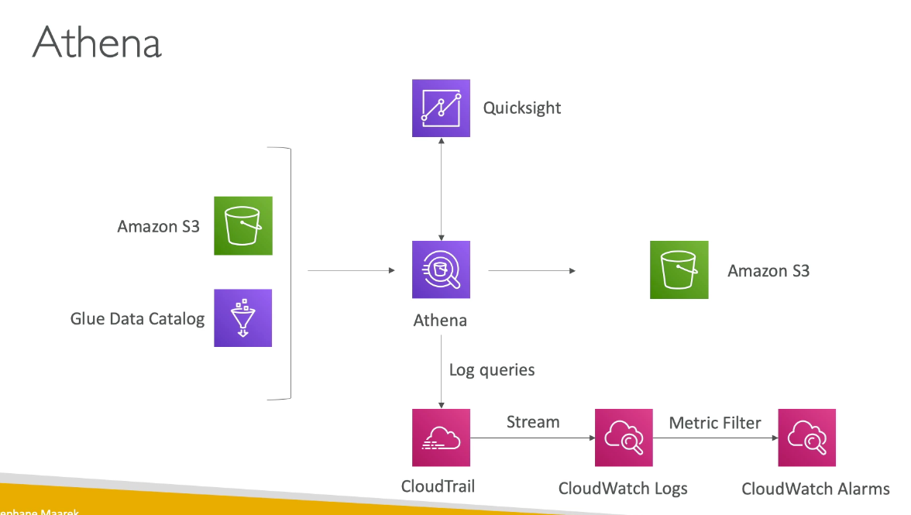

# Chapter 8: data engineering

## AWS Kinesis Data Stream

1. Managed data streaming service at scale in real-time
2. Great for application logs, metrics, IoT, clickstream
3. Streaming processing
4. replicated across 3 AZ

### Kinesis stream

1. log latency streaming ingest at scale
2. Streams are divided into ordered shards
3. Data retention is 24 hours by default, can go up 7 days
4. Ability to reprocess/replay data
5. Multiple applications can consume the same stream
6. Real-time processing with scale of throughput
7. Once date is inserted, it cannot be deleted (immutability)

#### stream shard

1. 1 stream is made of many different shard
2. Billing is per shard provisioned, have as many shards as you want
3. Records are ordered per shard
4. Number of shards can evolve over time

#### kinesis producer and consumers

1. Producer
   1. AWS SDK
   2. Kinesis Producer Library
      1. Batch, compression, retris
   3. Kinesis agent
      1. Monitor log files and send them to kinesis directly
      2. Can write to Kinesis data streams and Kinesis data firehose
   4. Can send 1MB/s or 1000 message/s at write PER SHARD

2. Consumers
   1. AWS SDK
   2. Lambda (event source mapping)
   3. KCL: checkpointing, coordinated reads
      1. Makes it a scalable way to read kinesis data stream
   4. Consumer classic
      2. 2MB/s at read per SHARD across all consumers
      3. 5 api calls per second per shard across all consumers
   5. Consumer enhanced fan-out
      1. 2 mb/s at read per shard per enhanced consumer
      2. No API calls needed (push model)

## Kinesis firehose

1. load streams into S3, Redshift, ElasticSearch and Splunk
2. Fully managed service, automatic scaling
3. Near Real Time
4. Can transform using lambda function
5. Firehose accumulates records in a buffer
   1. Flushed based on time and size rule
6. Firehose can increase the buffer size
7. High throughput ==> Buffer size will be hit
8. Low throughput ==> Buffer time will be hit
9. To do real-time to S3, you will need to use kinesis data stream and lambda

### Difference between firehose and stream

1. Streams
   1. Going to write custom code
   2. Must manage scaling
   3. Use lambda to insert data in real time
   4. Data storage for 1-7 days, replay capability
2. Firehose
   1. Fully managed, send to S3, splunk, redshift, ElasticSearch
   2. Automated scaling
   3. no data storage
   4. Near real-time

### Kinesis analytics

1. Perform real-time analytics on stream using SQL
2. Use cases
   1. streaming ETL
   2. continous metric generation
   3. responsive analytics
3. Pay only for resources consumed
4. serverless; scales automtically
5. SQL or Flink to write the computation
6. Lambda can be used for pre-processing
7. Schema discovery

## Streaming architecture

### Full data Engineering pipeline

### 3000 message of 1 kb per second

1. Kinesis data streams --> AWS Lambda
   1. 3 shards: 3 MB/s = $0.015/hr = $32.4/mth
   2. KDF for output to S3 to persist data
2. DynamoDB streams --> AWS lambda
   1. 3000 WCU = 3 MB/s = $1,450.90/month
   2. Storage in DynamoDB

### Comparison chart

## AWS Batch

1. Run batch jobs as docker images
2. Dynamic provisioning of the instances (EC2 & spot instances) in VPC
3. Optimal quantity and type based on volume and requirements
4. No need to manage cluster, fully serverless
5. Pay for underlying EC2 instances
6. Schedule batch jobs using cloudwatch events
7. Orchestrate batch jobs using AWS step functions

### Batch vs lambda

1. Lambda
   1. Has time limit, limited runtimes, limited temporary disk space, serverless
2. Batch
   1. No time limit
   2. Any run time as long as it is a Docker image
   3. Relies on EC2
   4. Relies on EBS

### Compute environment

1. Managed compute environment
   1. Choose on-demand or spot instances
   2. set a max price for spot instances
   3. launched within own VPC
   4. Need a NAT gateway/instance or VPC endpoint for ECS
   5. Setup min and max vCPU
2. Unmanaged compute environment
   1. control provisioning, configuration of the EC2 instances

### Multi Node Mode

1. Large scale, good for HPC
2. Leverage multiple EC2/ECS instances at the same time
3. Good for tightly coupled workload
4. 1 main node and many child node

## Amazon EMR

1. Help create Hadoop cluster to analyze and process vast amount of data
2. Cluster can made up of hundreds of EC2 instances
3. Support Apache Spark, Hbase, Presto, Flink
4. Takes care of provisioning and configuration of EC2
5. Autoscaling with Cloudwatch

### Integrations

1. EMR is launched in a single AZ for lower cost, better networking performance
2. For more durable storage 
   1. Use EMRFS
3. Temporary storage use EBS volume (HDFS)
4. Use hive to read data from dynamoDB

### Node type and purchasing

1. Master Node: Manage the cluster, coordinate, manage health
2. Core Node: run task and store data
3. Task node (optional): just to run tasks
4. Purchasing option
   1. On demand: reliable, predictable, wont be terminated
   2. Resrved: min 1 year - cost saving
   3. Spot instances: can be terminated and less reliable
5. Depends on long-running cluster or transient (temporary) cluster
6. 1 big cluster or many smaller ones?

### instance configuration

1. Uniform instance group: select a single instance type and purchasing option for each node (has auto scaling)
2. Instance fleet: select target capacity, mix instance types and purchasing options (no auto scaling)

## Jobs on AWS

### Strategies

1. Provision EC2 instance (long running - CRON jobs)
2. Cloudwatch events + lambda (cron schedule)
   1. limited by run-time
3. Reactive workflow 
   1. CW events, S3 events, API gateway, SQS, SNS
4. Use AWS batch
   1. CW events --> batch
   2. Can use docker container
   3. Managed environment/multi node for HPC
5. CW events  --> Fargate
6. EMR 
   1. using a transient cluster

## Redshift

1. Redshift is based on PostgreSQL
   1. Not use for OLTP
2. Use for OLAP (online analytical processing)
3. 10x better performance than other data warehouses, scale to PBs of data
4. It is columnar storage of data (instead of row base)
5. Massively parallel query execution
6. Pay as you go based on instance provisioned
7. Has a SQL interface for performing
8. BI tools integration
9. Loaded from S3, kinesis firehose
10. From 1 node to 128 nodes, up to 160 GB
11. Not multi-AZ
12. Leader node: for query planning, result aggregation
13. Compute node: for performing the queries, send results to leader
14. Backup & restore, security/VPC/IAM/KMS
15. Redshift enhanced VPC routing: copy/unload goes through VPC
16. Redshift is provisioned, so its worth it when you have a sustained usage (Use Athena if the queries are sporadic)

### Snapshots and DR

1. Snapshots are point in time backup of a cluster
2. Snapshots are incremental
3. Restore snapshop into a new cluster
4. Automated snapshot: Every 8 hours or 5 GB or on a schedule. Need to set retention
5. Manual snapshot: snapshot is retained until you delete it
6. Can configure Redshift snapshot to another AWS region

### Redshift Spectrum

1. Query data that is in S3 without loading it
2. Must have a redshift cluster available to start the query
3. Query is submitted to thousands of Redshift Spectrum nodes

## Athena and Quicksight

1. Athena
   1. Serverless SQL queries on top of data in S3
   2. Pay per query
   3. Output to S3
   4. Support CSV, JSON, Parquet, ORC
   5. Queries are logged in Cloudtrail
   6. Great for sporadic queries
   7. Read to use queries for VPC Flow Logs, Cloudtrail, ALB access logs, Cost and usage reports
2. Quicksight
   1. Business intelligence tool for data visualization, creating dashboards
   2. Integrates with Athena

### Solution architecture

### Quicksight (dashboard/visualization)
 
1. can load data from RDS/JDBC/AmazonS3/JIRA

## Big data architecture

### Big data ingestion

[ingestion](./data-engineering/ingestion-pipeline.png)

### Comparison

1. EMR
   1. Need to use big data tool such as Apache Hive, Spark
   2. One long-running cluster, many jobs, with auto-scaling
   3. purchasing options - spot, on-demand, reserved instances
   4. can access data in dynamoDB/S3
   5. Scratch data on EBS disk (HDFS) or long term in S3 (EMRFS)
2. Athena
   1. simple quries and aggregation, data must live in S3
   2. Audit querieis through Cloudtrail
3. Redshift
   1. Must provision server

