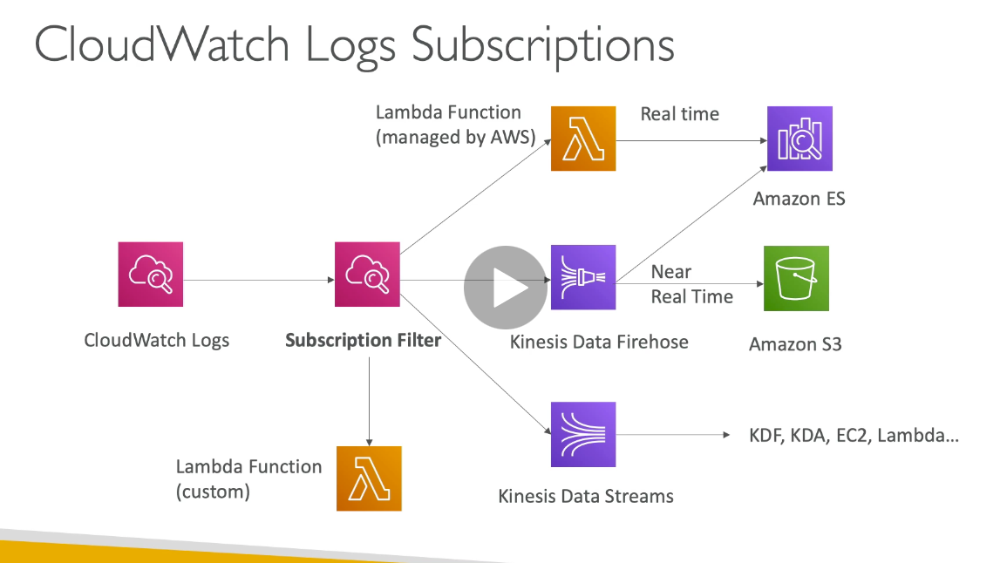
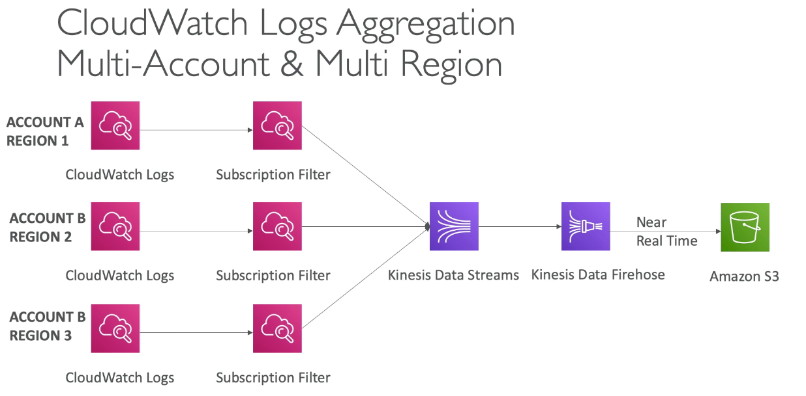
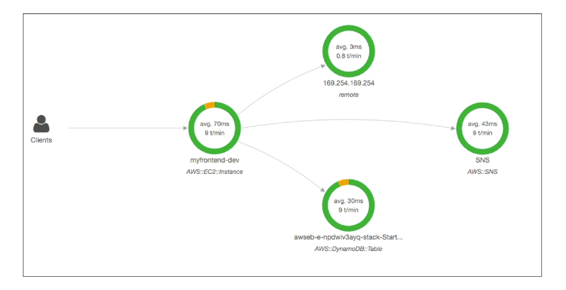

# Chapter 9: monitoring

## Cloudwatch

1. Cloudwatch metrics
   1. Provided by many AWS serivces
   2. **EC2 RAM is not a built in metric**
   3. Create custom metric is 1 minute, high resolution
2. Cloudwatch alarm
   1. Trigger 3 things
      1. EC2 action (reboot, stop, terminate, recover)
      2. Auto scaling
      3. SNS
   2. Alarm can be intercepted cloudwatch events
3. Cloudwatch dashboard

### Cloudwatch alarm

1. Monitor critical ec2 instance
   1. If fail, trigger recover action: which will keep its private/public ip
2. Scale base on cloudwatch alarm
3. SNS

### Cloudwatch alarms

1. Intercept events from AWS service
2. Can intercept any API call with Cloudtrail integration
3. Targets
   1. Compute: lambda, batch, ec task
   2. Orchestration: Step functions, code pipeline
   3. Integrations: SQS, SNS, Kinesis Data stream, Kinesis Data Firehose
   4. Maintainece: SSM, EC2 actions

### Cloudwatch logs

1. Getting data into cloudwatch logs
   1. SDK, Cloudwatch logs agent, cloudwatch unified agent
   2. Elastic beanstalk: collection of logs from application
   3. ECS: collection from containers
   4. Lambda: Collection from function logs
   5. VPC flow logs
   6. API gateway
   7. Cloudtrail based on filter
   8. Cloudwatch log agents
   9. Route53: DNS queries
2.  Log group: arbitary name
3.  Log stream: instance within application/log files/containers
4.  Expriation policies
5.  Can send log to
    1.  Amazon S3
    2.  Kinesis Data stream
    3.  Kinesis Data firehose
    4.  Lambda
    5.  ElasticSearch

### Cloud watch logs metric filter and insights

1. Log can use filter expressions
   1. i.e. find a specific IP inside of a log
   2. i.e. count occurences of "ERROR" in your log
   3. Can be used to trigger alarm
2. Log insights: Query logs and add queries to cloudwatch dashboard

### S3 export

1. Must be encrypted with AES-256 (SSE-S3), not **SSE-KMS**
2. Log data takes up to 12 hours (not real time)
3. Need to call using CreateExportTask
4. For real time, use log subscriptions

### Logs subscriptions

### Cloudwatch logs aggregation multi-account & multi-region

### Log agent vs unified agent

1. Cloudwatch log agents
   1. only sent to cloudwatch Logs
2. Unified agent
   1. send to cloudwatch logs
   2. Additional system-level metrics such as RAM, processes
   3. Centralized configuration using SSM parameter store
3. Batch sends
   1. batch_count: min 1, default 10000
   2. batch_duration: min is 5000 ms
   3. batch_size: max - 1 MB
4. Both agent cannot send to kinesis
   1. To send to kinesis, need to use kinesis agent

## X-Ray

1. Visual analysis of applications
2. Trace request across microservices
3. Integrations with
   1. EC2 - install xray agent
   2. ECS - install the x ray agent
   3. Lambda
   4. Beanstalk
   5. API gateway
4. The X-Ray agent or services need IAM permissions to X-Ray

