# Chapter 10: Deployment

## Elastic Beanstalk

1. Developer centric view of deploying an application on AWS
2. Full control over the configuration of each component
3. Beanstalk is free, you have to pay the underyling resources
4. Support
   1. Go
   2. Java SE
   3. Java with Tomecat
   4. .NET on window server
   5. Node.js
   6. PHP
   7. Python
   8. Ruby
   9. Packer Builder
   10. Single container docker
   11. Multicontainer Docker
   12. Preconfigured Docker
   13. Custom platform
5.  Bean is great to "Replatform"
6.  Managed service
    1.  Instance configuration handled by beanstalk
    2.  Deployment stragtegy is configuratble but performed by Elastic Beanstalk
7.  Developer is responsible for just the application code 

### 3 architecture models

### Web server vs worker environment

1. Perform task that are long to complete, offload these task to a dedicated worker environment
2. Decoupling your application into 2 tiers 
3. Define periodic tasks in a file "cron.yaml"

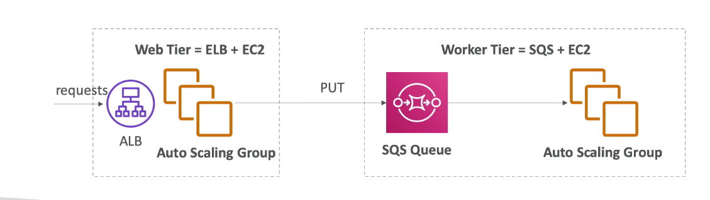

### Blue/green deployment

1. zero downtime and release facility
2. Create a new stage envornment and deploy v2 there
3. Routing traffic
   1. Using beanstalk, "swap urls" when down with the environment testing
   2. Weighted routing in route 53

## OpsWorks

1. Chef and Puppet help you perform server configuration automatically or repetitive actions
2. They work great with EC2 and On premise VM
3. AWS opswork = Managed Chef & Puppet
4. Alternative to AWS SSM
5. If you have Chef or Puppet, good to use Ops work
6. Consistent deployment
7. can automate:
   1. user accounts, crons, ntp, packages, services

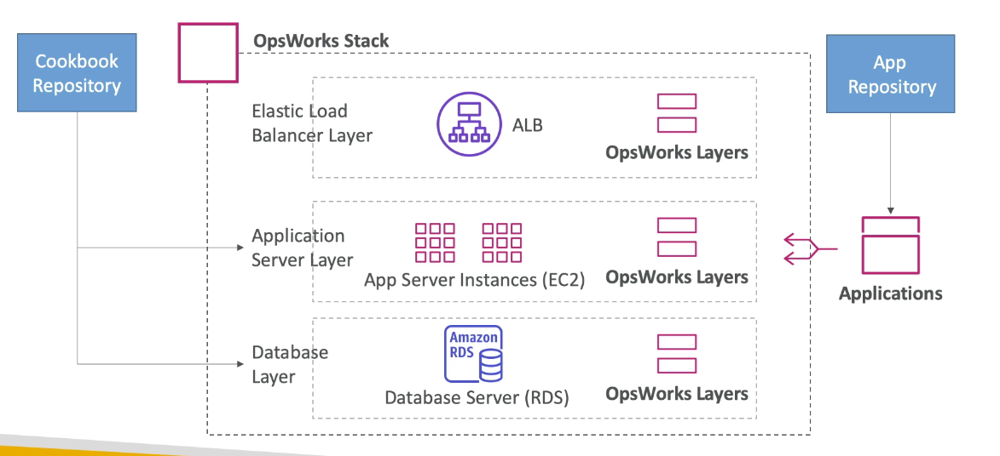

## AWS CodeDeploy

1. Deploy application to many EC2 instances
2. Instances are not managed by Elastic Beanstalk 
3. Alternative with Ansible, terraform
4. Code deploy can deploy to EC2, ASG, ECS and Lambda

### Codedeploy to EC2

1. deploy the application using appspec.yml + deployment strategy
2. will do in-place update to fleet of EC2 instances
3. can deploy hooks to verify the deployment after each deployment phase
   
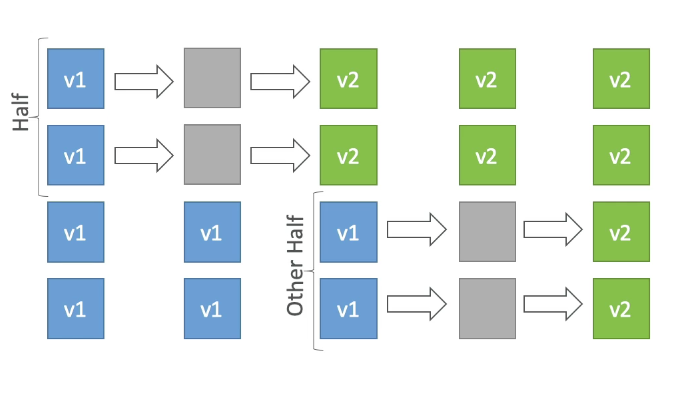

### Codedeploy to ASG

1. in-place updates:
   1. Update current existing EC2 instances
   2. Instances newly created by an ASG will also get automated deployment
2. Blue/Green deployment
   1. A new auto scaling group is created (settings are copied)
   2. Choose how long to keep the old instances
   3. Must be using an ELB

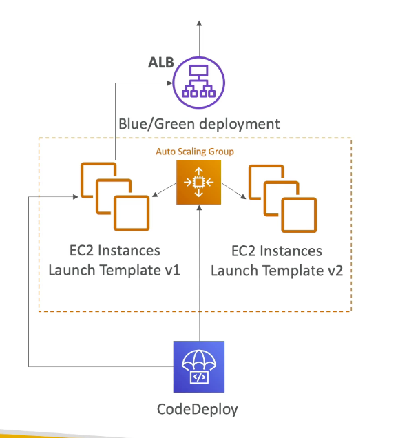

### CodeDeploy to AWS Lambda

1. Traffic shifting feature
2. Pre and post traffic hooks feature to validate deployment
3. Easy and automated rollback using Cloudwatch Alarms
4. SAM framework natively uses Code Deploy

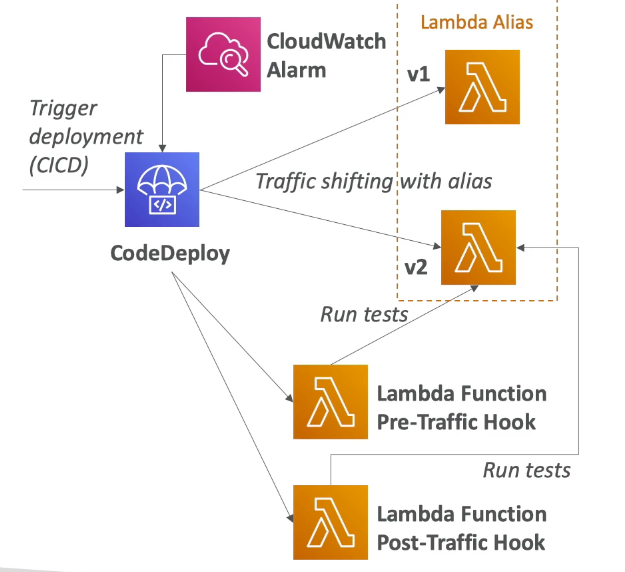

### CodeDeploy to ECS

1. Support for Blue/Green deployments
2. Setup is done with the ECS service
3. A new task set is created and traffic is re-routed to the new task
4. Then if everything is stable for X minutes, old task is terminated

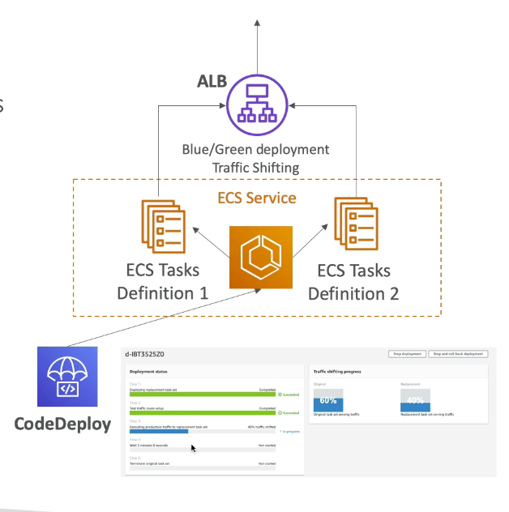

## Cloudformation

1. Infrastructure as code (IaC) in AWS
2. Portability of stacks across multiple accounts and regions
3. Backbone of EBS/Service catalog services/SAM framework
4. Must know service as a developer/sysops/devops

### Cloudformation & ASG

1. Cloudformation manages the ASG, not the underlying EC2
2. Define "success conditions" for the launch of EC2 instances using CreationPolicy
3. Define "update strategies" for the update of EC2 instances using UpdatePolicy
4. To update the underlying EC2 in a ASG, create new launch configuration/launch template and use and UpdatePolicy

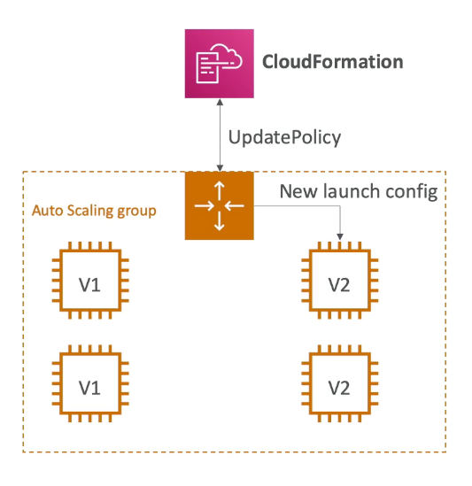

### Retaining data on deletes

1. You can put a deletionPolicy on any resource to control what happens when the cloudformation template is deleted
2. DeletionPolicy=retain
   1. Keep the resource
3. DeletionPolicy=Snapshot
   1. EBSVlolume, ElasticCache, RDS
4. DeletePolicy=Delete (default)
   1. AWS:RDS:DBCluster resources, the delete policy is snapshot

### Cloudformation and IAM

1. when deploying a Cloudformation stack
   1. it uses the permission of the user's own IAM principal
   2. Assign a role to the stack that can perform the actions
2. If you create IAM resources, you need to explicitly provide a "capability" to cloudformation CAPABILITY_IAM and CAPABILITY_NAMED_IAM
3. Cloudformation custom resources (LAMBDA)
   1. You can define a custom resources in CF
   2. An AWS resources is not yet supported
   3. An on-premise resource
   4. Empty an S3 bucket before being deleted
   5. Fetch an AMI id

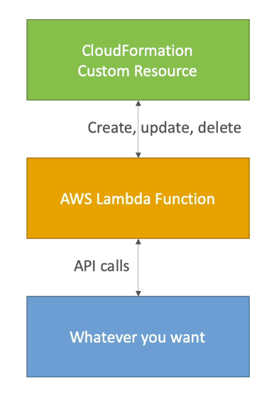

### Cross vs nested stacks

1. Cross stacks
   1. Helpful when stacks have different lifecycles
   2. Use output exports and FN:ImportValue
   3. When you need to pass export values to many stacks
2. Nested stacks
   1. Components must be reused
   2. Reuse how to properly configure an Application Load Balancer
   3. The nested stack only is important to the higher level stack (it's not shared)

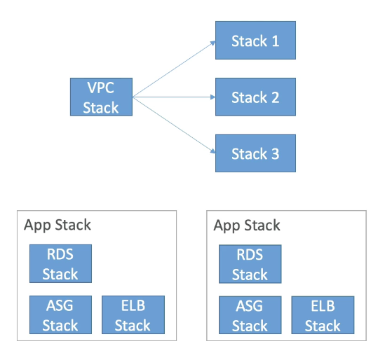

### Concepts

1. Cloudformer
   1. Create an AWS Cloudformation template from existing AWS resources
2. Changeset
   1. Generate and preview the CF changes before they applied
3. Stackset
   1. Deploy a CF stack across multiple accounts and regions
4. Stack policies
   1. Prevent accidental updates/deletes to stack resources

## AWS Service catalog

1. Users that are new to AWS have too many options and may create stacks that are no compliant
2. Some user just want a quick self-services portal to launch a set of authorized product pre-defined by admins

### Diagram

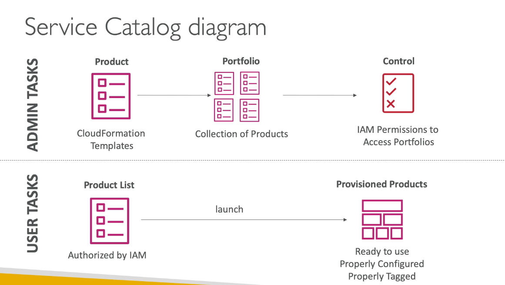

### Concept

1. create and manage catalog of IT services that are approved
2. "product" are cloudformation templates
3. Cloudformation help ensure consistency, and standardization by Admins
4. Products are assigned to portfolios
5. Teams are presented a self-service portal
6. Help with governance, compliance and consistency
7. Give user access to launching a product without requiring deep AWS knowledge
8. Integrate with "self-service portals" such as ServiceNow

## SAM - serverless application model

1. Framework for developing and deploying serverless application
2. All configuration is YAML
   1. Lambda function
   2. DynamoDB
   3. API gateway
   4. Cognito User pool
3. Help to run lambda, api gateway, dynamoDB locally
4. use codeDeploy to deploy lambda function
5. Leverage cloudformation

### CI/CD architecture

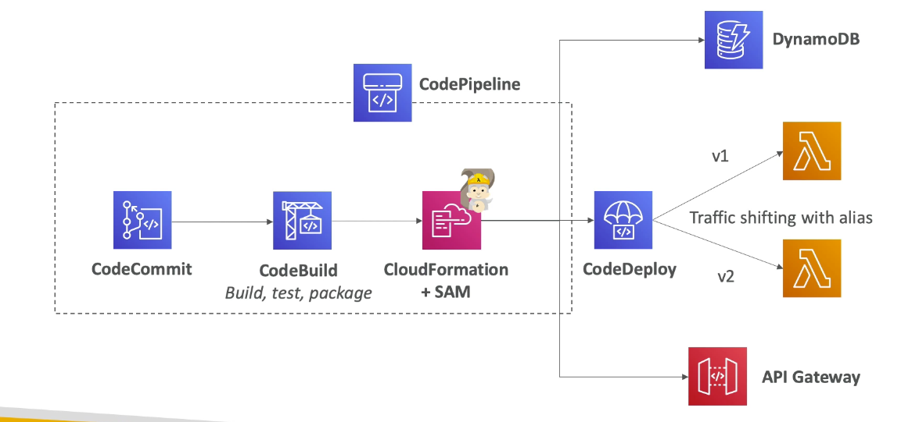

## Deployment comparisons

1. Vanilla EC2 with User Data (for first launch)
2. Build an AMI for things that are too slow to install and use EC2 user data for quick runtime setup
3. ASG with launch template that rely on AMI
4. CodeDeploy (no new AMI - application deployment)
   1. in-place on EC2
   2. in-place on ASG
   3. new instance on ASG
   4. new task set for ECS + traffic shifting
   5. traffic shifting for AWS lambda
5. Beanstalk
   1. in-place all at once upgrade
   2. rolling upgrade
   3. immutable upgrades (new instances)
   4. blue/green (entirely new stack)
6. Opswork
   1. for chef/puppet
   2. can manage ELB and EC2 instances
   3. cannot manage ASG
7. SAM framework
   1. leverage Cloudformation and code deploy

## SSM (system manager)

1. Help you manage your EC2 and on-premise system at scale
2. Get operational insights about the state of your infrastructure
3. Easily detect problems
4. Patching automation for enhanced compliacne
5. Works for both window and Linux
6. Integrated with cloudwatch metrics/dashboard/AWS config
7. Free service

### Features

1. resource groups
2. insights
   1. Insights Dashboard
   2. inventory: discover and audit the software installed
   3. compliance
3. Parameter store
4. Action
   1. automation
   2. run command
   3. session manager
   4. patch manager
   5. maintenance windows - use run/patch manager at scale without disrupting the service
   6. state manager: define and maintaining configuration of OS

### how it works

1. install the SSM agent onto the systems
2. Install by default on Amazon Linux AMI and some Ubuntu AMI
3. Make sure the EC2 instances have a proper IAM role to allow SSM actions

### Run command

1. Execute a document (= script) or just run a commnad
2. Run command across multiple instances
3. Rate control/error control
4. Integrated with IAM & cloudtrail
5. No need SSH
   
### Patch manager

1. Define a patch baseline
   1. which patches should or should not installed on your instances
   2. Linux
      1. AmazonLinux2DefaultPatchBaseline
      2. CentOSDefaultPatchBaseline
   3. Window (patches are auto-approved 7 days after the releases)
      1. AWS-DefaultPatchBaseline: install OS patch criticalupdates and securityupdates
      2. WindowPredefinedPatchBaseline-OS-Application: update microsoft applications
   4. Can define your own custom patch baselines (OS, classification, severity)
2. Steps
   1. Define a patch baseline
   2. Define patch group : defined based on tags i.e. dev, test
   3. Define maintenance windows (schedule duration, registered targets/patch group and registered task)
   4. Add AWS-RunPatchBaseline Run Command as part of the registered task
   5. Define Rate control for the task
   6. Monitor Patch compliance using SSM Inventory

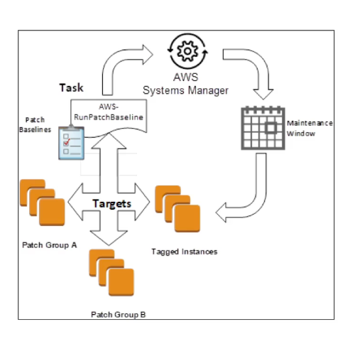

## AWS parameter store

1. secure storage for configuration and secrets
2. Optional seamless encryption using KMS
3. Configuration management using path and IAM
4. Integration with Cloudformation
5. Notifications with Cloudwatch Events
6. Version tracking of configurations/secrets
7. Can retrieve secrets from secret manager using the SSM parameter store API

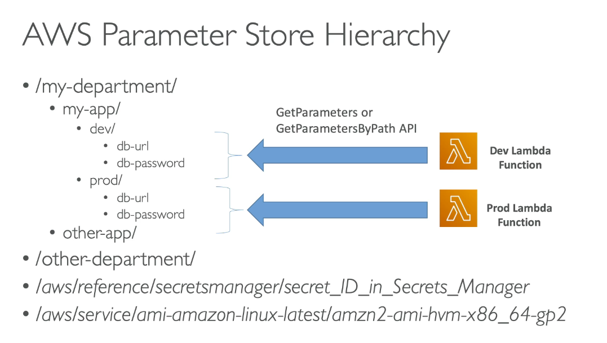