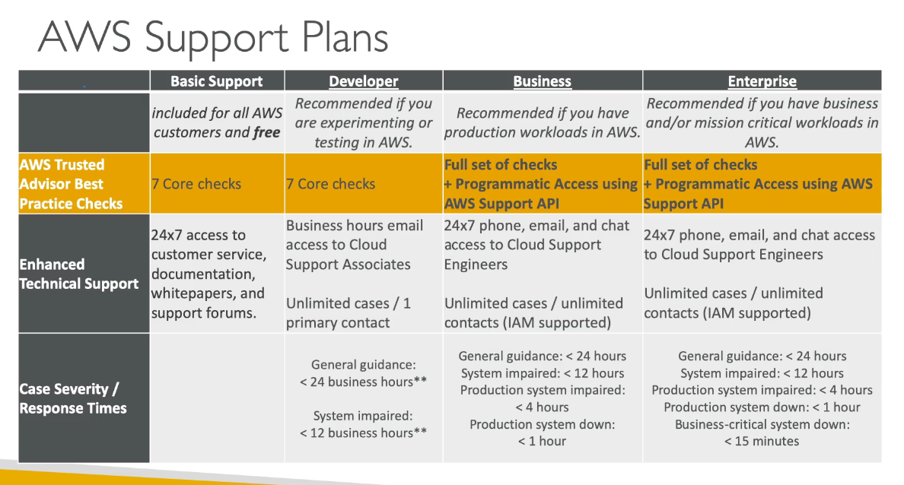
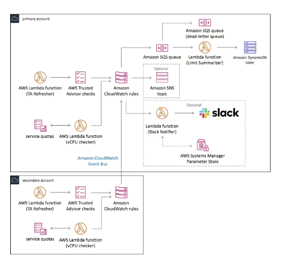
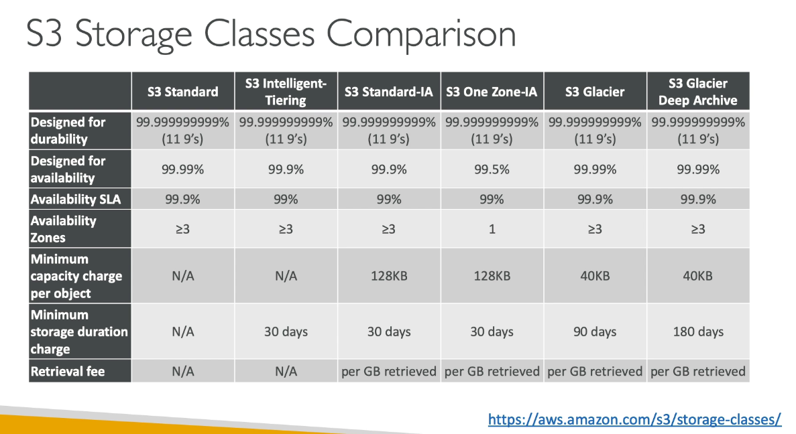
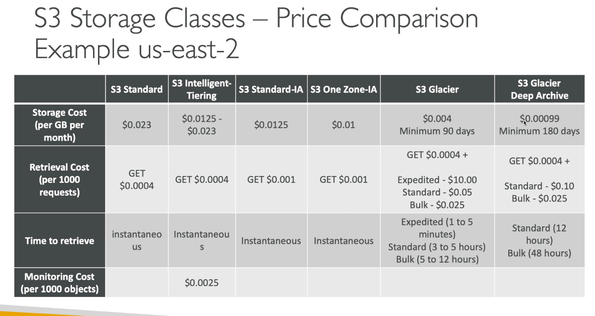

# Chapter 11: Cost control

## AWS cost allocation tags

1. With tag, we can track resources that relate to each other
2. With tags, we can enable detailed costing reports
3. showed up as columns in reports
4. AWS generated Cost allocation tags
   1. Automatically applied to resources you create
   2. start with prefix: aws:created
5. User tags
   1. start with prefix: user
6. Cost allocation tag appear in billing console and takes up to 24 hours for the tag to show up in the report

## Trusted advisor

1. No need to install anything
2. Analyze AWS accounts and provide recommendations
   1. **Cost optimization and recommendations**
   2. Performance
   3. Security
   4. Fault tolerance
   5. **Service Limits**
3. Core checks and recommendations - all customers
4. Can enable a weekly email notificaiton from the console
5. Full trusted advisor - available for business and enterprise support plans 
   1. Set cloudwatch alarms when reaching limits
   2. Programmtic Access using AWS API

### Support plans 

### Good to know

1. can check if a S3 bucket is made public but not check for S3 object
   1. Use cloudwatch events/S3 events
2. Service limits
   1. Can only be monitored
   2. Need to create manually in AWS support center
   3. Need to be enterprise/business plan
   4. Use AWS service quotas has a programmatic access to change limits

## EC2 launch types

1. on demand instances: short workload, predictable, reliable 
2. spot instances: short workload, for cheap, can lose instance
3. reserved instance: (min 1 year)
   1. reserved instance: long workloads
   2. convertible reserved instance: long workload with flexible instance type
   3. scheduled reserved instance: i.e. every thursday 
4. Dedicated instance: no other customer will share the hardware
5. Dedicated host: book an entire physical server, control instance placement
   1. Great for software license that operates at the core level
   2. can define host affinity so that instance reboot are kept on the same host
   
### AWS Saving plan

1. Get discount based on long-term usage
2. commit to a certain type of usage: i.e. $10 per hour for 1 to 3 years
3. Any usage beyond the saving plan is billed at the on-demand price
4. EC2 instance saving plan (up to 72%)
   1. Select instance family and locked to a specific region
5. Compute saving plan
   1. Up to 66% 
   2. Ability to move between instance family, across region, across compute type

## S3 Cost saving

1. S3 standard - general purpose
2. S3 standard IA (infrequent access)
3. S3 one zone IA (infrequent access)
4. S3 intelligent tiering (pay for monitoring)
5. Glacier
6. Glacier deep archive (wait at least 12 hours)

### Other cost saving

1. S3 select & glacier select: save in network and CPU cost
2. S3 lifecycle rules: transition object between tiers
3. Compress object to save space
4. S3 requester pays - 
   1. In general, bucket owner pay for all Amazon S3 storage and data transfer cost
   2. With requester pay, the requester pays for the cost of the request and the data download from the bucket
   3. Bucket owner pay the cost of storing data
   4. Useful to share large datasets with other account
   5. If an IAM role is assume, the owner account of that role pay for the request
   6. Use S3 bucket policy so that the requester (their account) will be paying

## S3 Tiers

### Amazon S3 standard - general purpose

1. high durability ( 9 x 11)
2. if you store 10,000,000 objects, incur a loss of a single object once every 10,000 years
3. 99.99% availability
4. Sustan 2 concurrent facility failures

### Amazon S3 IA

1. Suitable for less frequently access
2. 9 x 11 durability
3. 99.9 availability
4. Lower cost
5. sustain 2 concurrent facility failures

### S3 One zone IA

1. Same as IA but data store in a single AZ
2. high durability (11 x 9) in a single AZ
3. 99.5 availability
4. low latency and high throughput performance
5. low cost compared to IA (20%)
6. Use case: secondary backup copies of data, store data you can re-create

### S3 intelligent tiering

1. same low latency and high throughput
2. Monthly monitoring and auto-tiering fee
3. Automatically move objects between 2 access tiers based on changing access patterns
4. Designed for (11x9) durability
5. 99.9 availability

### Glacier

1. Low cost object storage meant for archiving/backup
2. Data is retained for the longer term (10s of year)
3. Alternative to on-premise
4. 11 x 9 durability
5. Each archive can be up to 40TB
6. 3 retrieval options
   1. Expediated : 1 - 5 mins
   2. Standard : 3 - 5 hours
   3. Bulk : 5 - 12 hours
7. Min storage duration is 90 days

### Glacier deep archieve

1. standard : 12 hours
2. bulk : 48 hours
3. min storage duration: 180 days

### S3 comparison chart

### S3 price comparison

