# Chapter 12: Migration

## Cloud migration - 6R

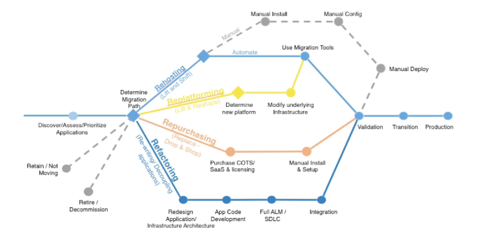

1. rehosting: "lift and shift"
   1. Simple migrations by re-hosting on AWS
   2. No cloud optimization being done, application is migrated as
   3. Could save as much as 30% on cost
   4. Migrate using AWS VM import/export, AWS server migration service
2. Replatforming:
   1. Migrate your database to RDS
   2. Migrate application to Elastic beanstalk (Java with Tomcat)
3. Repurchase: "drop and shop"
   1. Moving to a different product while moving to the cloud
   2. Often you move to a SaaS platform
   3. Expensive in the short term
   4. Use case: CRM to salesforce.com, HR to workday, CMS to Drupal
4. Refactoring/Re-architecting
   1. Reimagine how application can be architected using Cloud Native features
   2. Driven by need of business to add features, scale, performance
   3. Move an application to serverless architecture, use AWS S3
5. Retire
   1. Turn off things you do not need
   2. reduce surface area for attacks
   3. Save cost
6. Retain
   1. Do nothing for now (for simplicity, cost reason, importance)

## Storage gateway

1. Bridge between on-premise data and cloud data in S3
2. Use cases: disaster recovery

### file gateway

1. virtual machine to bridge between NFS and S3
2. Meta data and directory structure are preserved
3. Most recent use data is cached in the file
4. Confuraged S3 bucket are accessible using NFS and SMB protocol
5. Can be mounted on many server
6. Can use Amazon S3 object versioning
   1. Ability to store multiple object versions
   2. Helpful to restore a file to a previous version
   3. Could restore an entire file system to a previous version
   4. Must use "refreshcache" api to refresh the cache
7. Amazon S3 object lock
   1. Enable to have the file gateway for Write once read many (WORM) data
   2. If there are file modifications/rename file share; the file gateway creates a new version of the object without affecting prior version

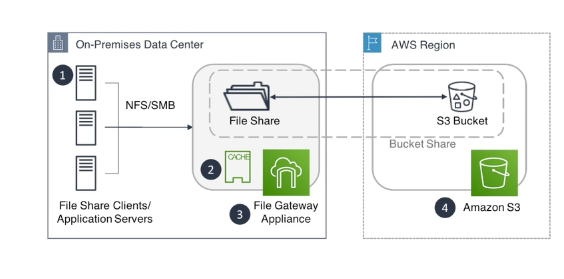

#### S3 Solution architect

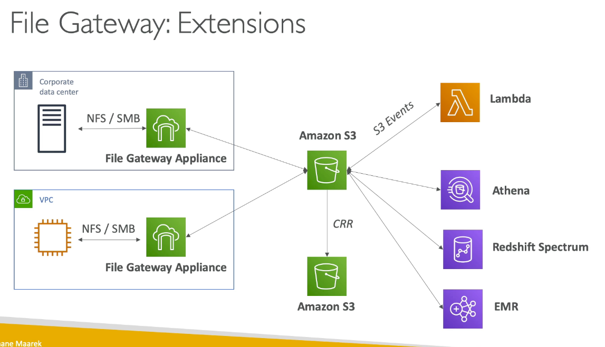

#### Read only replica

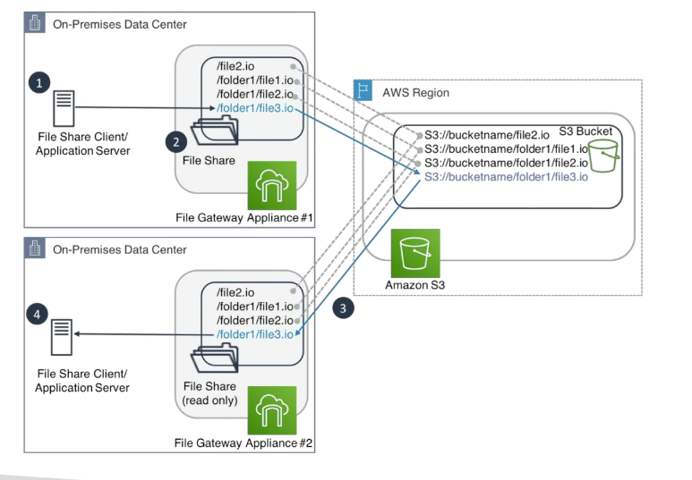

#### backup and lifecycle policies

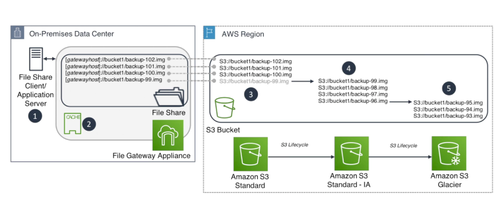

### Volume gateway

1. Block storage using iSCSI protocl backed by S3
2. Cache volumes: low latency access to most recent data, full data on S3
3. Stored volumes: entire data set is on premise, scheduled backup to S3
4. cannot access directly from S3, have to create EBS snapshot and restore as EBS
5. Up to 32 volumes per gateway
   1. Each volume up to 32TB in cached mode
   2. Each volume to 16TB in stored mode

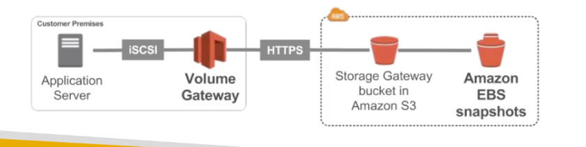

### Tape gateway

1. Have backup processes using physical tapes
2. VTL (virtual tape library) backed by Amazon S3 and Glacier
3. Backup data using existing tape-based processes (and ISCSI interface)
4. Works with leading backup software vendors
5. Cannot acecess single file within tapes, have to restore the entire tape

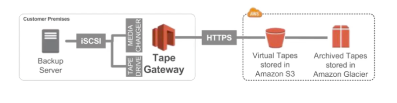

## Snowball

1. Phycial data transport solution that help moving TBs or PBs
2. Alternative to moving data
3. Secure, tamper resistant, use KMS 256 bit encryption
4. 50TB and 80TB
5. More than 1 week to transfer data, use snowball

### Snowball vs direct upload

1. Direct upload to S3: 10Gbit/s
2. with snowball: physically shipped data

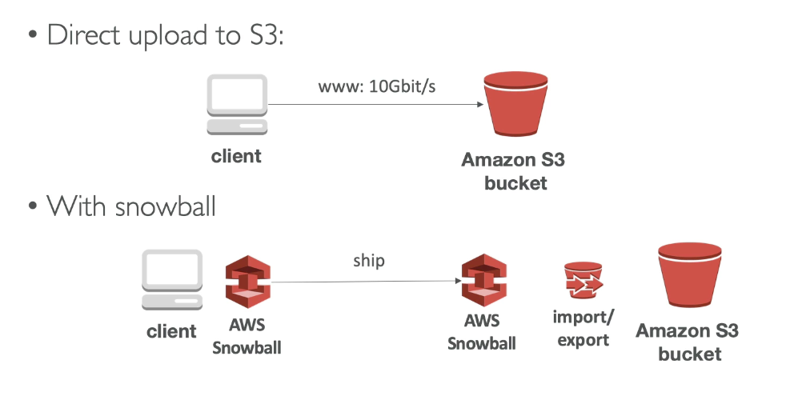

### Snowball edge

1. add computational capability to the device
2. 100 TB capacity with
   1. Storage optimized - 24 vCPU
   2. Compute optimized - 52 vCPU and optional GPU
3. Useful to pre-process data while moving

### Snowmobile

1. Transfer exabytes of data
2. Each snow mobile has 100PB of capacity
3. use snow mobile if more than 10 PB

## AWS DMS (database migration service)

1. Quickly and securely migrate databases to AWS, resilient, self-healing
2. Source database remains available during the migration
3. Support
   1. Homogeneous migration: oracle to oracle
   2. Hetrogeneous migration: microsoft SQL to Aurora
4. Continuous data replication using CDC
5. Create an EC2 instance to perform replication tasks

### DMS source and targets

1. Sources
   1. On premise and EC2 instances database
   2. Azure
   3. Amazon RDS
   4. Amazon S3
2. Targets 
   1. On premise and EC2 instances
   2. RDS
   3. Redshift
   4. DynamoDB
   5. S3
   6. ElasticSearch service
   7. Kinesis Data Streams
   8. DocumentDB

### AWS Schema conversion tool

1. Convert your database schema from one engine to another
2. SQL server to MySQL
3. Oracle to Amazon Redshift

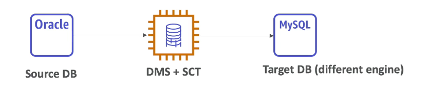

### Things to know

1. Works over VPC peering, VPN, Direct connect
2. Support
   1. FUll load
   2. Full load + CDC
   3. CDC only
3. Oracle
   1. Support TDS
   2. Support BLOBS that have a primary key and TDE
4. ElasticSearch
   1. Source does not exist
   2. Target: possible to migrate to DMS from a relational database
   3. Cannot be used to replicate ElasticSearch Data

### Snowball + DMS

1. Larger data migrations can include many terabytes of information
2. can be limited due to network bandwidth
3. Stages
   1. Use AWS SCT to extract data locally and move it to an edge device
   2. Ship AWS device to AWS
   3. Edge device lodas it into an Amazon S3 bucket
   4. AWS migrate the data to target data store. CDC to continous update the target data store

## VM Migrations

### Application Discovery Service
1. Plan migration projects by gathering information about on-premises data centers
2. Agentless discovery (Application discovery agentless connector)
   1. Open Virtual Appliance package that can be deployed to a VMware host
   2. VM inventory, configuration, and performance history such as CPU, memory and disk usage
3. Agent based discovery
   1. system configuration, system performance, running processes and details of the network connections between systems
4. Data can be exported as CSV

### Server migration service

1. Migrate entire VMs to AWS
2. All OS, data, everything is kept intact
3. SMS is used for re-host
4. Only works if VM vSphere, window hyper-v and azure VM
5. Every replication creates an EBS snapshot/AMI ready for deployment
6. Every replication is incremendal

### On-premise strategy

1. Ability to download Amazon Linux as a VM (.iso format)
   1. Install on VMware, Virtualbox
   2. Similar env as AWS but on premise
2. AWS Application Discovery Service
   1. Gather information about on premise server
   2. Track with AWS migration hub
3. AWS VM Export/Import
   1. Create a DR strategy for on premise VM
   2. Export back VM from EC2 to on-premise
4. AWS Server Migration service
   1. Incremental replication of on-premise live servers to AWS
   2. Migrate entire VM into AWS
5. AWS Database migration service
   1. replicate on-premise => AWS, AWS => AWS
   2. can work with snowball

## Disaster Recovery

1. Any event that has a negative impact
2. DR is about preparing and recovering from a disaster
3. Recovery plan?
   1. on-premise => on-premise
   2. on-premise => cloud
   3. AWS cloud region A => cloud region B

### RTO & RPO

1. Recovery point objective
   1. Time between RPO is the data loss
2. Recovery time objective
   1. Application downtime

### Strategies

1. Backup and restore
2. Pilot light
3. warm standby
4. Hotsite/multi site approach

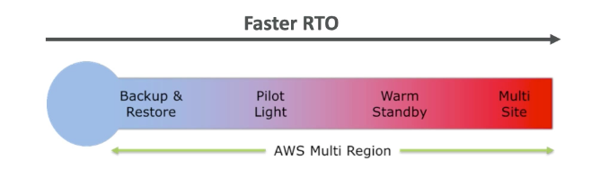

### Backup and restore

1. easy
2. inexpensive

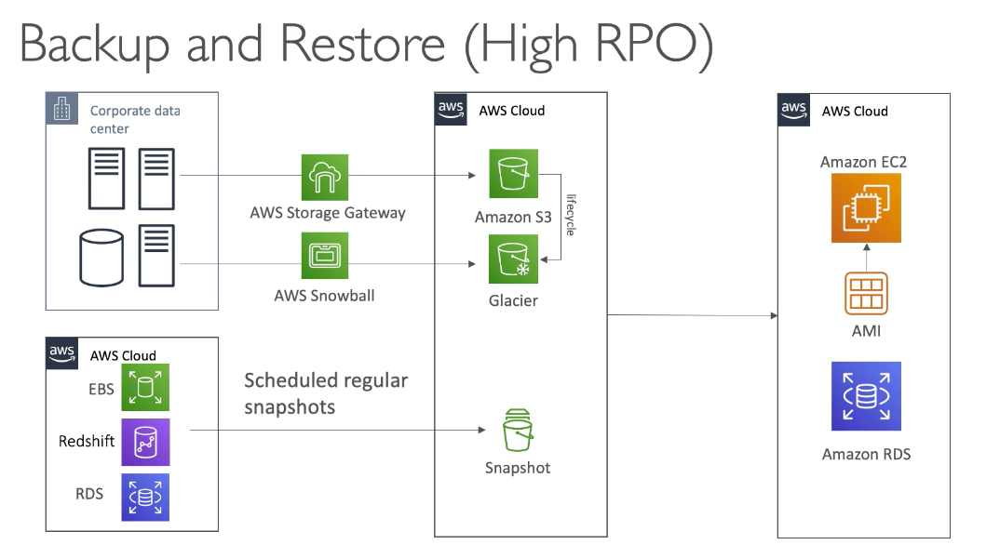

### Pilot Light

1. Critical system are up and running in the cloud
   
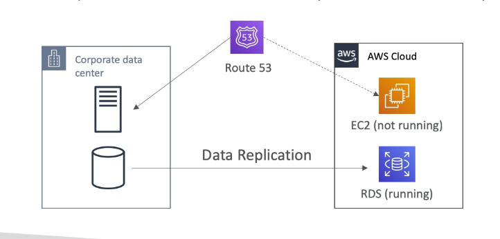

### Warm standby

1. Full system is up and running, at min size
2. on disaster, we scale to production load

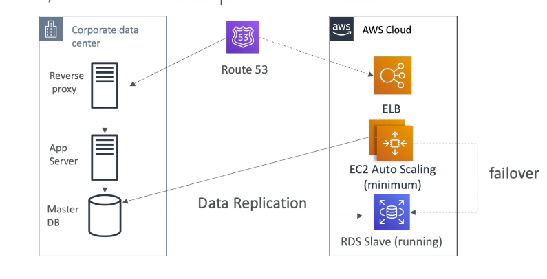

### Multi-site

1. Very low RTO
2. Full production scale is running
3. Very expensive

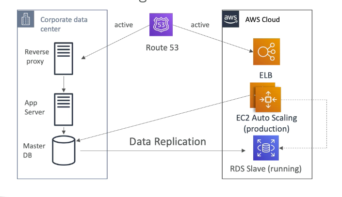

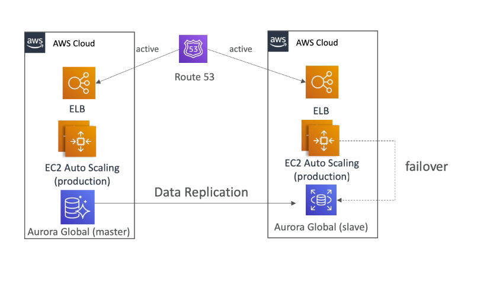

### Recovery tips

1. Backup 
   1. EBS snapshots, RDS automated backup
   2. Regularly pushes to S3, Cross region replication
   3. Storage gateway or snowball
2. High Availability
   1. Route 53 to migrate DNS over region to region
   2. RDS Multi AZ, Elastic Cache Multi AZ, EFS, S3
   3. Site to Site VPN as a recovery from direct connect
3. Replication
   1. RDS replication (Cross region), AWS Aurora + Global databases
   2. Database replication from on-premise
   3. Storage gateway
4. Automation
   1. Cloudformation/Elastic Beanstalk to re-create a whole new environment
   2. Recover/Reboot EC2 instances when CW alarm fails
   3. AWS Lambda functions for customized automation
5. Chaos
   1. Randomly terminate EC2 instances
  