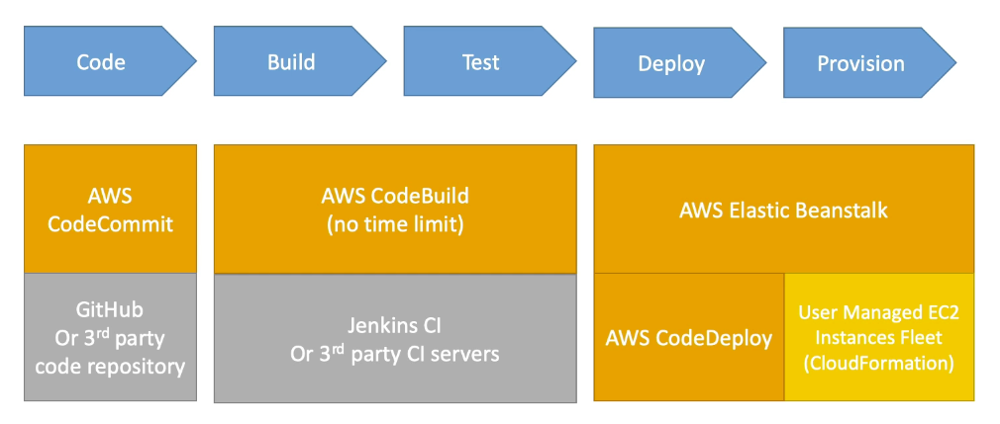
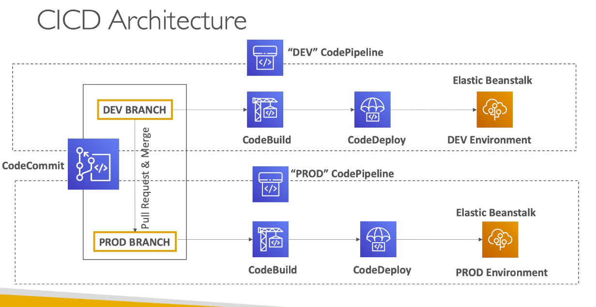
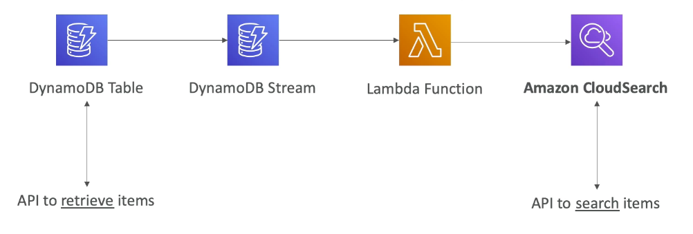
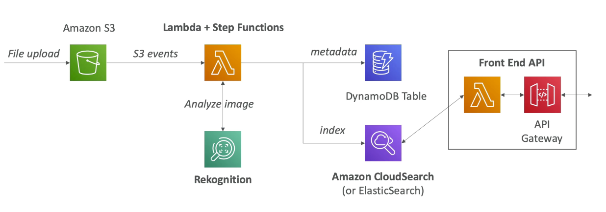
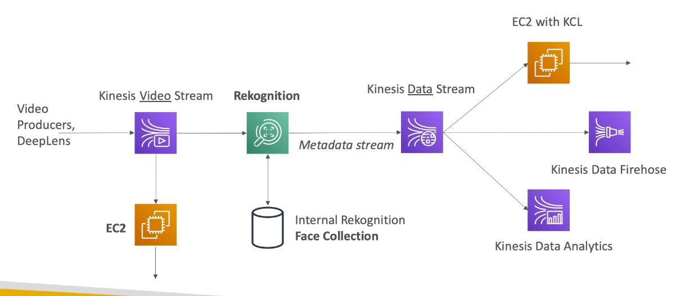
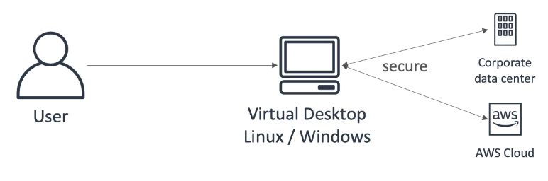
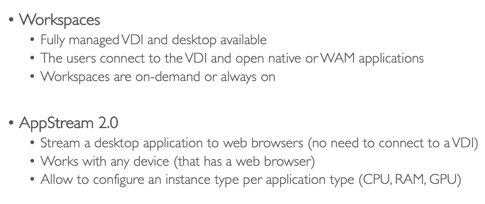

# Chapter 14: Other services

## CI/CD

### Continous integration

1. Deliver faster as the code is tested
2. Deploy often
3. Happier developer as they are unblocked

### Continous delivery

1. Ensure that the software can be released reliably
2. Automated deployment

## Cloudsearch

1. Managed service to setup, manage and scale a search solution
2. Managed alternative to ElasticSearch
3. Free text, boolean, autocomplete suggestions, geospatial search

## Alexa for business, Lex and connect

1. Alexa for business
   1. Help employees be more productive in meeting rooms and their desk
2. Amazon Lex (Same technology that power Alexa)
   1. Automatic speech recognition (ASR)
   2. NLU to reconginze the intent of text 
   3. Help build chatbots
3. Amazon Connect
   1. Receive calls, create contact flow
   2. Can integrate with other CRM

## AWS rekognition

1. Find object, people, text, scenes in images and videos using ML
2. Facial analysis and facial search to do user verification
3. Create a database of "familiar faces"
4. Use cases:
   1. Labelling
   2. Content moderation
   3. Text detection
   4. Face detection and analysis
   5. Face search and verification
   6. Celebrity recognition
   

## Kinesis Video Stream

1. One video stream per streaming device (producer)
2. Underlying data is stored in S3 (but we dont have access)
3. Cannot output the stream data to S3
   1. Need to consume the stream and build a custom solution
4. Consumers
   1. consumed by EC2 instances for real time analysis
  

## AWS workspaces and App stream

1. Managed secure cloud desktop
2. Eliminate on-premise VDI (virtual desktop infrastructure)
3. On Demand, pay per by usage
4. Workspaces Application Manager (WAM)
   1. Deploy and manage applications as virtualized application containers
   2. Provision at scale and keep application updated using WAM
5. Windows Update
   1. Amazon workspaces are configured to install software updates
6. Maintenance Windows
   1. Autostop workspaces: automatically start once a month to install updates
   2. Always on workspaces: 0000 - 0400 on sunday morning
   3. Custom timeframe

### Appstream 2.0

1. Desktop application streaming service
2. Deliver to any computer without acquiring, provisioning infrastructure
3. Application is delivered from within a web browser

### Comparison

## Amazon mechanical turk

1. crowdsourcing marketplace to perform simple human tasks
2. distributed virtual workforce
3. integrates with SWF natively
4. use cases
   1. image classification
   2. data collection
   3. business processing

## AWS device farm

1. application testing service for mobile and web applications
2. test across real browser and real mobile devices
3. fully automated using framework
4. improve the quality of web and mobile apps
5. generate videos and logs to document the issues encountered