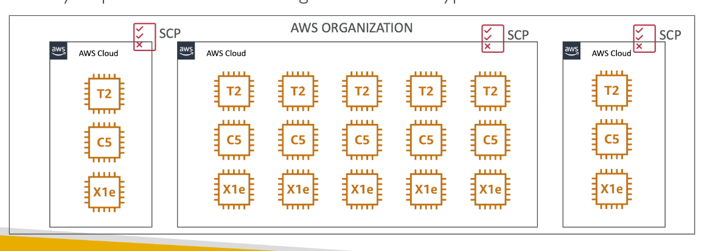
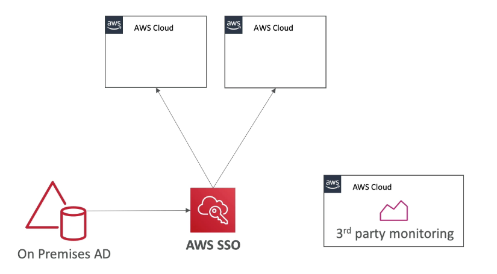
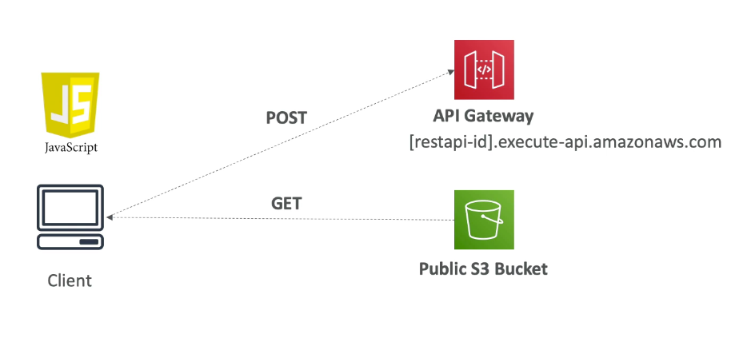
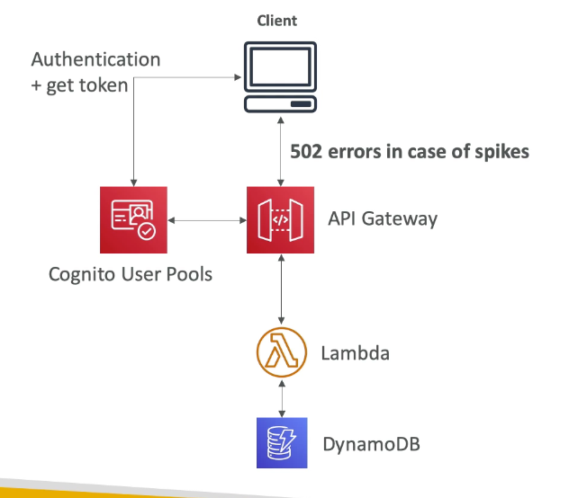
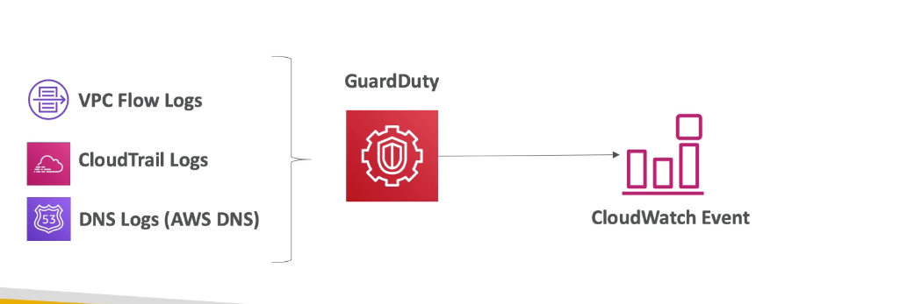
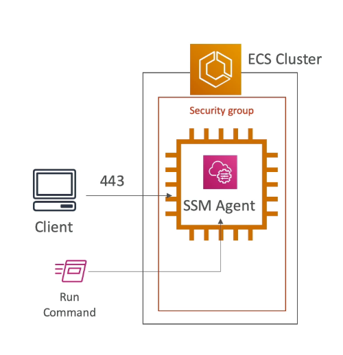
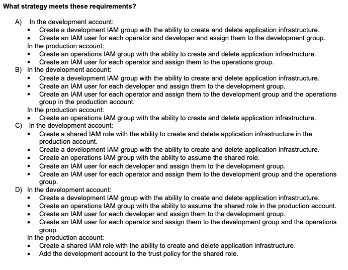
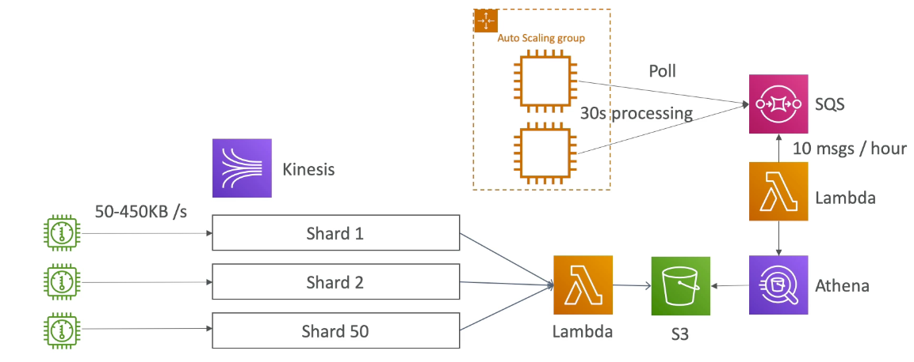

# Chapter 15: Practice Paper

## Question 1

> An enterprise has a large number of AWS accounts owned by separate business groups. One of the
accounts was recently compromised. The attacker launched a large number of instances, resulting in a
high bill for that account.
The security breach was addressed, but management has asked a solutions architect to develop a
solution to prevent excessive spending in all accounts. Each business group wants to retain full control
over its AWS account.
Which solution should the solutions architect recommend to meet these requirements?

1. Use AWS Organizations to add each AWS account to the master account. Create a service control policy (SCP) that uses the ec2:instanceType condition key to prevent the launch of high-cost instance types in each account
   1. Does not give control of the account
2. Attach a new customer-managed IAM policy to an IAM group in each account that uses
the ec2:instanceType condition key to prevent the launch of high-cost instance types. Place all of the existing IAM users in each group.
   1. Does not give control of the account
3. **Enable billing alerts on each AWS account. Create Amazon CloudWatch alarms that send an Amazon SNS notification to the account administrator whenever their account exceeds the spending budget.**
4. Enable Cost Explorer in each account. Regularly review the Cost Explorer reports for each account to ensure spending does not exceed the planned budget.
   1. Cost explorer is a dashboard and can only be reviewed on regular cadence

### Alternative solution

1. Use EC2 limit
2. Create a lambda to query the number of EC2 instance created per account

## Question 2

> A company has multiple AWS accounts. The company has integrated its on-premises Active Directory
with AWS SSO to grant Active Directory users least privilege abilities to manage infrastructure across all
the accounts. A solutions architect must integrate a third-party monitoring solution that requires read-only access across all AWS accounts. The monitoring solution will run in its own AWS account. How can the monitoring solution be given the required permissions?

1. Create a user in an AWS SSO directory and assign a read-only permissions set. Assign all AWS accounts to be monitored to the new user. Provide the third-party monitoring solution with the user name and password.
   1. In this situation, you cannot have both users defined in AWS SSO and in AD. SSO only allows for one identity source
2. Create an IAM role in the organization's master account. Allow the AWS account of the third-party monitoring solution to assume the role.
   1. Acess to Master account does not give acces to other AWS account
3. Invite the AWS account of the third-party monitoring solution to join the organization. Enable all features.
   1. It does not give read-only access to the 3rd party monitoring tools.
   2. It provides consolidated billing
4. **Create an AWS CloudFormation template that defines a new IAM role for the third-party monitoring solution with the account of the third party listed in the trust policy. Create the IAM role across all linked AWS accounts by using a stack set.**

## Question 3

> A team is building an HTML form hosted in a public Amazon S3 bucket. The form uses JavaScript to
post data to an Amazon API Gateway endpoint. The endpoint is integrated with AWS Lambda
functions. The team has tested each method in the API Gateway console and received valid responses.
Which combination of steps must be completed for the form to successfully post to the API Gateway and
receive a valid response? (Select TWO.)

1. Configure the S3 bucket to allow cross-origin resource sharing (CORS).
2. Host the form on Amazon EC2 rather than Amazon S3.
3. Request a limit increase for API Gateway.
4. **Enable cross-origin resource sharing (CORS) in API Gateway.**
5. **Configure the S3 bucket for web hosting.**

## Question 4

> A retail company runs a serverless mobile app built on Amazon API Gateway, AWS Lambda, Amazon
Cognito, and Amazon DynamoDB. During heavy holiday traffic spikes, the company receives complaints
of intermittent system failures. Developers find that the API Gateway endpoint is returning 502 Bad
Gateway errors to seemingly valid requests.
Which method should address this issue?

1. **Increase the concurrency limit for Lambda functions and configure notification alerts to be sent byAmazon CloudWatch when the ConcurrentExecutions metric approaches the limit.**
2. Configure notification alerts for the limit of transactions per second on the API Gateway endpoint and create a Lambda function that will increase this limit, as needed.
   1. Issues is not on the API gateway level
   2. It will be the solution if the error is 429: Quota exceeded, throttle
3. Shard users to Amazon Cognito user pools in multiple AWS Regions to reduce user authentication latency.
4. Use DynamoDB strongly consistent reads to ensure the latest data is always returned to the client application.

### Basics

1. 4xx means client error
   1. 400: bad request
   2. 403: access denied, WAF filtered
   3. 429: Quota exceeded, throttle
2. 5xx mean server error
   1. 502: bad gateway exception, incompatible output returned from a lambda proxy integration
   2. 503: service unavailable exception
   3. 504: integration failure - api-gateway time out after 29 seconds

## Question 5
> A web hosting company has enabled Amazon GuardDuty in every AWS Region for all of its accounts. A system administrator must create an automated response to high-severity events. How should this be accomplished?

1. Create rules through VPC Flow Logs that trigger an AWS Lambda function that programmatically addresses the issue.
2. **Create an Amazon CloudWatch Events rule that triggers an AWS Lambda function that programmatically addresses the issue.**
3. Configure AWS Trusted Advisor to trigger an AWS Lambda function that programmatically addresses the issue.
4. Configure AWS CloudTrail to trigger an AWS Lambda function that programmatically addresses the issue.
   
## Question 6

> A company is launching a new web service on an Amazon ECS cluster. Company policy requires that
the security group on the cluster instances block all inbound traffic but HTTPS (port 443). The cluster
consists of 100 Amazon EC2 instances. Security engineers are responsible for managing and updating
the cluster instances. The security engineering team is small, so any management efforts must be
minimized.
How can the service be designed to meet these operational requirements?

1. Change the SSH port to 2222 on the cluster instances with a user data script. Log in to each instance using SSH over port 2222.
   1. Cannot open SSH port 2222 because of company policy. It only allows port 443
2. Change the SSH port to 2222 on the cluster instances with a user data script. Use AWS Trusted Advisor to remotely manage the cluster instances over port 2222.
   1. Cannot open SSH port 2222 because of company policy. It only allows port 443
3. **Launch the cluster instances with no SSH key pairs. Use the Amazon Systems Manager Run Command to remotely manage the cluster instances.**
   1. Need to make sure the ec2 instance has instance role
   2. Need to include ssm agent in the OS
4. Launch the cluster instances with no SSH key pairs. Use AWS Trusted Advisor to remotely manage the cluster instances.

### Question 7
> A company has two AWS accounts: one for production workloads and one for development workloads.
Creating and managing these workloads are a development team and an operations team. The company
needs a security strategy that meets the following requirements:

1. Developers need to create and delete development application infrastructure.
2. Operators need to create and delete both development and production application infrastructure.
3. Developers should have no access to production infrastructure.
4. All users should have a single set of AWS credentials.

What strategy meets these requirements?

1. Option A is ruled out as it create 2 set of AWS credentials in both dev and prod account
2. Option B - cannot assign an IAM user to another group in another account
3. Option C - Cannot create an IAM role to create/delete in another account
4. **Option D - correct answer**

## Question 8

> A company is migrating an Apache Hadoop cluster from its data center to AWS. The cluster consists
of 60 VMware Linux virtual machines (VMs). During the migration cluster, downtime should be
minimized.
Which process will minimize downtime?

1. Use the AWS Management Portal for vCenter to migrate the VMs to AWS as Amazon EC2 instances.
   1. Service is deprecating
   2. No information regarding if the VM are using vCenter
2. **Use AWS Server Migration Service (AWS SMS) to migrate the VMs to AWS as AMIs. Launch the cluster on AWS as Amazon EC2 instances from the migrated AMIs.**
   1. Supports incremental backup of the server
3. Create Open Virtualization Archive (OVA) files of the VMs. Upload the OVA files to Amazon S3. Use VM Import/Export to create AMIs from the OVA files. Launch the cluster on AWS as Amazon EC2 instances from the AMIs.
   1. A longer downtime due to the use of uploading to S3
4. Export the Hadoop Digital File System (HDFS) data from the VMs to a new Amazon Aurora DB cluster. Launch a new Hadoop cluster on Amazon EC2 instances. Import the data from the Aurora database to HDFS on the new cluster.
   1. Hadoop data has all kind of file but Aurora does not support it

### Alternative

1. Create an EMR cluster to migrate the hadoop cluster
2. Migrate data using import/export to Amazon S3

## Question 9

> A solutions architect needs to reduce costs for a big data application. The application environment
consists of hundreds of devices that send events to Amazon Kinesis Data Streams. The device ID is used
as the partition key, so each device gets a separate shard. Each device sends between 50 KB and 450 KB
of data per second. The shards are polled by an AWS Lambda function that processes the data and stores
the result on Amazon S3.
Every hour, an AWS Lambda function runs an Amazon Athena query against the result data that identifies
any outliers and places them in an Amazon SQS queue. An Amazon EC2 Auto Scaling group of two EC2
instances monitors the queue and runs a short (approximately 30-second) process to address the
outliers. The devices submit an average of 10 outlying values every hour.
Which combination of changes to the application would MOST reduce costs? (Select TWO.)

1. Change the Auto Scaling group launch configuration to use smaller instance types in the same instance
family.
2. **Replace the Auto Scaling group with an AWS Lambda function triggered by messages arriving in the Amazon SQS queue.**
3. Reconfigure the devices and data stream to set a ratio of 10 devices to 1 data stream shard.
4. **Reconfigure the devices and data stream to set a ratio of 2 devices to 1 data stream shard.**
5. Change the desired capacity of the Auto Scaling group to a single EC2 instance.

## Question 10

> A company operates an ecommerce application on Amazon EC2 instances behind an Application
Load Balancer. The instances run in an Amazon EC2 Auto Scaling group across multiple Availability
Zones. After an order is successfully processed, the application immediately posts order data to an
external third-party affiliate tracking system that pays sales commissions for order referrals. During a
highly successful marketing promotion, the number of EC2 instances increased from 2 to 20. The
application continued to work correctly, but the increased request rate overwhelmed the third-party
affiliate and resulted in failed requests.
Which combination of architectural changes could ensure that the entire process functions correctly
under load? (Select TWO.)

1. Move the code that calls the affiliate to a new AWS Lambda function. Modify the application to invoke the Lambda function asynchronously.
2. **Move the code that calls the affiliate to a new AWS Lambda function. Modify the application to place the order data in an Amazon SQS queue. Trigger the Lambda function from the queue.**
3. Increase the timeout of the new AWS Lambda function.
4. **Adjust the concurrency limit of the new AWS Lambda function.**
5. Increase the memory of the new AWS Lambda function.

# Chapter 15: Practice Paper (Old)

## Question 1

> Your company’s on-premises content management system has the following architecture:
 Application Tier – Java code on a JBoss application server
 Database Tier – Oracle database regularly backed up to Amazon Simple Storage Service (S3) using
the Oracle RMAN backup utility
 Static Content – stored on a 512GB gateway stored Storage Gateway volume attached to the
application server via the iSCSI interface
Which AWS based disaster recovery strategy will give you the best RTO?

1. **Deploy the Oracle database and the JBoss app server on EC2. Restore the RMAN Oracle backups from Amazon S3. Generate an EBS volume of static content from the Storage Gateway and attach it to the JBoss EC2 server.**
2. Deploy the Oracle database on RDS. Deploy the JBoss app server on EC2. Restore the RMAN Oracle
backups from Amazon Glacier. Generate an EBS volume of static content from the Storage Gateway and
attach it to the JBoss EC2 server.
3. Deploy the Oracle database and the JBoss app server on EC2. Restore the RMAN Oracle backups from
Amazon S3. Restore the static content by attaching an AWS Storage Gateway running on Amazon EC2
as an iSCSI volume to the JBoss EC2 server.
4. Deploy the Oracle database and the JBoss app server on EC2. Restore the RMAN Oracle backups from
Amazon S3. Restore the static content from an AWS Storage Gateway-VTL running on Amazon EC2

## Question 2 

> An ERP application is deployed in multiple Availability Zones in a single region. In the event of failure, the
RTO must be less than 3 hours, and the RPO is 15 minutes. The customer realizes that data corruption
occurred roughly 1.5 hours ago. Which DR strategy can be used to achieve this RTO and RPO in the
event of this kind of failure?

1. Take 15-minute DB backups stored in Amazon Glacier, with transaction logs stored in Amazon S3 every
5 minutes.
2. Use synchronous database master-slave replication between two Availability Zones.
3. **Take hourly DB backups to Amazon S3, with transaction logs stored in S3 every 5 minutes.**
4. Take hourly DB backups to an Amazon EC2 instance store volume, with transaction logs stored in
Amazon S3 every 5 minutes.

## Question 3

> The Marketing Director in your company asked you to create a mobile app that lets users post sightings
of good deeds known as random acts of kindness in 80-character summaries. You decided to write the
application in JavaScript so that it would run on the broadest range of phones, browsers, and tablets.
Your application should provide access to Amazon DynamoDB to store the good deed summaries. Initial
testing of a prototype shows that there aren’t large spikes in usage. Which option provides the most costeffective and scalable architecture for this application?

1. Provide the JavaScript client with temporary credentials from the Security Token Service using a Token
Vending Machine (TVM) on an EC2 instance to provide signed credentials mapped to an Amazon Identity
and Access Management (IAM) user allowing DynamoDB puts and S3 gets. You serve your mobile
application out of an S3 bucket enabled as a web site. Your client updates DynamoDB.
2. **Register the application with a Web Identity Provider like Amazon, Google, or Facebook, create an IAM role for that provider, and set up permissions for the IAM role to allow S3 gets and DynamoDB puts. You serve your mobile application out of an S3 bucket enabled as a web site. Your client updates DynamoDB.**
3. Provide the JavaScript client with temporary credentials from the Security Token Service using a Token
Vending Machine (TVM) to provide signed credentials mapped to an IAM user allowing DynamoDB puts.
You serve your mobile application out of Apache EC2 instances that are load-balanced and autoscaled.
Your EC2 instances are configured with an IAM role that allows DynamoDB puts. Your server updates
DynamoDB.
4. Register the JavaScript application with a Web Identity Provider like Amazon, Google, or Facebook,
create an IAM role for that provider, and set up permissions for the IAM role to allow DynamoDB puts.
You serve your mobile application out of Apache EC2 instances that are load-balanced and autoscaled.
Your EC2 instances are configured with an IAM role that allows DynamoDB puts. Your server updates
DynamoDB.

## Question 4

You are building a website that will retrieve and display highly sensitive information to users. The amount
of traffic the site will receive is known and not expected to fluctuate. The site will leverage SSL to protect
the communication between the clients and the web servers. Due to the nature of the site you are very
concerned about the security of your SSL private key and want to ensure that the key cannot be
accidentally or intentionally moved outside your environment. Additionally, while the data the site will
display is stored on an encrypted EBS volume, you are also concerned that the web servers’ logs might
contain some sensitive information; therefore, the logs must be stored so that they can only be decrypted
by employees of your company. Which of these architectures meets all of the requirements?

1. Use Elastic Load Balancing to distribute traffic to a set of web servers. To protect the SSL private key,
upload the key to the load balancer and configure the load balancer to offload the SSL traffic. Write your
web server logs to an ephemeral volume that has been encrypted using a randomly generated AES key.
2. Use Elastic Load Balancing to distribute traffic to a set of web servers. Use TCP load balancing on the
load balancer and configure your web servers to retrieve the private key from a private Amazon S3
bucket on boot. Write your web server logs to a private Amazon S3 bucket using Amazon S3 server-side
encryption.
3. **Use Elastic Load Balancing to distribute traffic to a set of web servers, configure the load balancer to perform TCP load balancing, use an AWS CloudHSM to perform the SSL transactions, and write your web server logs to a private Amazon S3 bucket using Amazon S3 server-side encryption.**
4. Use Elastic Load Balancing to distribute traffic to a set of web servers. Configure the load balancer to
perform TCP load balancing, use an AWS CloudHSM to perform the SSL transactions, and write your
web server logs to an ephemeral volume that has been encrypted using a randomly generated AES key

## Question 5 

> You are designing network connectivity for your fat client application. The application is designed for
business travelers who must be able to connect to it from their hotel rooms, cafes, public Wi-Fi hotspots,
and elsewhere on the Internet. You do not want to publish the application on the Internet.
Which network design meets the above requirements while minimizing deployment and operational
costs?

1. Implement AWS Direct Connect, and create a private interface to your VPC. Create a public subnet and
place your application servers in it.
2. Implement Elastic Load Balancing with an SSL listener that terminates the back-end connection to the
application.
3. Configure an IPsec VPN connection, and provide the users with the configuration details. Create a public
subnet in your VPC, and place your application servers in it.
4. **Configure an SSL VPN solution in a public subnet of your VPC, then install and configure SSL VPN client software on all user computers. Create a private subnet in your VPC and place your application servers in it.**

## Question 6

> Your company hosts an on-premises legacy engineering application with 900GB of data shared via a
central file server. The engineering data consists of thousands of individual files ranging in size from
megabytes to multiple gigabytes. Engineers typically modify 5-10 percent of the files a day. Your CTO
would like to migrate this application to AWS, but only if the application can be migrated over the
weekend to minimize user downtime. You calculate that it will take a minimum of 48 hours to transfer
900GB of data using your company’s existing 45-Mbps Internet connection.
After replicating the application’s environment in AWS, which option will allow you to move the
application’s data to AWS without losing any data and within the given timeframe?

1. Copy the data to Amazon S3 using multiple threads and multi-part upload for large files over the
weekend, and work in parallel with your developers to reconfigure the replicated application environment
to leverage Amazon S3 to serve the engineering files.
2. **Sync the application data to Amazon S3 starting a week before the migration, on Friday morning perform a final sync, and copy the entire data set to your AWS file server after the sync completes.**
3. Copy the application data to a 1-TB USB drive on Friday and immediately send overnight, with Saturday
delivery, the USB drive to AWS Import/Export to be imported as an EBS volume, mount the resulting EBS
volume to your AWS file server on Sunday.
4. Leverage the AWS Storage Gateway to create a Gateway-Stored volume. On Friday copy the application
data to the Storage Gateway volume. After the data has been copied, perform a snapshot of the volume
and restore the volume as an EBS volume to be attached to your AWS file server on Sunday