# Chapter 13: VPC

## Basics

1. CIDR: Block of IP address
   1. i.e. 192.168.0.0/26 - 192.168.0.0 - 192.168.0.63 (64 IP)
2. Private IP
   1. Only accessible in private network
   2. 10.0.0.0/8 => 10.0.0.0 - 10.255.255.255 (big network)
   3. 172.16.0.0/12 => 172.16.0.0 - 172.31.255.255 (default AWS)
   4. 192.168.0.0/16 => 192.168.0.0 - 192.168.255.255 (home network)
3. Public IP
   1. All the rest

### VPC 

1. defined list of CIDR blocks, cannot be changed
2. Each CIDR has a min size of /28 and max size of /16 (65536 IP)
3. VPC is private, so only private IP CIDR ranges are allowed
   
### Subnets

1. Within a VPC, defined a CIDR as a subset of the VPC CIDR
2. first 4 IP and last one in every subnet are reserved by AWS
   
### Route Tables

1. Used to control where the network traffic is directed to
2. Can be associated with specific subnets
3. The "most specific" routing rule is always followed
   
### Internet gateway

1. Help VPC connect to the internet, HA scales horizontally
2. Act as a NAT for instance that have a public IPv4 or IPv6
  
### Public subnet

1. Has a route table that sends 0.0.0.0/0 to IGW
2. Instances must have a public IPv4 to talk to the internet

### Private subnet

1.  Access internet with a NAT instance/gateway setup in public subnet
2.  Edit routes so that 0.0.0.0/0 route traffic to the NAT
  
### NAT instance

1.  EC2 instance deploy in a public subnet
2.  edit the route in private subnet to route 0.0.0.0/0 to NAT instance
3.  Not resilient to failure, limited bandwidth based on instance type, cheap
4.  Manage failover 

### NAT gateway

1.  Managed NAT solution, bandwidth scales automatically
2.  Resilient to failure within a single AZ
3.  Must deploy multiple NAT gateawy in multiple AZ
4.  Has an elastic IP

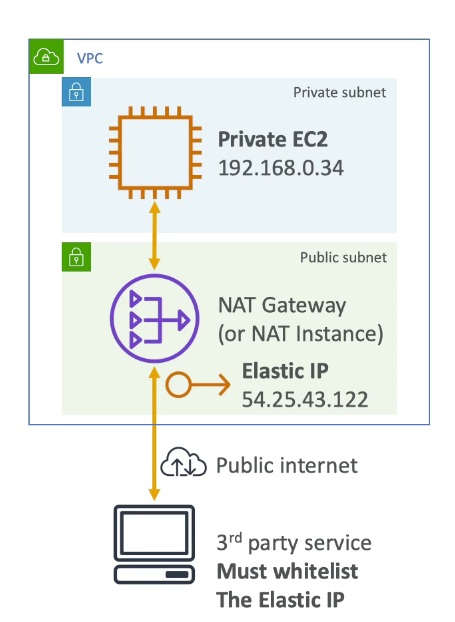

### Network ACL

1. stateless firewall defined at the subnet level
2. support for allow and deny rules
3. stateless = return traffic must be explicitly allowed by rules
4. helpful to quickly and cheaply block specific IP addresses

### Security groups

1. Applied at the instance level
2. Only allow rules, no deny rules
3. Stateful = return traffic is automatically allowed
4. Can reference other security groups in the same region

### VPC flow logs

1. log internet traffic going through your VPC
2. Can be defined at the VPC level, subnet level or ENI level
3. Helpful to capture "denied internet traffic"
4. Can be sent to Cloudwatch logs and Amazon S3

### Bastion hosts

1. SSH into private EC2 instances through a public EC2 instance
2. Manage these instance 
3. Use SSM session manager , a more secure way to remote control EC2 instances

### IPv6

1. All IPv6 addresses are public
2. Addresses are "random" and cannot be scanned online
3. VPC support for IPv6
   1. Create an IPv6 CIDR for VPC and use IGW (support IPv6)
   2. Public subnet
      1. create an instance with IPv6 support
      2. route table entry ::/0 (IPv6) to the IGW
   3. Private subnet
      1. egress-only internet gateway in public subnet
      2. route table entry for private subnet from ::/0 to the egress-only IGW

## VPC peering

1. Connect 2 VPC, privately using "AWS network"
2. Make them behaves as if they are in the same network
3. Must not have overlapping CIDR
4. Not transitive
5. Update route tables in each VPC's subnet to ensure instances can communicate
6. can work inter-region and cross account
7. can reference a security group of a peered VPC
8. VPC uses the longest prefix match to select the most specific route

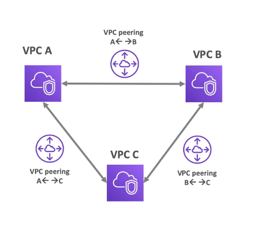

### Invalid configurations

1. Overlapping CIDR for IPv4
2. No transitive peering
3. No edge to edge routing

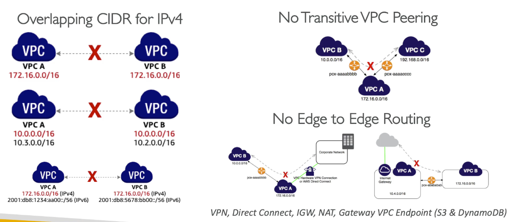

## Transit VPC and Transit Gateway

1. Transit VPC = software VPN
2. Use public internet with a software VPC solution
3. Allow for transitive connectivity between VPC and location
4. ALlow overlapping CIDR ranges, network level packet filtering
5. Have to manage your own software vpn

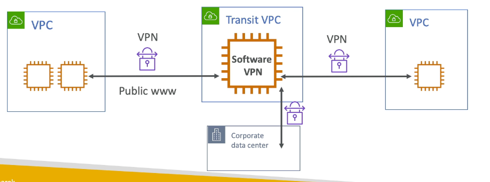

### transit gateway

1. Transitive peering between thousands of VPC and on-premise, hub-and-spoke (star) connection
2. Regional resource, can work cross-region
3. Share cross acount using Resource Access Manager (RAM)
4. Peer transit across region
5. Limit which VPC can talk with other VPC (at the transit gateway level)
6. Works with direct connect gateway, VPC connections
7. Supports IP multicast
8. Instances in a VPC can access a NAT gateway, NLB, privatelink, and EFS in other VPCs

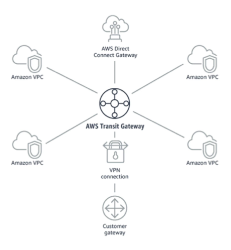

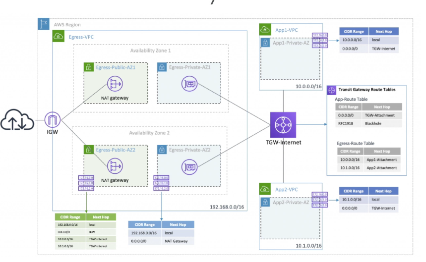

## VPC endpoints

1. Allow you to connect to AWS services using a private network instead of public www network
2. Scales horizontally and are redundant
3. No need IGW, NAT to access AWS services
4. Can set up VPC endpoint gateway (S3 & DynamoDB) 
5. VPC endpoint interface (the rest)
6. Issues
   1. Check DNS setting resolution in your VPC
   2. Check route tables

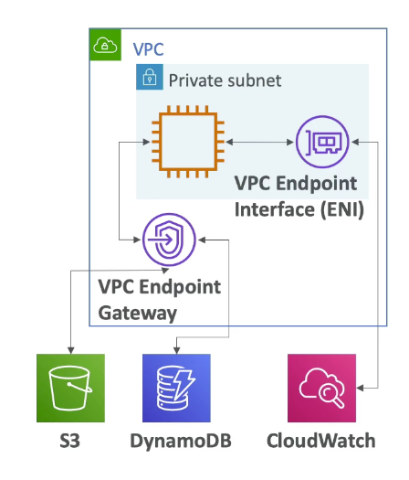

### VPC endpoint gateway

1. only works for S3 and dynamoDB, must create 1 gateway per VPC
2. must update route table entries
3. Gateway is defined at the VPC level
4. Ensure DNS resolution must be enabled in the VPC
5. Can use public hostname for S3
6. Gateway endpoint cannot be extended out of a VPC 
   1. Cannot be extended using VPN, DX, Transit gateway

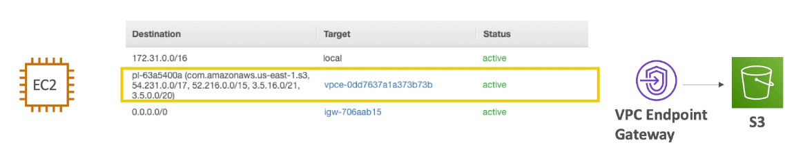

### VPC endpoint interface

1. provision an ENI will have a private endpoint interface hostnmae
2. leverage security groups for security
3. Private DNS (setting when you create the endpoint)
   1. public hostname of a service will resolve to the private endpoint interface hostname
   2. VPC settings: "Enable DNS hostname" and "enable DNS support" to be true
   3. No need to change public hostname
4. interface can be access from Direct connect and Site-to-Site VPN
  
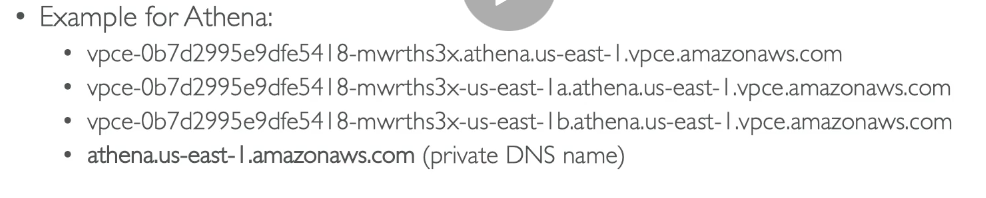

## VPC endpoint policies

1. Endpoint policies are JSON document to control access to services
2. Does not override or replace IAM user policies or service-specific policies
3. Can circumvent if - IAM user can still use other SQS API from outside the VPC endpoints
   1. Add an SQS queue policy to deny any action not done through VPC endpoints
4. aws:sourceVPC/aws:sourceVPCe only work for VPC private endpoint
5. If you want to restrict access using IP, have to use public IP or an elastic IP - cannot use private IP, using the condition aws:sourceIP

### Troubleshoot end point policies

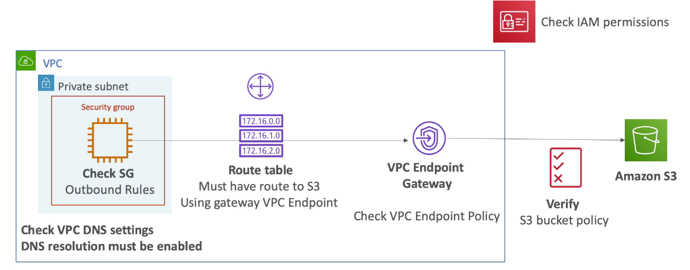

## AWS private link

1. most secure and scalable way to expose a service to 1000s of VPC
2. Does not require VPC peering, internet gateway, NAT, route tables
3. Require a network load balancer (ServiceVPC) and ENI (customer VPC)
4. If NLB is in multiple AZ, ENI needs to be in multiple AZ

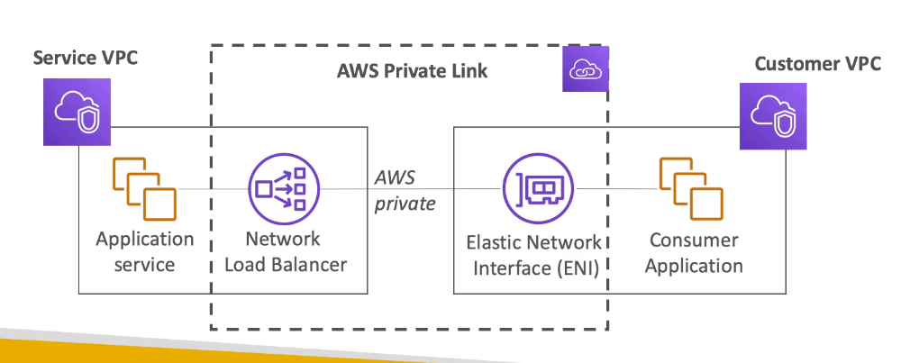

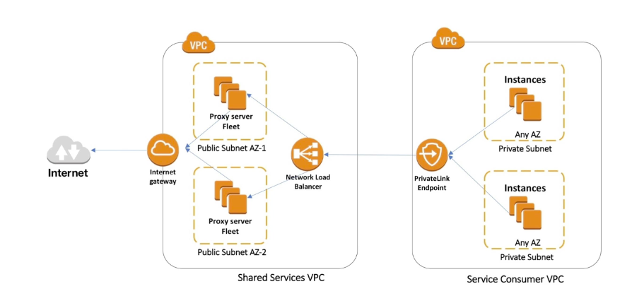

## VPN

1. On-premise
   1. Setup a software or hardware VPN
   2. on premise VPN should be accessible using a public IP
2. AWS 
   1. setup a virtual private gateway (VGW) and attach to your VPC
   2. Setup a customer gateway to point the on-premise VPN appliance
3. Two VPN connections (tunnels) are created for redunduncy, encrypted using IPSec
4. can optionally accelerate it using Global Accelerator

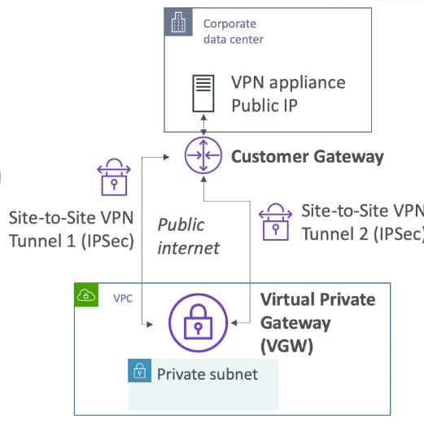

### Route propagation in site-to-site VPN

1. static routing: 
   1. create static route in corporate data center through CGW
   2. create static route in AWS through VGW
2. Dynamic routing:
   1. Uses BGP to share route automatically
   2. Need to specify the ASN (autonomous system number) of the CGW and VGW

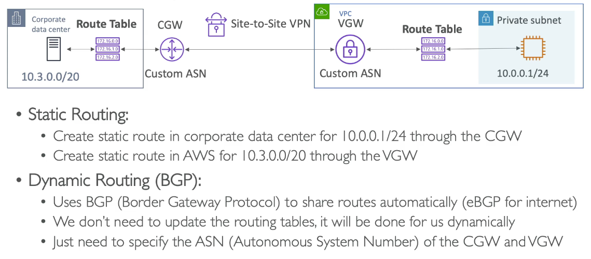

### Site to site VPN and internet access

#### NAT gateway restrictions

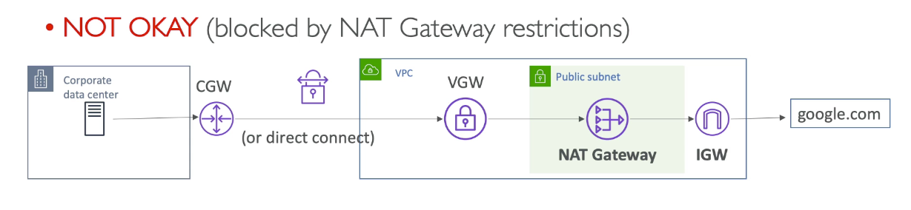

#### NAT instance (Self-managed)

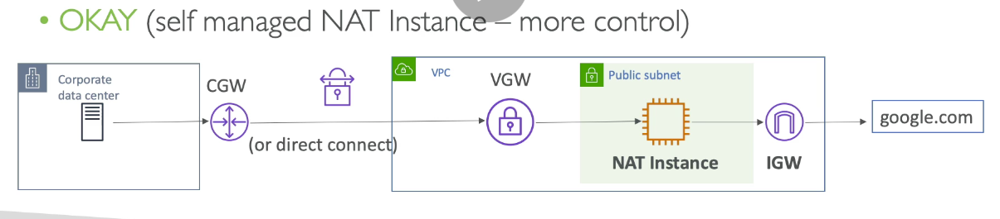

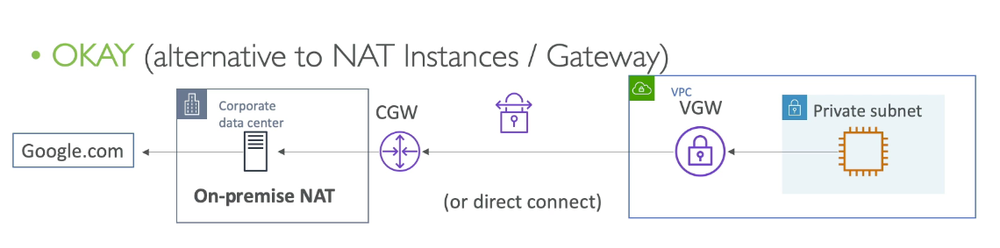

### VPN cloudhub

1. Connect up to 10 customer gateway for each VGW
2. Low cost hub and spoke model for primary/secondary network connectivity between locations
3. Goes over the public internet

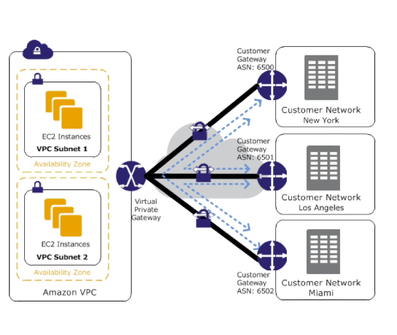

### AWS client VPN

1. Connect your computer using openVPN to private network in AWS/on-premise
2. Alternatively, you can setup your own software VPN

### VPN to multiple VPC

### create a site-to-site for every VGW

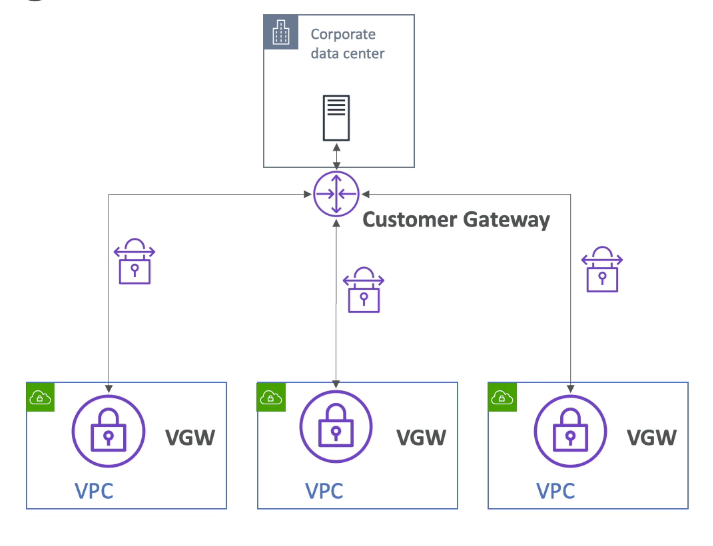

### Recommended solution (VPC peering)

### Other solutions (use transit gateway/vpc)

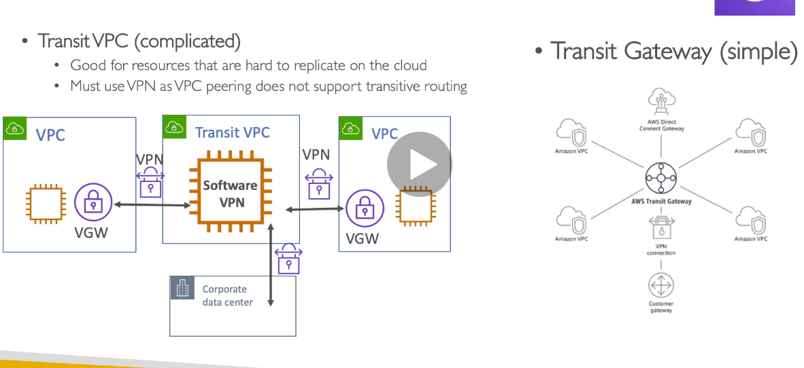

## Direct connect

1. dedicated private connection from a remote network to VPC
2. Dedicated connection setup
3. More expensive than running a VPC solution
4. Private access to AWS services through VIF
5. Bypass ISP, reduce network
6. Not redundant by default

### Direct connect virtual interfaces (VIF)

1. public VIF: connect to public aws endpoints (S3 bucket)
2. private VIF: resources in VPC (ec2 instance)
3. transit virtual interface: to connect resource using a transit gateway
4. VPC endpoint cannot be accessed through Private VIF

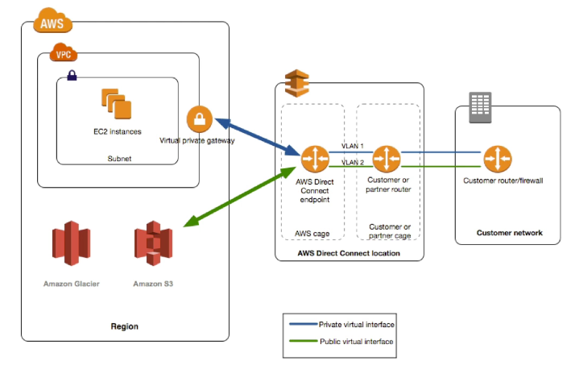

### Connection Type

1. Dedicated connections: 1Gbps and 10Gbps
   1. Request made to AWS and completed by AWS Direct connect
2. Hosted connections
   1. connection requests are made via AWS Direct Connect Partners
3. Lead times are average 1 month

### Encryption

1. Data in transit is not encrypted
2. Use AWS Direct connect + VPN to provide an IPsec encrypted private connection

### Direct link aggregation groups

1. Get increased speed and failover by summing up existing direct connect to a logical one
2. Can aggregate up to 4 
3. All connections must have the same bandwidth
4. All connections in the LAG must terminate at the same AWS Direct connect endpoint

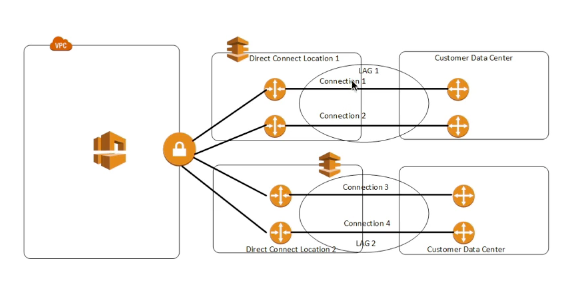

### Direct connect gateway

1. Setup a direct connect to one or more VPC in many different regions

## On-premise redundant connections

### Active active VPN connection

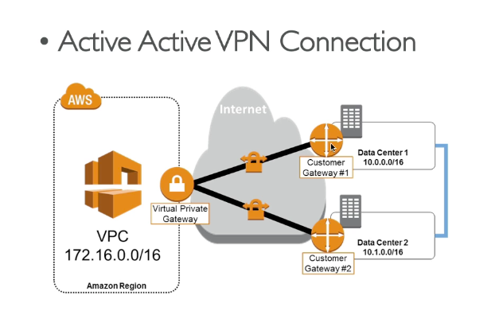

### Direct connect high availability

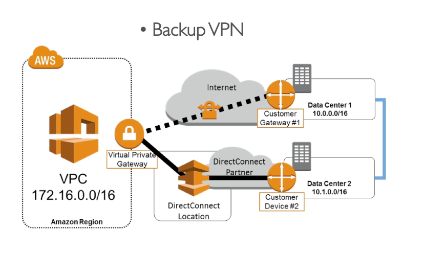
